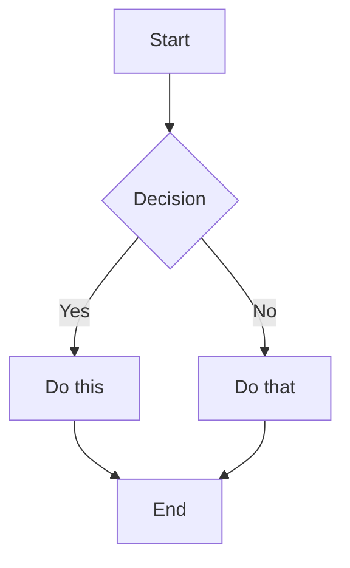

# Gunj Operator Documentation

Welcome to the Gunj Operator documentation! This directory contains all documentation for the project, including user guides, developer documentation, API references, and architecture documentation.

## Documentation Structure

```
docs/
├── development/              # Developer documentation
│   ├── getting-started.md   # Developer setup guide
│   └── coding-standards.md  # Code style and standards
├── architecture/            # Architecture documentation
│   └── overview.md         # System architecture
├── api/                    # API documentation
├── user-guide/             # End-user documentation
├── testing/                # Testing documentation
├── generated/              # Auto-generated docs (git-ignored)
├── mkdocs.yml             # MkDocs configuration
├── config.toml            # Hugo configuration (alternative)
├── requirements.txt       # Python dependencies
└── generate-docs.sh       # Documentation generation script
```

## Quick Start

### Prerequisites

1. **Python 3.8+** for MkDocs
2. **Node.js 18+** for some documentation tools
3. **Go 1.21+** for generating Go documentation

### Setup

1. **Install Python dependencies:**
   ```bash
   pip install -r requirements.txt
   ```

2. **Install Node.js tools:**
   ```bash
   npm install -g @mermaid-js/mermaid-cli spectaql markdown-link-check
   ```

3. **Install Go tools:**
   ```bash
   go install github.com/elastic/crd-ref-docs@latest
   go install golang.org/x/tools/cmd/godoc@latest
   ```

### Building Documentation

#### Option 1: Using MkDocs (Recommended)

```bash
# Serve documentation locally
mkdocs serve

# Build static site
mkdocs build

# Deploy to GitHub Pages
mkdocs gh-deploy
```

#### Option 2: Using the generation script

```bash
# Make script executable
chmod +x generate-docs.sh

# Generate all documentation
./generate-docs.sh
```

This script will:
- Generate CRD reference documentation
- Generate Go API documentation
- Generate OpenAPI documentation
- Generate GraphQL documentation
- Extract and document Prometheus metrics
- Generate CLI documentation
- Convert Mermaid diagrams to images
- Validate all documentation links

### Viewing Documentation

After running `mkdocs serve`, open http://localhost:8000 in your browser.

## Writing Documentation

### Markdown Standards

- Use [GitHub Flavored Markdown](https://guides.github.com/features/mastering-markdown/)
- Include a table of contents for long documents
- Use code blocks with language hints
- Include examples wherever possible

### Adding New Pages

1. Create a new `.md` file in the appropriate directory
2. Add the page to `nav` section in `mkdocs.yml`
3. Include proper front matter:

```yaml
---
title: "Your Page Title"
description: "Brief description of the page"
weight: 10
---
```

### Including Diagrams

Use Mermaid for diagrams:



### Code Examples

Always include the language identifier:

````markdown
```go
func main() {
    fmt.Println("Hello, World!")
}
```

```yaml
apiVersion: v1
kind: ConfigMap
metadata:
  name: example
```
````

## Documentation Types

### 1. User Documentation

Located in `user-guide/`, focuses on:
- Installation and setup
- Configuration options
- Day-to-day operations
- Troubleshooting

### 2. Developer Documentation

Located in `development/`, includes:
- Development environment setup
- Coding standards
- Testing guidelines
- Contributing guide

### 3. API Documentation

Located in `api/`, contains:
- REST API reference
- GraphQL schema
- WebSocket events
- CRD specifications

### 4. Architecture Documentation

Located in `architecture/`, covers:
- System design
- Component interactions
- Design decisions
- Security architecture

## Versioning Documentation

We use [mike](https://github.com/jimporter/mike) for versioned documentation:

```bash
# Deploy new version
mike deploy v2.0 latest

# List versions
mike list

# Set default version
mike set-default latest
```

## Contributing to Documentation

1. **Fork and clone** the repository
2. **Create a branch** for your changes
3. **Write or update** documentation
4. **Run checks:**
   ```bash
   # Check for broken links
   markdown-link-check docs/**/*.md
   
   # Preview changes
   mkdocs serve
   ```
5. **Submit a pull request**

### Documentation Review Checklist

- [ ] Spelling and grammar checked
- [ ] Technical accuracy verified
- [ ] Code examples tested
- [ ] Links validated
- [ ] Follows documentation standards
- [ ] Includes relevant examples
- [ ] Updated table of contents
- [ ] Added to navigation (if new page)

## Automated Documentation

Some documentation is automatically generated:

- **CRD Reference**: Generated from Go types
- **OpenAPI Docs**: Generated from OpenAPI spec
- **GraphQL Docs**: Generated from GraphQL schema
- **CLI Reference**: Generated from CLI code
- **Metrics Reference**: Extracted from source code

Do not edit generated files directly; modify the source instead.

## Documentation Deployment

Documentation is automatically deployed to GitHub Pages when:
- Changes are pushed to the `main` branch
- A new release is tagged

The deployment process:
1. GitHub Actions builds the documentation
2. Deploys to the `gh-pages` branch
3. Available at https://gunjanjp.github.io/gunj-operator

## Getting Help

- **Documentation issues**: Open an issue with the `documentation` label
- **Questions**: Ask in our [Slack channel](https://kubernetes.slack.com/messages/gunj-operator)
- **Suggestions**: Create a discussion on GitHub

## License

The documentation is licensed under the same [MIT License](../LICENSE) as the project.
