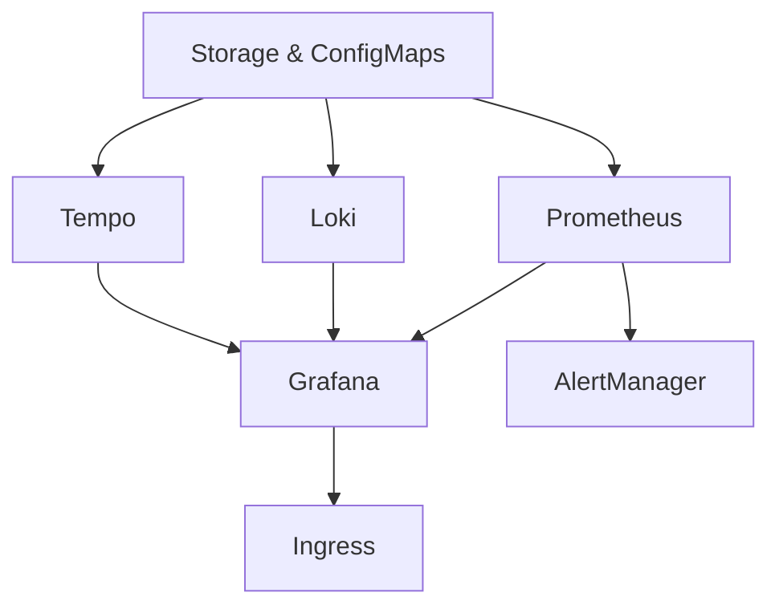

# ADR-002: Component Deployment Strategy

**Date**: 2025-06-12  
**Status**: Accepted  
**Context**: Gunj Operator Development  

## Context

The Gunj Operator needs to deploy and manage multiple observability components:
- Prometheus (metrics)
- Grafana (visualization)
- Loki (logs)
- Tempo (traces)
- AlertManager (alerting)
- OpenTelemetry Collector (data collection)

We need to decide on the deployment strategy for these components.

## Decision

We will use a **Hybrid Helm + Native Kubernetes Resources** approach:
- Use Helm charts as templates during build time
- Generate native Kubernetes manifests from Helm charts
- Deploy using controller-runtime client directly
- No runtime Helm dependency

## Rationale

### Options Considered

1. **Pure Kubernetes Manifests**
   - Pros: Full control, no dependencies, fastest
   - Cons: Lots of boilerplate, hard to maintain

2. **Embedded Helm Charts**
   - Pros: Reuse community charts, easy updates
   - Cons: Runtime complexity, Helm dependency

3. **Operator SDK Helm Operator**
   - Pros: Simple to implement
   - Cons: Limited control, performance overhead

4. **Kustomize**
   - Pros: Native Kubernetes, good for variations
   - Cons: Limited templating capabilities

5. **Hybrid Approach** ✓
   - Pros: Best of both worlds, no runtime dependencies
   - Cons: Build-time complexity

### Implementation Strategy

```go
// Build time: Generate Go code from Helm charts
//go:generate helm template prometheus prometheus-community/prometheus -f values/prometheus.yaml > manifests/prometheus.yaml
//go:generate go run hack/generate-manifests.go

// Runtime: Deploy using native client
func (m *PrometheusManager) Deploy(ctx context.Context, platform *v1alpha1.ObservabilityPlatform) error {
    manifests := m.generateManifests(platform)
    for _, manifest := range manifests {
        if err := m.client.Apply(ctx, manifest); err != nil {
            return err
        }
    }
    return nil
}
```

### Component Deployment Order



## Consequences

### Positive
- No runtime Helm dependency
- Full control over deployment
- Optimal performance
- Easy to customize per component
- Can leverage community Helm charts

### Negative
- Build-time complexity
- Need to maintain manifest generation
- Chart updates require rebuilding

### Mitigation
- Automated manifest generation in CI
- Version pinning for stability
- Comprehensive testing of generated manifests

## Implementation Details

### Directory Structure
```
internal/managers/
├── prometheus/
│   ├── manager.go
│   ├── manifests/
│   │   ├── deployment.yaml
│   │   ├── service.yaml
│   │   └── configmap.yaml
│   └── templates/
├── grafana/
├── loki/
└── tempo/
```

### Resource Ownership
- All resources labeled with operator ownership
- Owner references for garbage collection
- Deterministic naming convention

### Configuration Management
- ConfigMaps for component configuration
- Secrets for sensitive data
- Hot-reload where supported

## References
- [Helm Template Command](https://helm.sh/docs/helm/helm_template/)
- [Controller Runtime Apply](https://github.com/kubernetes-sigs/controller-runtime)
- [Kubernetes Garbage Collection](https://kubernetes.io/docs/concepts/workloads/controllers/garbage-collection/)
