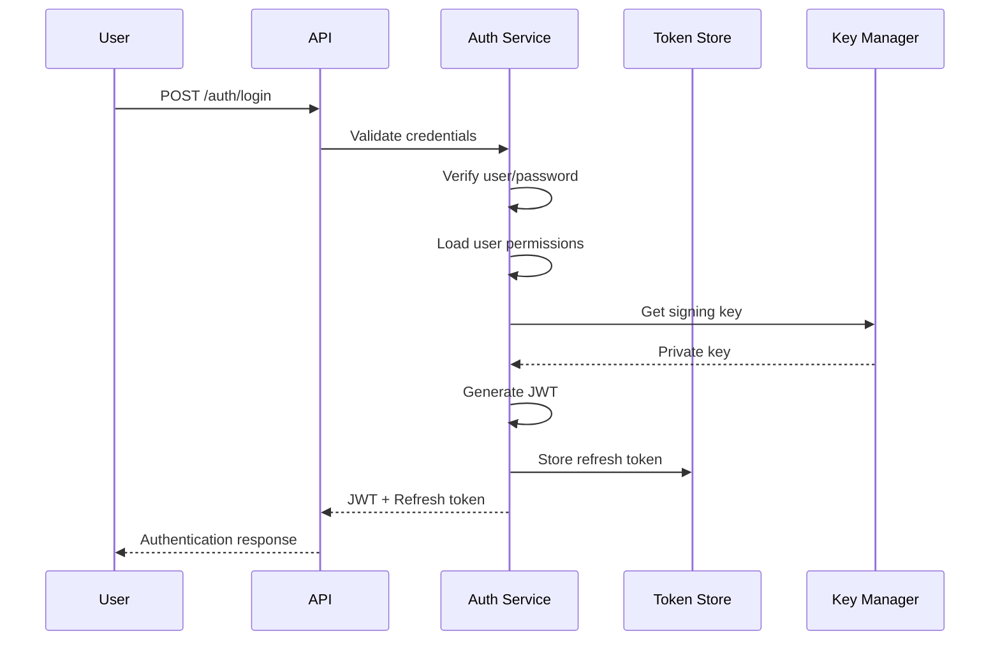
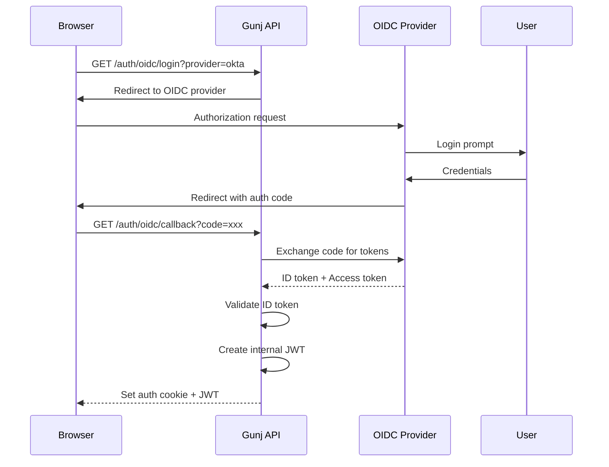
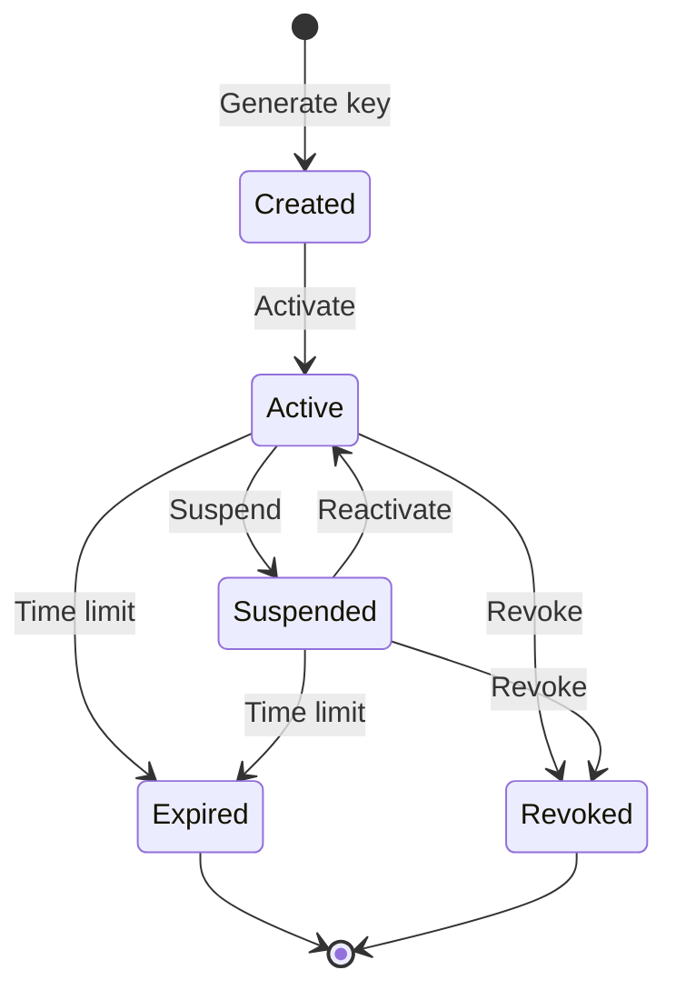
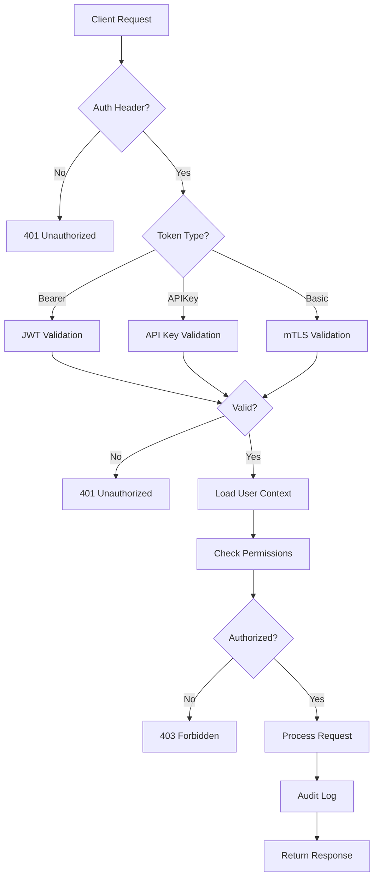
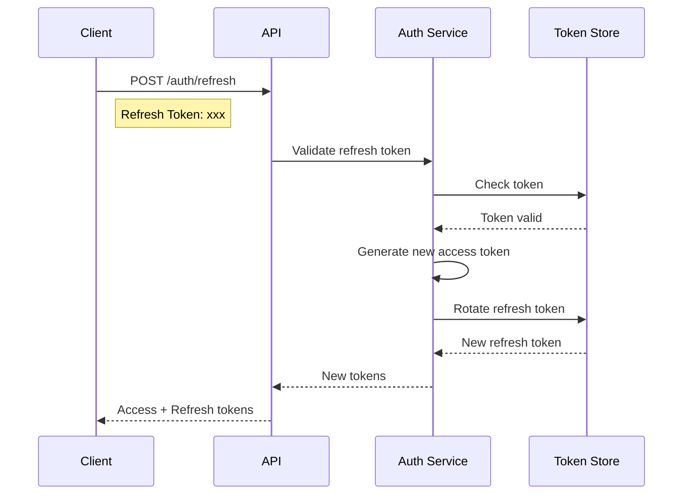

# Gunj Operator Authentication & Authorization Architecture

**Version**: 1.0.0  
**Date**: June 12, 2025  
**Status**: Draft  
**Author**: Gunjan JP  

## Table of Contents
1. [Overview](#overview)
2. [Authentication Methods](#authentication-methods)
3. [Authorization Model](#authorization-model)
4. [JWT Token Architecture](#jwt-token-architecture)
5. [OIDC Integration](#oidc-integration)
6. [API Key Management](#api-key-management)
7. [RBAC Implementation](#rbac-implementation)
8. [Security Flows](#security-flows)
9. [Integration Patterns](#integration-patterns)
10. [Security Best Practices](#security-best-practices)

## Overview

The Gunj Operator implements a comprehensive authentication and authorization system that provides:

- **Multiple Authentication Methods**: JWT, OIDC, API Keys, mTLS
- **Fine-grained Authorization**: RBAC with Kubernetes integration
- **Token Management**: Secure token generation, validation, and refresh
- **Audit Logging**: Complete audit trail of all access attempts
- **Multi-tenancy**: Namespace-based isolation and access control

### Architecture Principles

1. **Zero Trust**: Never trust, always verify
2. **Least Privilege**: Minimal permissions by default
3. **Defense in Depth**: Multiple security layers
4. **Separation of Concerns**: AuthN vs AuthZ
5. **Standards-based**: OAuth 2.0, OIDC, JWT

## Authentication Methods

### 1. JWT Bearer Tokens (Primary)

JWT tokens are the primary authentication method for interactive users and service accounts.

```yaml
# Token Structure
Header:
  alg: RS256
  typ: JWT
  kid: key-id-2025-06-12

Payload:
  # Standard Claims
  iss: https://gunj-operator.example.com
  sub: user:john.doe@example.com
  aud: gunj-operator-api
  exp: 1718236800  # 1 hour from issue
  iat: 1718233200
  jti: 550e8400-e29b-41d4-a716-446655440000
  
  # Custom Claims
  email: john.doe@example.com
  name: John Doe
  roles: ["platform-operator", "viewer"]
  permissions: ["platform:read", "platform:create"]
  namespaces: ["default", "monitoring", "production"]
  tenant: "acme-corp"
  
Signature: RS256(base64UrlEncode(header) + "." + base64UrlEncode(payload))
```

### 2. OIDC (OpenID Connect)

Integration with enterprise identity providers for SSO.

```yaml
# Supported Providers
providers:
  - name: okta
    issuer: https://dev-123456.okta.com
    clientId: gunj-operator
    scopes: ["openid", "profile", "email", "groups"]
    
  - name: auth0
    issuer: https://gunj-operator.auth0.com
    clientId: gunj-operator-client
    scopes: ["openid", "profile", "email"]
    
  - name: keycloak
    issuer: https://keycloak.example.com/auth/realms/gunj
    clientId: gunj-operator
    scopes: ["openid", "profile", "email", "roles"]
    
  - name: azure-ad
    issuer: https://login.microsoftonline.com/{tenant}/v2.0
    clientId: gunj-operator-app
    scopes: ["openid", "profile", "email", "User.Read"]
```

### 3. API Keys

For programmatic access and CI/CD pipelines.

```yaml
# API Key Structure
Format: gop_[environment]_[random]_[checksum]
Example: gop_prod_a1b2c3d4e5f6g7h8i9j0_x7y8z9

# API Key Metadata
apiKey:
  id: ak_550e8400-e29b-41d4-a716-446655440000
  name: "CI/CD Pipeline Key"
  description: "Used by GitLab CI for deployments"
  createdAt: "2025-06-12T10:00:00Z"
  expiresAt: "2026-06-12T10:00:00Z"
  lastUsed: "2025-06-12T14:30:00Z"
  scopes: ["platform:deploy", "platform:read"]
  namespaces: ["staging", "production"]
  rateLimit: 1000  # requests per hour
  ipWhitelist: ["10.0.0.0/8", "192.168.1.100"]
```

### 4. mTLS (Mutual TLS)

For service-to-service authentication.

```yaml
# Certificate Requirements
client_certificate:
  subject:
    CN: service-account:prometheus-scraper
    O: gunj-operator
    OU: monitoring
  extensions:
    subjectAltName:
      - DNS:prometheus.monitoring.svc.cluster.local
      - IP:10.96.0.10
  validity: 90 days
  keyUsage:
    - digitalSignature
    - keyEncipherment
  extKeyUsage:
    - clientAuth
```

### 5. Kubernetes Service Account Tokens

For in-cluster authentication.

```yaml
# Service Account Token Validation
serviceAccount:
  name: gunj-operator-controller
  namespace: gunj-system
  token: eyJhbGciOiJSUzI1NiIsImtpZCI6IiJ9...
  audiences: ["gunj-operator-api"]
  expirationSeconds: 3600
```

## Authorization Model

### RBAC Hierarchy

```yaml
# Role Definition
roles:
  # Super Admin - Full access
  - name: admin
    description: "Full administrative access"
    permissions: ["*"]
    
  # Platform Operator - Manage platforms
  - name: platform-operator
    description: "Create and manage observability platforms"
    permissions:
      - "platform:*"
      - "component:*"
      - "backup:create"
      - "backup:read"
      
  # Platform Viewer - Read-only access
  - name: platform-viewer
    description: "View platforms and metrics"
    permissions:
      - "platform:read"
      - "component:read"
      - "metrics:read"
      - "logs:read"
      
  # Cost Analyst - Financial visibility
  - name: cost-analyst
    description: "View cost and optimization data"
    permissions:
      - "platform:read"
      - "cost:read"
      - "recommendations:read"
      
  # Security Auditor - Compliance and audit
  - name: security-auditor
    description: "Audit access and compliance"
    permissions:
      - "audit:read"
      - "platform:read"
      - "webhook:read"
```

### Permission Structure

```yaml
# Permission Format: resource:action:scope
permissions:
  # Platform permissions
  - platform:create         # Create new platforms
  - platform:read          # View platforms
  - platform:update        # Update platform configuration
  - platform:delete        # Delete platforms
  - platform:backup        # Create backups
  - platform:restore       # Restore from backup
  - platform:upgrade       # Upgrade platform
  
  # Component permissions
  - component:read         # View component status
  - component:update       # Update component config
  - component:scale        # Scale components
  - component:restart      # Restart components
  
  # Monitoring permissions
  - metrics:read           # View metrics
  - logs:read             # View logs
  - traces:read           # View traces
  - alerts:read           # View alerts
  - alerts:create         # Create alert rules
  
  # Administrative permissions
  - user:create           # Create users
  - user:read            # View users
  - user:update          # Update users
  - user:delete          # Delete users
  - webhook:*            # Manage webhooks
  - audit:read           # View audit logs
```

### Namespace-based Access Control

```yaml
# Namespace Binding
namespaceBindings:
  - user: john.doe@example.com
    role: platform-operator
    namespaces:
      - production
      - staging
    
  - user: jane.smith@example.com
    role: platform-viewer
    namespaces:
      - "*"  # All namespaces
    
  - serviceAccount: monitoring-sa
    role: platform-viewer
    namespaces:
      - monitoring
```

## JWT Token Architecture

### Token Generation Flow



### Token Types

```yaml
# Access Token (Short-lived)
access_token:
  type: Bearer
  lifetime: 1 hour
  algorithm: RS256
  claims:
    standard: [iss, sub, aud, exp, iat, jti]
    custom: [email, roles, permissions, namespaces]
  usage: API requests
  
# Refresh Token (Long-lived)
refresh_token:
  type: Opaque
  lifetime: 30 days
  storage: Redis
  rotation: true  # Issue new refresh token on use
  usage: Obtain new access token
  
# ID Token (OIDC)
id_token:
  type: JWT
  lifetime: 1 hour
  algorithm: RS256
  claims:
    standard: [iss, sub, aud, exp, iat]
    profile: [name, email, picture]
  usage: User identity verification
```

### Token Validation

```go
// Token Validation Pipeline
func ValidateToken(token string) (*Claims, error) {
    // 1. Parse token
    parsed, err := jwt.Parse(token, keyFunc)
    if err != nil {
        return nil, ErrInvalidToken
    }
    
    // 2. Validate signature
    if !parsed.Valid {
        return nil, ErrInvalidSignature
    }
    
    // 3. Check expiration
    claims := parsed.Claims.(*Claims)
    if claims.ExpiresAt < time.Now().Unix() {
        return nil, ErrTokenExpired
    }
    
    // 4. Validate issuer
    if claims.Issuer != expectedIssuer {
        return nil, ErrInvalidIssuer
    }
    
    // 5. Check revocation
    if isRevoked(claims.JTI) {
        return nil, ErrTokenRevoked
    }
    
    // 6. Validate audience
    if !contains(claims.Audience, expectedAudience) {
        return nil, ErrInvalidAudience
    }
    
    return claims, nil
}
```

## OIDC Integration

### OIDC Flow



### OIDC Configuration

```yaml
# Operator OIDC Configuration
apiVersion: v1
kind: ConfigMap
metadata:
  name: gunj-operator-oidc
data:
  oidc.yaml: |
    providers:
      okta:
        issuer: https://dev-123456.okta.com
        clientId: ${OIDC_CLIENT_ID}
        clientSecret: ${OIDC_CLIENT_SECRET}
        redirectUri: https://api.gunj-operator.com/auth/oidc/callback
        scopes:
          - openid
          - profile
          - email
          - groups
        claimMappings:
          sub: sub
          email: email
          name: name
          groups: groups
        groupClaimPrefix: "okta:"
        requiredClaims:
          email_verified: true
```

### Group Mapping

```yaml
# OIDC Group to Role Mapping
groupMappings:
  # Okta groups
  "okta:platform-admins": admin
  "okta:platform-operators": platform-operator
  "okta:developers": platform-viewer
  
  # Azure AD groups
  "aad:it-operations": platform-operator
  "aad:finance-team": cost-analyst
  
  # Keycloak roles
  "keycloak:gunj-admin": admin
  "keycloak:gunj-operator": platform-operator
```

## API Key Management

### API Key Lifecycle



### API Key Storage

```yaml
# Database Schema
api_keys:
  id: UUID PRIMARY KEY
  key_hash: VARCHAR(64) UNIQUE NOT NULL  # SHA-256 hash
  name: VARCHAR(255) NOT NULL
  description: TEXT
  user_id: UUID REFERENCES users(id)
  scopes: JSONB  # ["platform:read", "platform:create"]
  namespaces: JSONB  # ["default", "production"]
  rate_limit: INTEGER DEFAULT 1000
  ip_whitelist: JSONB  # ["10.0.0.0/8"]
  metadata: JSONB
  created_at: TIMESTAMP NOT NULL
  expires_at: TIMESTAMP
  last_used_at: TIMESTAMP
  revoked_at: TIMESTAMP
  revoked_by: UUID REFERENCES users(id)
  revoke_reason: TEXT
  
api_key_usage:
  id: UUID PRIMARY KEY
  api_key_id: UUID REFERENCES api_keys(id)
  timestamp: TIMESTAMP NOT NULL
  ip_address: INET
  user_agent: TEXT
  endpoint: VARCHAR(255)
  status_code: INTEGER
  response_time_ms: INTEGER
```

### API Key Validation

```go
func ValidateAPIKey(key string) (*APIKeyContext, error) {
    // 1. Parse key format
    parts := strings.Split(key, "_")
    if len(parts) != 4 || parts[0] != "gop" {
        return nil, ErrInvalidKeyFormat
    }
    
    // 2. Validate checksum
    if !validateChecksum(key) {
        return nil, ErrInvalidChecksum
    }
    
    // 3. Look up key in database
    keyHash := sha256.Sum256([]byte(key))
    apiKey, err := db.GetAPIKeyByHash(hex.EncodeToString(keyHash[:]))
    if err != nil {
        return nil, ErrKeyNotFound
    }
    
    // 4. Check expiration
    if apiKey.ExpiresAt != nil && apiKey.ExpiresAt.Before(time.Now()) {
        return nil, ErrKeyExpired
    }
    
    // 5. Check revocation
    if apiKey.RevokedAt != nil {
        return nil, ErrKeyRevoked
    }
    
    // 6. Check IP whitelist
    if !checkIPWhitelist(apiKey.IPWhitelist, clientIP) {
        return nil, ErrIPNotAllowed
    }
    
    // 7. Update last used
    go db.UpdateAPIKeyLastUsed(apiKey.ID)
    
    return &APIKeyContext{
        KeyID:      apiKey.ID,
        UserID:     apiKey.UserID,
        Scopes:     apiKey.Scopes,
        Namespaces: apiKey.Namespaces,
        RateLimit:  apiKey.RateLimit,
    }, nil
}
```

## RBAC Implementation

### Kubernetes RBAC Integration

```yaml
# ClusterRole for Gunj Operator
apiVersion: rbac.authorization.k8s.io/v1
kind: ClusterRole
metadata:
  name: gunj-operator-admin
rules:
  # CRD permissions
  - apiGroups: ["observability.io"]
    resources: ["observabilityplatforms"]
    verbs: ["*"]
  
  # Core resources
  - apiGroups: [""]
    resources: ["namespaces", "configmaps", "secrets", "services"]
    verbs: ["get", "list", "watch", "create", "update", "patch"]
    
  # Apps resources
  - apiGroups: ["apps"]
    resources: ["deployments", "statefulsets", "daemonsets"]
    verbs: ["*"]
    
  # Monitoring resources
  - apiGroups: ["monitoring.coreos.com"]
    resources: ["prometheuses", "alertmanagers", "servicemonitors"]
    verbs: ["*"]

---
# RoleBinding for namespace-scoped access
apiVersion: rbac.authorization.k8s.io/v1
kind: RoleBinding
metadata:
  name: gunj-platform-operator
  namespace: production
subjects:
  - kind: User
    name: john.doe@example.com
    apiGroup: rbac.authorization.k8s.io
  - kind: ServiceAccount
    name: platform-operator-sa
    namespace: gunj-system
roleRef:
  kind: ClusterRole
  name: gunj-operator-platform-operator
  apiGroup: rbac.authorization.k8s.io
```

### Permission Evaluation

```go
// Permission Check Pipeline
func HasPermission(ctx context.Context, resource, action string) bool {
    // 1. Extract user context
    user := GetUserFromContext(ctx)
    if user == nil {
        return false
    }
    
    // 2. Check super admin
    if contains(user.Roles, "admin") {
        return true
    }
    
    // 3. Build required permission
    permission := fmt.Sprintf("%s:%s", resource, action)
    
    // 4. Check direct permissions
    if contains(user.Permissions, permission) {
        return true
    }
    
    // 5. Check wildcard permissions
    if contains(user.Permissions, fmt.Sprintf("%s:*", resource)) {
        return true
    }
    
    // 6. Check role-based permissions
    for _, role := range user.Roles {
        rolePerms := getRolePermissions(role)
        if contains(rolePerms, permission) {
            return true
        }
    }
    
    // 7. Check namespace-scoped permissions
    namespace := GetNamespaceFromContext(ctx)
    if namespace != "" {
        if hasNamespacePermission(user, namespace, permission) {
            return true
        }
    }
    
    // 8. Audit the check
    auditPermissionCheck(user, resource, action, false)
    
    return false
}
```

### Dynamic Permission Loading

```yaml
# Permission Configuration
apiVersion: v1
kind: ConfigMap
metadata:
  name: gunj-operator-rbac
data:
  roles.yaml: |
    roles:
      platform-operator:
        description: "Manage observability platforms"
        permissions:
          - platform:create
          - platform:read
          - platform:update
          - platform:delete
          - component:*
          - backup:create
          - backup:read
          
      cost-viewer:
        description: "View cost analysis"
        permissions:
          - platform:read
          - cost:read
          - recommendations:read
  
  bindings.yaml: |
    bindings:
      - subject:
          kind: User
          name: john.doe@example.com
        roleRef:
          name: platform-operator
        namespaces:
          - production
          - staging
```

## Security Flows

### Authentication Flow



### Token Refresh Flow



### Multi-Factor Authentication

```yaml
# MFA Configuration
mfa:
  required: true
  methods:
    - type: totp
      name: "Authenticator App"
      enabled: true
      
    - type: sms
      name: "SMS Code"
      enabled: true
      provider: twilio
      
    - type: email
      name: "Email Code"
      enabled: true
      
    - type: webauthn
      name: "Security Key"
      enabled: true
      
  policy:
    enforcement: adaptive  # always, never, adaptive
    riskFactors:
      - newDevice: 10
      - newLocation: 20
      - impossibleTravel: 50
      - suspiciousIP: 30
    threshold: 25  # Require MFA if risk score >= 25
```

## Integration Patterns

### REST API Integration

```go
// Gin Middleware for REST API
func AuthMiddleware() gin.HandlerFunc {
    return func(c *gin.Context) {
        // 1. Extract token
        token, err := extractToken(c.Request)
        if err != nil {
            c.AbortWithStatusJSON(401, gin.H{
                "error": "Missing authentication",
            })
            return
        }
        
        // 2. Validate token
        claims, err := validateToken(token)
        if err != nil {
            c.AbortWithStatusJSON(401, gin.H{
                "error": "Invalid token",
                "details": err.Error(),
            })
            return
        }
        
        // 3. Set user context
        c.Set("user", claims)
        c.Set("namespaces", claims.Namespaces)
        
        // 4. Continue
        c.Next()
    }
}

// RBAC Middleware
func RequirePermission(resource, action string) gin.HandlerFunc {
    return func(c *gin.Context) {
        user := c.MustGet("user").(*Claims)
        
        if !hasPermission(user, resource, action) {
            c.AbortWithStatusJSON(403, gin.H{
                "error": "Insufficient permissions",
                "required": fmt.Sprintf("%s:%s", resource, action),
            })
            return
        }
        
        c.Next()
    }
}
```

### GraphQL Integration

```go
// GraphQL Directive Implementation
func HasRoleDirective(next graphql.Resolver, roles []string) graphql.Resolver {
    return func(ctx context.Context, args interface{}) (interface{}, error) {
        user := GetUserFromContext(ctx)
        if user == nil {
            return nil, ErrUnauthenticated
        }
        
        for _, role := range roles {
            if contains(user.Roles, role) {
                return next(ctx, args)
            }
        }
        
        return nil, ErrUnauthorized
    }
}

// GraphQL Context Enrichment
func AuthContextMiddleware(next http.Handler) http.Handler {
    return http.HandlerFunc(func(w http.ResponseWriter, r *http.Request) {
        // Extract and validate token
        token, err := extractToken(r)
        if err != nil {
            // Allow unauthenticated access for public queries
            next.ServeHTTP(w, r)
            return
        }
        
        claims, err := validateToken(token)
        if err != nil {
            http.Error(w, "Invalid token", 401)
            return
        }
        
        // Enrich context
        ctx := context.WithValue(r.Context(), "user", claims)
        ctx = context.WithValue(ctx, "permissions", claims.Permissions)
        
        next.ServeHTTP(w, r.WithContext(ctx))
    })
}
```

### Kubernetes Integration

```go
// ServiceAccount Token Review
func ValidateServiceAccountToken(token string) (*Claims, error) {
    // Create TokenReview
    tr := &authv1.TokenReview{
        Spec: authv1.TokenReviewSpec{
            Token: token,
            Audiences: []string{"gunj-operator-api"},
        },
    }
    
    // Submit to Kubernetes API
    result, err := k8sClient.AuthenticationV1().
        TokenReviews().
        Create(context.TODO(), tr, metav1.CreateOptions{})
    
    if err != nil {
        return nil, err
    }
    
    if !result.Status.Authenticated {
        return nil, ErrInvalidServiceAccount
    }
    
    // Convert to internal claims
    return &Claims{
        Subject:     result.Status.User.Username,
        Groups:      result.Status.User.Groups,
        Namespaces:  extractNamespaces(result.Status.User),
        Permissions: mapGroupsToPermissions(result.Status.User.Groups),
    }, nil
}
```

## Security Best Practices

### 1. Token Security

```yaml
# Token Best Practices
tokens:
  access_token:
    algorithm: RS256  # Asymmetric signing
    keyRotation: 90d  # Rotate signing keys
    keySize: 4096    # RSA key size
    lifetime: 1h     # Short-lived
    jtiTracking: true # Prevent replay attacks
    
  refresh_token:
    storage: encrypted  # Encrypt at rest
    rotation: true      # One-time use
    lifetime: 30d       # Reasonable expiry
    bindToIP: false     # Don't bind to IP (mobile friendly)
    
  security_headers:
    - "X-Content-Type-Options: nosniff"
    - "X-Frame-Options: DENY"
    - "Strict-Transport-Security: max-age=31536000"
    - "Content-Security-Policy: default-src 'self'"
```

### 2. Rate Limiting

```yaml
# Rate Limit Configuration
rateLimiting:
  # Global limits
  global:
    requests: 10000
    window: 1h
    
  # Per-user limits
  authenticated:
    requests: 1000
    window: 1h
    
  # Per-API key limits
  apiKey:
    default: 1000
    window: 1h
    custom:  # Can be overridden per key
      
  # Endpoint-specific limits
  endpoints:
    "/auth/login":
      requests: 10
      window: 15m
      
    "/api/v1/platforms":
      POST:
        requests: 100
        window: 1h
      GET:
        requests: 1000
        window: 1h
```

### 3. Audit Logging

```yaml
# Audit Log Schema
audit_logs:
  id: UUID
  timestamp: TIMESTAMP
  event_type: VARCHAR(50)  # auth.login, auth.logout, permission.check
  user_id: UUID
  username: VARCHAR(255)
  ip_address: INET
  user_agent: TEXT
  resource: VARCHAR(255)
  action: VARCHAR(50)
  result: VARCHAR(20)  # success, failure, denied
  details: JSONB
  request_id: UUID
  session_id: UUID
  
# Audit Events
events:
  - auth.login.success
  - auth.login.failure
  - auth.logout
  - auth.token.refresh
  - auth.mfa.required
  - auth.mfa.success
  - permission.check.denied
  - api_key.created
  - api_key.revoked
  - role.assigned
  - role.revoked
```

### 4. Security Headers

```go
// Security Headers Middleware
func SecurityHeaders() gin.HandlerFunc {
    return func(c *gin.Context) {
        // Prevent XSS
        c.Header("X-Content-Type-Options", "nosniff")
        c.Header("X-XSS-Protection", "1; mode=block")
        
        // Prevent Clickjacking
        c.Header("X-Frame-Options", "DENY")
        
        // Force HTTPS
        c.Header("Strict-Transport-Security", "max-age=31536000; includeSubDomains")
        
        // Content Security Policy
        c.Header("Content-Security-Policy", 
            "default-src 'self'; "+
            "script-src 'self' 'unsafe-inline' 'unsafe-eval'; "+
            "style-src 'self' 'unsafe-inline'; "+
            "img-src 'self' data: https:; "+
            "font-src 'self'; "+
            "connect-src 'self' wss://;")
        
        // Referrer Policy
        c.Header("Referrer-Policy", "strict-origin-when-cross-origin")
        
        // Permissions Policy
        c.Header("Permissions-Policy", 
            "accelerometer=(), camera=(), geolocation=(), "+
            "gyroscope=(), magnetometer=(), microphone=(), "+
            "payment=(), usb=()")
        
        c.Next()
    }
}
```

### 5. Secrets Management

```yaml
# Secret Storage Strategy
secrets:
  # JWT Signing Keys
  jwt_keys:
    storage: Kubernetes Secret
    rotation: Automatic (90 days)
    backup: HashiCorp Vault
    
  # OIDC Client Secrets
  oidc_secrets:
    storage: Kubernetes Secret
    encryption: Sealed Secrets
    access: RBAC controlled
    
  # API Keys
  api_keys:
    storage: PostgreSQL (encrypted)
    encryption: AES-256-GCM
    key_derivation: Argon2id
    
  # TLS Certificates
  tls_certs:
    storage: Kubernetes Secret
    type: kubernetes.io/tls
    renewal: cert-manager
    
  # Database Credentials
  db_credentials:
    storage: External Secrets Operator
    backend: AWS Secrets Manager
    rotation: Automatic (30 days)
```

## Implementation Checklist

### Phase 1: Core Authentication (Week 1)
- [ ] JWT token generation and validation
- [ ] User authentication endpoint
- [ ] Token refresh mechanism
- [ ] Basic RBAC implementation
- [ ] Authentication middleware

### Phase 2: OIDC Integration (Week 2)
- [ ] OIDC provider configuration
- [ ] OAuth2 flow implementation
- [ ] Group mapping logic
- [ ] Session management
- [ ] SSO testing

### Phase 3: API Key Management (Week 3)
- [ ] API key generation
- [ ] Key validation logic
- [ ] Rate limiting per key
- [ ] Key rotation API
- [ ] Usage tracking

### Phase 4: Advanced Security (Week 4)
- [ ] mTLS implementation
- [ ] MFA support
- [ ] Audit logging
- [ ] Security headers
- [ ] Penetration testing

## Security Compliance

### Standards Compliance
- **OAuth 2.0**: RFC 6749
- **OpenID Connect**: Core 1.0
- **JWT**: RFC 7519
- **OWASP**: Top 10 compliance
- **CIS**: Kubernetes Benchmark

### Security Certifications
- SOC 2 Type II ready
- ISO 27001 compliant
- GDPR compliant
- HIPAA ready (with configuration)