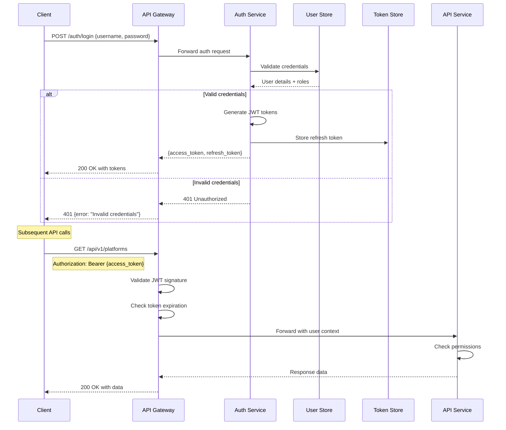
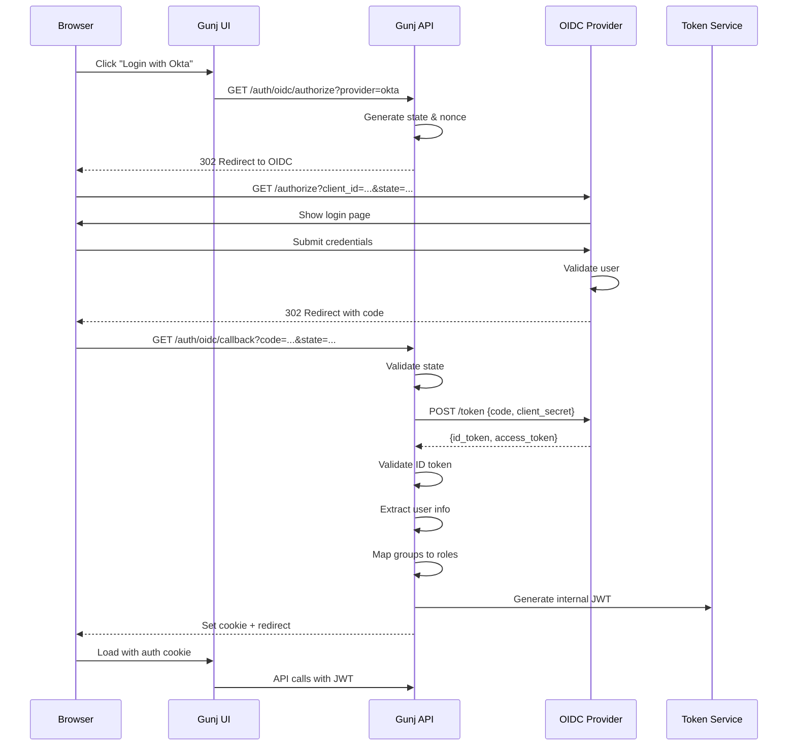
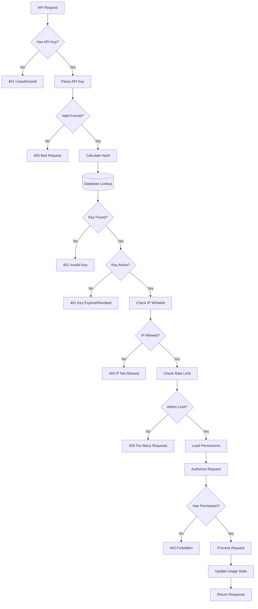
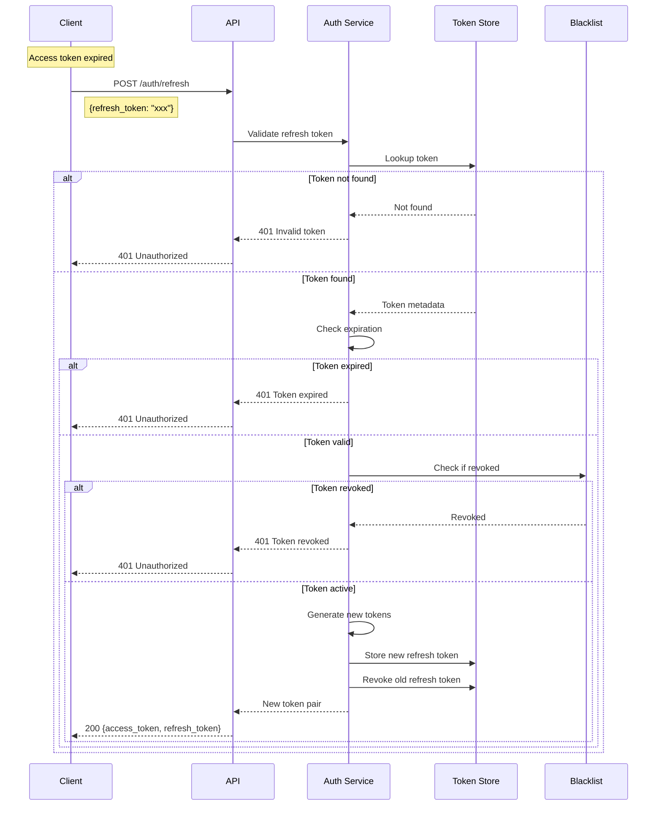
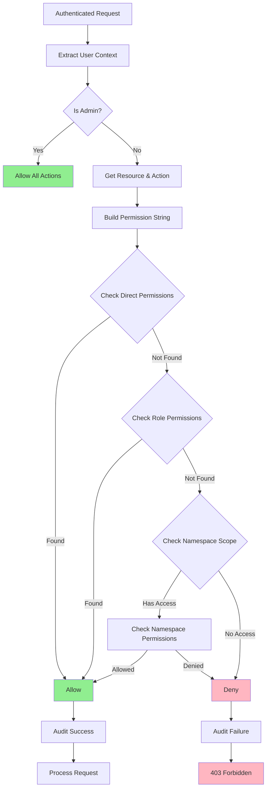
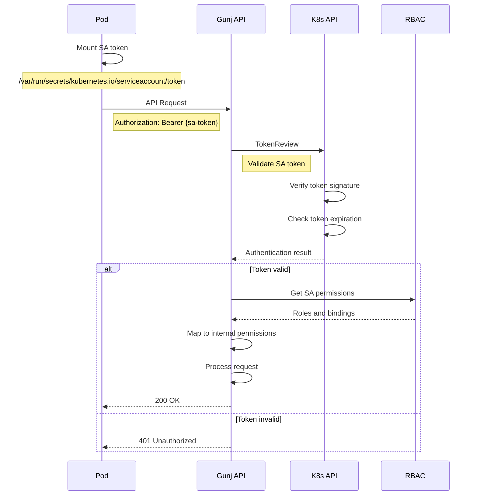
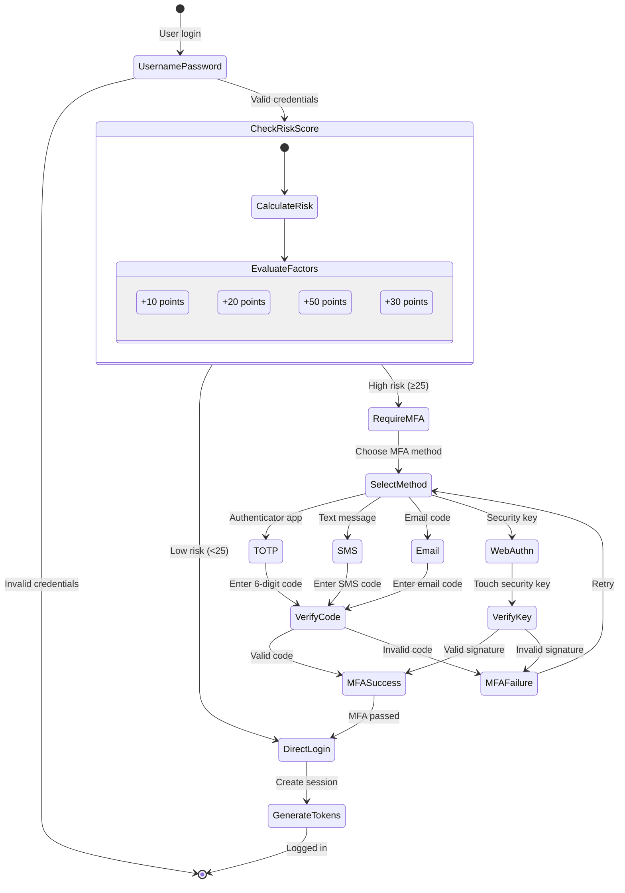
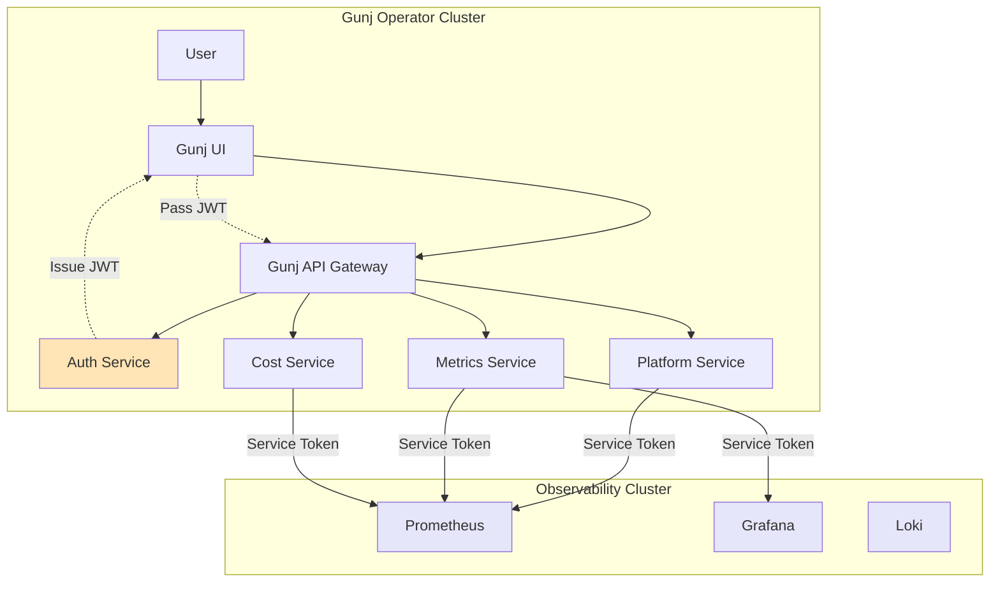
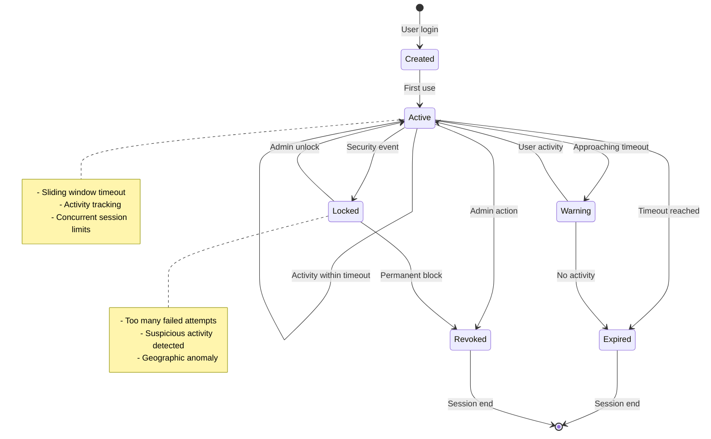
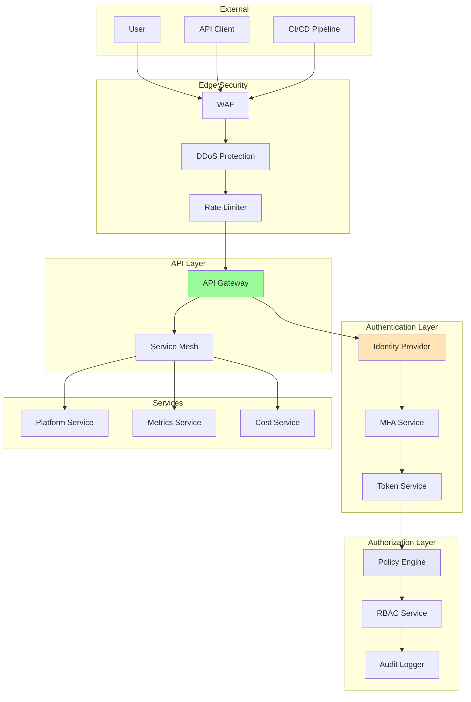

# Authentication Flow Diagrams

This document provides visual representations of the authentication and authorization flows in the Gunj Operator.

## 1. JWT Authentication Flow

## 2. OIDC Authentication Flow

## 3. API Key Authentication Flow

## 4. Token Refresh Flow

## 5. RBAC Authorization Flow

## 6. Service Account Authentication

## 7. Multi-Factor Authentication Flow

## 8. Cross-Service Authentication

## 9. Session Management Lifecycle

## 10. Zero Trust Security Model

## Implementation Notes

1. **Token Storage**: All tokens are stored encrypted at rest
2. **Transport Security**: All communication uses TLS 1.3
3. **Audit Logging**: Every authentication event is logged
4. **Rate Limiting**: Applied at multiple layers
5. **Session Management**: Configurable timeout with sliding window
6. **Key Rotation**: Automatic rotation for signing keys
7. **Monitoring**: Real-time alerts for auth anomalies