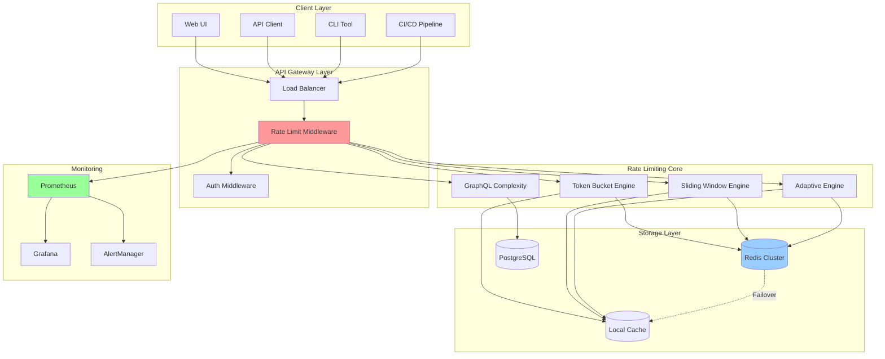
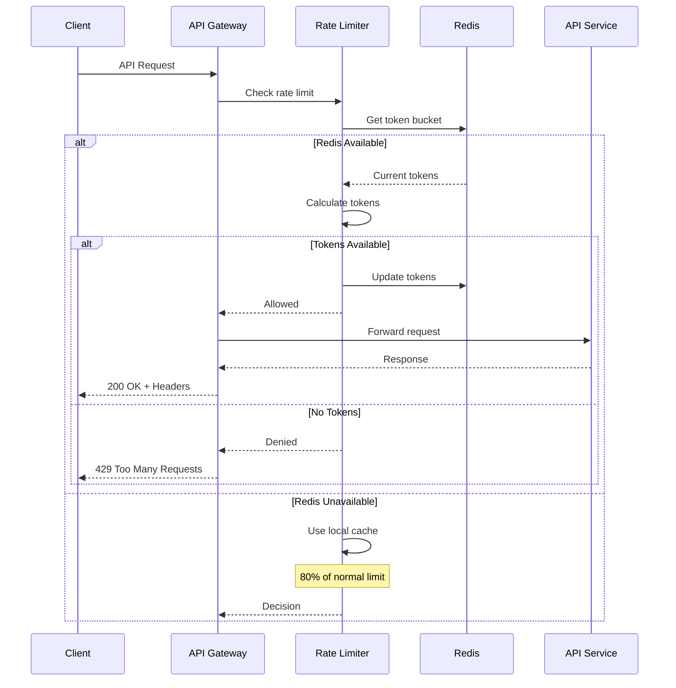
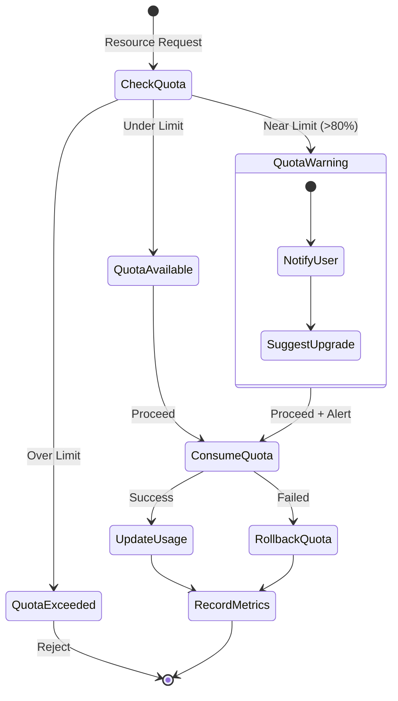

# Rate Limiting Architecture Diagram



## Rate Limiting Flow



## Quota Management Flow



## Implementation Architecture

```
┌─────────────────────────────────────────────────────────────┐
│                      Rate Limiting System                     │
├─────────────────────────────────────────────────────────────┤
│                                                               │
│  ┌─────────────┐  ┌──────────────┐  ┌───────────────┐      │
│  │   Ingress   │  │   Strategy   │  │   GraphQL     │      │
│  │  Middleware │  │   Selector   │  │  Complexity   │      │
│  └──────┬──────┘  └──────┬───────┘  └───────┬───────┘      │
│         │                 │                   │               │
│         ▼                 ▼                   ▼               │
│  ┌─────────────────────────────────────────────────┐        │
│  │              Rate Limiter Core                   │        │
│  │  ┌─────────┐ ┌─────────┐ ┌─────────┐ ┌────────┐│        │
│  │  │  Token  │ │ Sliding │ │  Fixed  │ │Adaptive││        │
│  │  │ Bucket  │ │ Window  │ │ Window  │ │ Limiter││        │
│  │  └─────────┘ └─────────┘ └─────────┘ └────────┘│        │
│  └─────────────────────────────────────────────────┘        │
│                           │                                   │
│                           ▼                                   │
│  ┌─────────────────────────────────────────────────┐        │
│  │              Storage Abstraction                 │        │
│  │  ┌─────────┐ ┌─────────┐ ┌─────────┐ ┌────────┐│        │
│  │  │  Redis  │ │  Local  │ │Postgres │ │ Memory ││        │
│  │  │ Driver  │ │  Cache  │ │ Driver  │ │ Store  ││        │
│  │  └─────────┘ └─────────┘ └─────────┘ └────────┘│        │
│  └─────────────────────────────────────────────────┘        │
│                                                               │
└─────────────────────────────────────────────────────────────┘
```