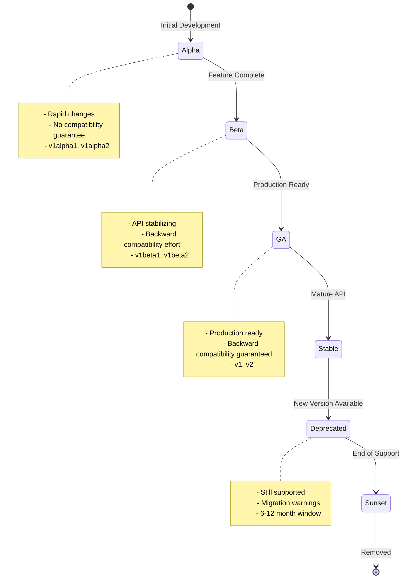

# Gunj Operator API Versioning Strategy

**Version**: 1.0.0  
**Date**: June 12, 2025  
**Status**: Draft  
**Author**: Gunjan JP  

## Table of Contents
1. [Overview](#overview)
2. [Versioning Principles](#versioning-principles)
3. [REST API Versioning](#rest-api-versioning)
4. [GraphQL API Versioning](#graphql-api-versioning)
5. [CRD Versioning](#crd-versioning)
6. [Backward Compatibility](#backward-compatibility)
7. [Deprecation Policy](#deprecation-policy)
8. [Migration Strategies](#migration-strategies)
9. [Version Discovery](#version-discovery)
10. [Implementation Guidelines](#implementation-guidelines)

## Overview

The Gunj Operator API versioning strategy ensures that our APIs can evolve to meet new requirements while maintaining stability and backward compatibility for existing users. This document defines how we version our REST APIs, GraphQL APIs, and Kubernetes CRDs.

### Goals

1. **Stability**: Existing integrations continue to work
2. **Evolution**: APIs can grow and improve
3. **Clarity**: Version changes are well-communicated
4. **Flexibility**: Support multiple versions simultaneously
5. **Migration**: Clear paths for upgrading
6. **Discovery**: Easy version detection

## Versioning Principles

### Semantic Versioning

We follow semantic versioning (SemVer) for all API versions:

```
MAJOR.MINOR.PATCH

Example: v2.1.3
- MAJOR (2): Breaking changes
- MINOR (1): New features (backward compatible)
- PATCH (3): Bug fixes (backward compatible)
```

### Version Lifecycle



### Breaking Change Definition

A breaking change is any modification that requires clients to update their code:

- Removing endpoints or fields
- Changing field types or formats
- Modifying required fields
- Changing authentication methods
- Altering response structures
- Removing enum values

Non-breaking changes:
- Adding new endpoints
- Adding optional fields
- Adding enum values
- Performance improvements
- Bug fixes

## REST API Versioning

### Version in URL Path

We use URL path versioning for clear version identification:

```
https://api.gunj-operator.com/api/v1/platforms
https://api.gunj-operator.com/api/v2/platforms
```

### Version Format

```yaml
# API Version Structure
versions:
  # Stable versions
  - v1      # Current stable
  - v2      # Next major version
  
  # Beta versions
  - v2beta1 # Beta for v2
  - v2beta2 # Updated beta
  
  # Alpha versions
  - v3alpha1 # Early development
```

### URL Structure

```
https://api.gunj-operator.com/api/{version}/{resource}

Examples:
- /api/v1/platforms
- /api/v2/platforms
- /api/v2beta1/platforms
```

### Header-Based Version Negotiation

Support version selection via headers:

```http
# Request specific version
GET /api/platforms
Accept: application/vnd.gunj.v2+json

# Request with version range
GET /api/platforms
Accept: application/vnd.gunj.v2.1-v2.5+json
```

### Response Version Headers

```http
HTTP/1.1 200 OK
Content-Type: application/json
X-API-Version: v2
X-API-Deprecated: false
X-API-Sunset: 2026-06-12
X-API-Latest: v3
```

### Version-Specific Changes

```yaml
# Version change examples
v1:
  endpoint: /api/v1/platforms
  response:
    id: string
    name: string
    status: string
    
v2:
  endpoint: /api/v2/platforms
  response:
    id: string          # Same
    name: string        # Same
    status:            # Changed: now object
      phase: string
      message: string
    metadata:          # Added: new field
      labels: object
      annotations: object
```

## GraphQL API Versioning

### Evolution Without Versioning

GraphQL APIs evolve through field deprecation rather than versioning:

```graphql
type Platform {
  id: ID!
  name: String!
  
  # Deprecated field
  status: String @deprecated(reason: "Use statusInfo instead")
  
  # New field replacing status
  statusInfo: PlatformStatus!
  
  # Added field (non-breaking)
  metadata: PlatformMetadata
}
```

### Schema Versioning Strategy

```graphql
# Option 1: Field Arguments for Versions
type Query {
  # Version via argument
  platforms(version: ApiVersion = V2): [Platform!]!
  
  # Version-specific types
  platformsV1: [PlatformV1!]! @deprecated(reason: "Use platforms(version: V1)")
  platformsV2: [PlatformV2!]!
}

enum ApiVersion {
  V1 @deprecated(reason: "Use V2 or later")
  V2
  V3
}
```

### Type Versioning

```graphql
# Version-specific types when needed
interface Platform {
  id: ID!
  name: String!
}

type PlatformV1 implements Platform {
  id: ID!
  name: String!
  status: String! # Old field
}

type PlatformV2 implements Platform {
  id: ID!
  name: String!
  statusInfo: PlatformStatus! # New structure
  metadata: PlatformMetadata
}

union PlatformResult = PlatformV1 | PlatformV2
```

### Deprecation Directives

```graphql
# Custom deprecation directive with metadata
directive @deprecatedWithInfo(
  reason: String!
  removeAt: DateTime!
  migration: String!
) on FIELD_DEFINITION | ENUM_VALUE

type Platform {
  oldField: String @deprecatedWithInfo(
    reason: "Field restructured for clarity"
    removeAt: "2026-06-12T00:00:00Z"
    migration: "Use newField instead"
  )
  
  newField: StructuredField!
}
```

## CRD Versioning

### Kubernetes API Versioning

Follow Kubernetes conventions for CRD versioning:

```yaml
apiVersion: apiextensions.k8s.io/v1
kind: CustomResourceDefinition
metadata:
  name: observabilityplatforms.observability.io
spec:
  group: observability.io
  versions:
  # Stable version (storage version)
  - name: v1
    served: true
    storage: true
    schema:
      openAPIV3Schema:
        type: object
        properties:
          spec:
            type: object
            
  # Beta version
  - name: v1beta1
    served: true
    storage: false
    deprecated: true
    deprecationWarning: "v1beta1 is deprecated; use v1"
    schema:
      openAPIV3Schema:
        type: object
        
  # Alpha version (development only)
  - name: v1alpha1
    served: false  # Disabled in production
    storage: false
    schema:
      openAPIV3Schema:
        type: object
        
  conversion:
    strategy: Webhook
    webhook:
      clientConfig:
        service:
          name: gunj-webhook-service
          namespace: gunj-system
      conversionReviewVersions: ["v1", "v1beta1"]
```

### Conversion Webhooks

```go
// pkg/webhook/conversion.go
package webhook

import (
    "context"
    
    v1 "github.com/gunjanjp/gunj-operator/api/v1"
    v1beta1 "github.com/gunjanjp/gunj-operator/api/v1beta1"
)

// ConvertTo converts from v1beta1 to v1 (hub)
func (src *v1beta1.ObservabilityPlatform) ConvertTo(dstRaw conversion.Hub) error {
    dst := dstRaw.(*v1.ObservabilityPlatform)
    
    // Direct field mapping
    dst.ObjectMeta = src.ObjectMeta
    
    // Convert spec with schema changes
    dst.Spec.Components = convertComponentsToV1(src.Spec.Components)
    
    // Handle new fields with defaults
    if dst.Spec.Monitoring == nil {
        dst.Spec.Monitoring = &v1.MonitoringConfig{
            Enabled: true,
        }
    }
    
    // Convert status
    dst.Status = convertStatusToV1(src.Status)
    
    return nil
}

// ConvertFrom converts from v1 (hub) to v1beta1
func (dst *v1beta1.ObservabilityPlatform) ConvertFrom(srcRaw conversion.Hub) error {
    src := srcRaw.(*v1.ObservabilityPlatform)
    
    // Reverse conversion with potential data loss
    dst.ObjectMeta = src.ObjectMeta
    
    // Store unconvertible fields in annotations
    if src.Spec.Monitoring != nil && !src.Spec.Monitoring.Enabled {
        if dst.Annotations == nil {
            dst.Annotations = make(map[string]string)
        }
        dst.Annotations["observability.io/monitoring-disabled"] = "true"
    }
    
    return nil
}
```

## Backward Compatibility

### Compatibility Matrix

```yaml
# Client-Server Compatibility
compatibility:
  # Server v2 supports these client versions
  server_v2:
    supported_clients:
      - v2.x.x    # Full compatibility
      - v1.5+     # Supported with warnings
      - v1.0-1.4  # Limited support
    unsupported:
      - v0.x      # Not supported
      
  # Client v2 works with these servers
  client_v2:
    supported_servers:
      - v2.x.x    # Full compatibility
      - v3.x.x    # Forward compatible
    degraded:
      - v1.x.x    # Fallback mode
```

### Compatibility Guarantees

```yaml
guarantees:
  # Within major version
  major_version:
    promise: "No breaking changes within major version"
    example: "v2.0.0 → v2.5.0 compatible"
    
  # Beta versions
  beta:
    promise: "Best effort compatibility between betas"
    example: "v2beta1 → v2beta2 may have changes"
    
  # Alpha versions
  alpha:
    promise: "No compatibility guarantee"
    example: "v3alpha1 → v3alpha2 can break"
    
  # Cross-version
  cross_version:
    promise: "N-1 version support"
    example: "v2 server supports v1 clients"
```

### Feature Detection

```go
// Client-side feature detection
type APIClient struct {
    version    string
    features   map[string]bool
}

func (c *APIClient) Initialize() error {
    // Discover API version
    info, err := c.getVersionInfo()
    if err != nil {
        return err
    }
    
    c.version = info.Version
    c.features = info.Features
    
    return nil
}

func (c *APIClient) SupportsFeature(feature string) bool {
    return c.features[feature]
}

// Usage
if client.SupportsFeature("costAnalysis") {
    cost, err := client.GetCostAnalysis(platform)
} else {
    // Fallback to estimation
    cost = estimateCost(platform)
}
```

## Deprecation Policy

### Deprecation Timeline

```yaml
deprecation_timeline:
  # Announcement
  announcement:
    when: "New version GA"
    how:
      - Release notes
      - API responses
      - Documentation
      - Email notification
      
  # Warning period
  warning:
    duration: "6 months minimum"
    actions:
      - Deprecation headers
      - Console warnings
      - Metric tracking
      
  # Sunset period
  sunset:
    duration: "3 months"
    actions:
      - Sunset headers
      - Increased warnings
      - Migration reminders
      
  # Removal
  removal:
    when: "After sunset period"
    requirements:
      - "< 5% usage"
      - "Migration path available"
      - "Major version bump"
```

### Deprecation Headers

```http
# Deprecated endpoint response
HTTP/1.1 200 OK
Deprecation: true
Sunset: Sat, 12 Jun 2026 00:00:00 GMT
Link: <https://docs.gunj-operator.com/migrations/v2>; rel="deprecation"
Warning: 299 - "This endpoint is deprecated. Use /api/v2/platforms"
```

### Deprecation Notices

```json
{
  "data": {
    "platforms": [...]
  },
  "_deprecation": {
    "message": "This endpoint is deprecated",
    "since": "2025-12-01",
    "removal": "2026-06-12",
    "migration": "https://docs.gunj-operator.com/migrations/v2",
    "alternative": "/api/v2/platforms"
  }
}
```

## Migration Strategies

### Client Migration Path

```yaml
# Step-by-step migration
migration_steps:
  1_preparation:
    - Review breaking changes
    - Update client libraries
    - Test in staging
    
  2_dual_write:
    - Support both versions
    - Add feature flags
    - Monitor compatibility
    
  3_gradual_rollout:
    - Enable for subset
    - Monitor metrics
    - Gather feedback
    
  4_full_migration:
    - Switch all traffic
    - Disable old code
    - Clean up
```

### Migration Tools

```go
// pkg/migration/v1tov2/migrator.go
package v1tov2

type Migrator struct {
    v1Client *v1.Client
    v2Client *v2.Client
}

func (m *Migrator) MigratePlatform(ctx context.Context, v1Platform *v1.Platform) (*v2.Platform, error) {
    // Transform v1 to v2
    v2Platform := &v2.Platform{
        ID:   v1Platform.ID,
        Name: v1Platform.Name,
        
        // New structure
        StatusInfo: &v2.PlatformStatus{
            Phase:   mapStatusToPhase(v1Platform.Status),
            Message: generateMessage(v1Platform.Status),
        },
        
        // New fields with defaults
        Metadata: &v2.PlatformMetadata{
            Labels:      make(map[string]string),
            Annotations: make(map[string]string),
        },
    }
    
    // Validate transformation
    if err := v2Platform.Validate(); err != nil {
        return nil, fmt.Errorf("validation failed: %w", err)
    }
    
    return v2Platform, nil
}

// Batch migration with progress
func (m *Migrator) MigrateAll(ctx context.Context, progress chan<- MigrationProgress) error {
    platforms, err := m.v1Client.ListAllPlatforms(ctx)
    if err != nil {
        return err
    }
    
    total := len(platforms)
    for i, p := range platforms {
        v2p, err := m.MigratePlatform(ctx, p)
        if err != nil {
            progress <- MigrationProgress{
                Current: i,
                Total:   total,
                Error:   err,
            }
            continue
        }
        
        if err := m.v2Client.CreatePlatform(ctx, v2p); err != nil {
            progress <- MigrationProgress{
                Current: i,
                Total:   total,
                Error:   err,
            }
            continue
        }
        
        progress <- MigrationProgress{
            Current: i + 1,
            Total:   total,
            Success: true,
        }
    }
    
    return nil
}
```

### API Bridge

```go
// pkg/apibridge/bridge.go
package apibridge

// Bridge translates between API versions
type Bridge struct {
    v1Handler http.Handler
    v2Handler http.Handler
}

func (b *Bridge) ServeHTTP(w http.ResponseWriter, r *http.Request) {
    // Determine requested version
    version := extractVersion(r)
    
    switch version {
    case "v1":
        // Check if client accepts v2
        if acceptsVersion(r, "v2") {
            w.Header().Set("X-API-Version-Supported", "v2")
            w.Header().Set("X-API-Migration-Available", "true")
        }
        b.v1Handler.ServeHTTP(w, r)
        
    case "v2":
        b.v2Handler.ServeHTTP(w, r)
        
    default:
        // Version negotiation
        available := []string{"v1", "v2"}
        selected := negotiateVersion(r, available)
        
        if selected == "" {
            writeVersionError(w, available)
            return
        }
        
        // Redirect to selected version
        http.Redirect(w, r, "/api/"+selected+r.URL.Path, http.StatusSeeOther)
    }
}
```

## Version Discovery

### Version Endpoint

```http
GET /api/version
```

Response:
```json
{
  "current": "v2",
  "supported": ["v1", "v2"],
  "deprecated": ["v1"],
  "experimental": ["v3alpha1"],
  "default": "v2",
  "versions": {
    "v1": {
      "status": "deprecated",
      "deprecatedAt": "2025-12-01",
      "sunsetAt": "2026-06-12",
      "endpoints": ["/api/v1"],
      "migration": "https://docs.gunj-operator.com/migrate/v2"
    },
    "v2": {
      "status": "stable",
      "releasedAt": "2025-06-01",
      "endpoints": ["/api/v2"],
      "features": [
        "costAnalysis",
        "advancedMetrics",
        "multiCluster"
      ]
    },
    "v3alpha1": {
      "status": "experimental",
      "endpoints": ["/api/v3alpha1"],
      "warning": "This version is under active development and may change"
    }
  }
}
```

### OpenAPI Discovery

```yaml
# /api/v2/openapi.yaml
openapi: 3.0.0
info:
  title: Gunj Operator API
  version: 2.0.0
  x-api-versions:
    - version: v1
      status: deprecated
      sunset: 2026-06-12
    - version: v2
      status: current
      released: 2025-06-01
    - version: v3
      status: planned
      expected: 2026-01-01
```

### Client Auto-Discovery

```typescript
// sdk/typescript/src/client.ts
export class GunjClient {
  private version: string;
  private capabilities: Set<string>;
  
  async initialize(baseURL: string): Promise<void> {
    // Discover versions
    const discovery = await this.discover(baseURL);
    
    // Select best version
    this.version = this.selectVersion(discovery);
    
    // Load capabilities
    this.capabilities = new Set(discovery.versions[this.version].features);
    
    console.log(`Initialized Gunj client with API ${this.version}`);
  }
  
  private selectVersion(discovery: VersionDiscovery): string {
    // Prefer stable versions
    const stable = discovery.supported.filter(v => 
      discovery.versions[v].status === 'stable'
    );
    
    if (stable.length > 0) {
      // Use latest stable
      return stable.sort().reverse()[0];
    }
    
    // Fallback to current
    return discovery.current;
  }
  
  hasFeature(feature: string): boolean {
    return this.capabilities.has(feature);
  }
}
```

## Implementation Guidelines

### Code Organization

```
api/
├── v1/                        # Version 1 API
│   ├── handlers/
│   ├── models/
│   └── routes.go
├── v2/                        # Version 2 API
│   ├── handlers/
│   ├── models/
│   └── routes.go
├── common/                    # Shared code
│   ├── auth/
│   ├── middleware/
│   └── utils/
└── bridge/                    # Version bridging
    ├── v1tov2.go
    └── negotiation.go
```

### Version Routing

```go
// cmd/api-server/main.go
func setupRoutes(router *gin.Engine) {
    // Version endpoints
    router.GET("/api/version", handlers.GetVersionInfo)
    
    // V1 routes (deprecated)
    v1Group := router.Group("/api/v1")
    v1Group.Use(middleware.DeprecationWarning("v1", "2026-06-12"))
    v1.RegisterRoutes(v1Group)
    
    // V2 routes (current)
    v2Group := router.Group("/api/v2")
    v2.RegisterRoutes(v2Group)
    
    // V3 routes (experimental)
    if config.EnableExperimental {
        v3Group := router.Group("/api/v3alpha1")
        v3Group.Use(middleware.ExperimentalWarning())
        v3.RegisterRoutes(v3Group)
    }
    
    // Default version redirect
    router.GET("/api/platforms", func(c *gin.Context) {
        c.Redirect(http.StatusMovedPermanently, "/api/v2/platforms")
    })
}
```

### Testing Multiple Versions

```go
// test/api/multiversion_test.go
func TestAPIVersionCompatibility(t *testing.T) {
    tests := []struct {
        name     string
        version  string
        client   APIClient
        expected string
    }{
        {
            name:    "v1 client with v2 server",
            version: "v1",
            client:  NewV1Client(),
        },
        {
            name:    "v2 client with v2 server",
            version: "v2",
            client:  NewV2Client(),
        },
    }
    
    for _, tt := range tests {
        t.Run(tt.name, func(t *testing.T) {
            // Test basic operations
            platforms, err := tt.client.ListPlatforms()
            assert.NoError(t, err)
            assert.NotEmpty(t, platforms)
            
            // Verify version headers
            assert.Equal(t, tt.version, tt.client.GetAPIVersion())
        })
    }
}
```

## Version Support Matrix

```yaml
# Support timeline
support_matrix:
  v1:
    released: "2024-01-01"
    deprecated: "2025-12-01"
    sunset: "2026-06-12"
    removed: "2026-09-01"
    
  v2:
    released: "2025-06-01"
    stable: true
    lts: true  # Long-term support
    support_until: "2028-06-01"
    
  v3:
    planned: "2026-01-01"
    alpha: "2025-10-01"
    beta: "2025-12-01"
```

This comprehensive versioning strategy ensures that the Gunj Operator APIs can evolve safely while maintaining stability for existing users.