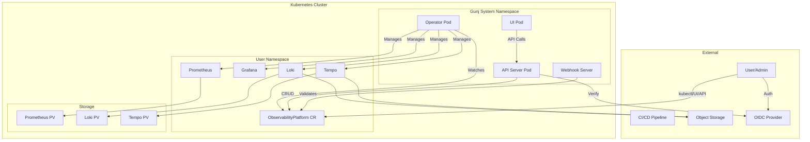
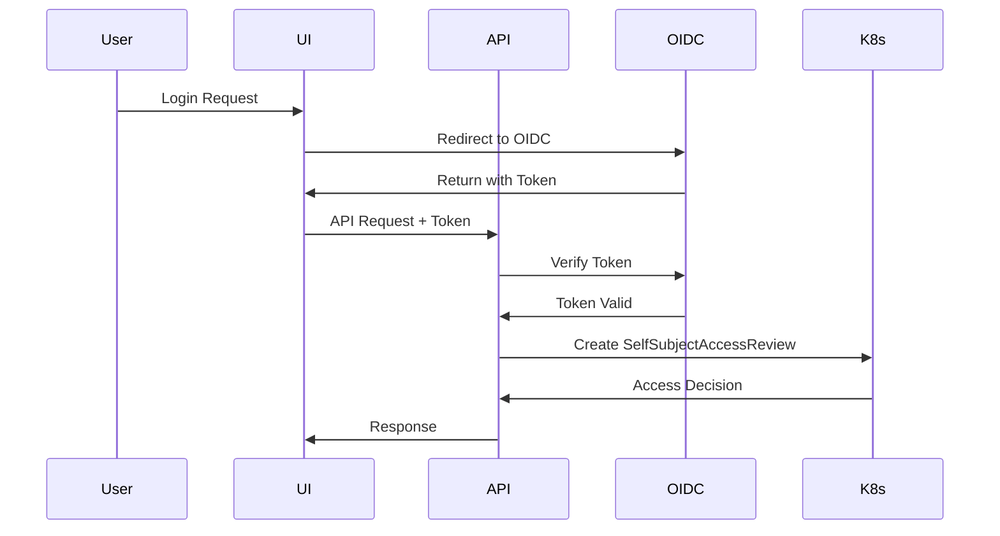

# Architecture Overview

## Introduction

The Gunj Operator is a cloud-native Kubernetes operator designed to manage observability platforms at scale. It follows the operator pattern and CNCF best practices to provide a declarative, self-healing, and extensible solution for deploying and managing Prometheus, Grafana, Loki, and Tempo.

## Table of Contents

1. [System Architecture](#system-architecture)
2. [Component Architecture](#component-architecture)
3. [Design Principles](#design-principles)
4. [Technology Stack](#technology-stack)
5. [Architecture Decisions](#architecture-decisions)
6. [Security Architecture](#security-architecture)
7. [Scalability Design](#scalability-design)
8. [Integration Points](#integration-points)

## System Architecture



## Component Architecture

### 1. Operator Core

The operator core implements the Kubernetes controller pattern:

```go
// Simplified controller architecture
type ObservabilityPlatformReconciler struct {
    client.Client
    Scheme *runtime.Scheme
    
    // Component managers
    PrometheusManager  *managers.PrometheusManager
    GrafanaManager     *managers.GrafanaManager
    LokiManager        *managers.LokiManager
    TempoManager       *managers.TempoManager
    
    // Utilities
    EventRecorder      record.EventRecorder
    MetricsCollector   *metrics.Collector
}
```

#### Key Components:

- **Reconciliation Loop**: Ensures desired state matches actual state
- **Component Managers**: Handle lifecycle of individual components
- **Event System**: Records significant events for auditing
- **Metrics Collection**: Exposes operational metrics

### 2. API Server

RESTful and GraphQL API server architecture:

```
api-server/
├── handlers/           # HTTP request handlers
│   ├── platform.go    # Platform CRUD operations
│   ├── components.go  # Component management
│   ├── metrics.go     # Metrics endpoints
│   └── health.go      # Health checks
├── middleware/         # HTTP middleware
│   ├── auth.go        # Authentication
│   ├── cors.go        # CORS handling
│   ├── logging.go     # Request logging
│   └── ratelimit.go   # Rate limiting
├── graphql/           # GraphQL implementation
│   ├── schema.go      # GraphQL schema
│   ├── resolvers.go   # Query/Mutation resolvers
│   └── dataloader.go  # Batch loading optimization
└── websocket/         # Real-time communication
    ├── hub.go         # WebSocket hub
    └── handlers.go    # WebSocket handlers
```

### 3. User Interface

React-based single-page application:

```
ui/
├── components/         # React components
│   ├── common/        # Shared components
│   ├── platform/      # Platform management
│   ├── monitoring/    # Monitoring views
│   └── settings/      # Configuration UI
├── hooks/             # Custom React hooks
│   ├── useAuth.ts     # Authentication hook
│   ├── useAPI.ts      # API communication
│   └── useWebSocket.ts # Real-time updates
├── store/             # State management
│   ├── platform.ts    # Platform state
│   ├── auth.ts        # Auth state
│   └── ui.ts          # UI preferences
└── utils/             # Utility functions
```

### 4. Custom Resource Definitions

#### ObservabilityPlatform CRD

```yaml
apiVersion: observability.io/v1beta1
kind: ObservabilityPlatform
metadata:
  name: production
  namespace: monitoring
spec:
  # Component specifications
  components:
    prometheus:
      enabled: true
      version: v2.48.0
      replicas: 3
      resources:
        requests:
          memory: "4Gi"
          cpu: "1"
      storage:
        size: 100Gi
        storageClassName: fast-ssd
    grafana:
      enabled: true
      version: "10.2.0"
    loki:
      enabled: true
      version: "2.9.0"
    tempo:
      enabled: true
      version: "2.3.0"
  
  # Global settings
  global:
    externalLabels:
      cluster: production
      region: us-east-1
    
status:
  phase: Ready
  conditions:
  - type: Ready
    status: "True"
    lastTransitionTime: "2025-06-12T10:00:00Z"
  components:
    prometheus:
      status: Running
      endpoints:
        internal: prometheus.monitoring.svc:9090
    grafana:
      status: Running
      endpoints:
        internal: grafana.monitoring.svc:3000
        external: https://grafana.example.com
```

## Design Principles

### 1. Declarative Configuration

All configurations are declarative, allowing GitOps workflows:

```yaml
# User declares desired state
spec:
  components:
    prometheus:
      replicas: 3

# Operator ensures actual state matches
status:
  components:
    prometheus:
      readyReplicas: 3
```

### 2. Self-Healing

The operator continuously monitors and corrects drift:

- Recreates deleted resources
- Updates modified configurations
- Handles node failures
- Manages version upgrades

### 3. Extensibility

Designed for extensibility through:

- Plugin system for custom components
- Webhook integration points
- Custom metrics and dashboards
- API extensions

### 4. Security by Default

- RBAC with least privilege
- Network policies enabled
- Encrypted communication
- Secret management
- Audit logging

## Technology Stack

### Core Technologies

| Component | Technology | Version | Purpose |
|-----------|------------|---------|---------|
| Language | Go | 1.21+ | Operator and API development |
| Framework | Kubebuilder | 3.14.0 | Operator framework |
| API Framework | Gin | 1.9.1 | RESTful API server |
| UI Framework | React | 18.2.0 | User interface |
| UI Language | TypeScript | 5.0+ | Type-safe frontend |
| State Management | Zustand | 4.4.0 | React state management |
| UI Components | Material-UI | 5.14.0 | Component library |
| Container Runtime | Docker | 24.0+ | Container building |
| Orchestration | Kubernetes | 1.26+ | Container orchestration |

### Testing Stack

| Type | Technology | Purpose |
|------|------------|---------|
| Unit Testing | Ginkgo/Gomega | Go BDD testing |
| UI Testing | Jest/RTL | React component testing |
| E2E Testing | Cypress | End-to-end testing |
| Load Testing | k6 | Performance testing |

### CI/CD Stack

| Purpose | Technology | Configuration |
|---------|------------|---------------|
| CI/CD | GitHub Actions | .github/workflows/ |
| Container Registry | Docker Hub | Multi-arch images |
| Artifact Storage | GitHub Releases | Binary releases |
| Documentation | Hugo | Static site generator |

## Architecture Decisions

### ADR-001: Operator Framework Selection

**Status**: Accepted

**Context**: Need to choose between Kubebuilder and Operator SDK

**Decision**: Use Kubebuilder for its:
- Better documentation
- Cleaner code generation
- Active community
- Native Kubernetes integration

**Consequences**: 
- Standardized project structure
- Good tooling support
- Learning curve for team

### ADR-002: State Management

**Status**: Accepted

**Context**: How to manage state across components

**Decision**: Use Kubernetes as the source of truth:
- CRDs store configuration
- Status subresources track state
- ConfigMaps for dynamic config
- Secrets for sensitive data

**Consequences**:
- Simplified state management
- Built-in persistence
- Kubernetes-native approach

### ADR-003: Multi-Tenancy Model

**Status**: Accepted

**Context**: Support multiple teams on same cluster

**Decision**: Namespace-based isolation:
- One namespace per platform
- RBAC per namespace
- Network policies for isolation
- Resource quotas per namespace

**Consequences**:
- Clear isolation boundaries
- Simple permission model
- Resource control

## Security Architecture

### Authentication & Authorization



### Security Layers

1. **Network Security**
   - TLS everywhere
   - Network policies
   - Service mesh ready

2. **Authentication**
   - OIDC integration
   - Service accounts
   - mTLS between components

3. **Authorization**
   - RBAC policies
   - Namespace isolation
   - API access control

4. **Data Security**
   - Encryption at rest
   - Encrypted backups
   - Secret rotation

## Scalability Design

### Horizontal Scaling

- **Operator**: Leader election for HA
- **API Server**: Stateless, scale with replicas
- **UI**: Static assets, CDN ready
- **Components**: Individual scaling policies

### Performance Optimization

1. **Caching Strategy**
   - Redis for API responses
   - Client-side caching
   - CDN for static assets

2. **Database Optimization**
   - Connection pooling
   - Query optimization
   - Read replicas

3. **Resource Management**
   - Vertical pod autoscaling
   - Horizontal pod autoscaling
   - Cluster autoscaling support

### Load Distribution

```yaml
apiVersion: v1
kind: Service
metadata:
  name: gunj-api
spec:
  selector:
    app: gunj-api
  ports:
  - port: 8080
  sessionAffinity: ClientIP
  sessionAffinityConfig:
    clientIP:
      timeoutSeconds: 3600
```

## Integration Points

### External Integrations

1. **GitOps Integration**
   - ArgoCD support
   - Flux compatibility
   - Webhook receivers

2. **Monitoring Integration**
   - Prometheus metrics
   - OpenTelemetry traces
   - Custom dashboards

3. **Storage Integration**
   - S3-compatible storage
   - Azure Blob Storage
   - Google Cloud Storage

4. **Authentication Providers**
   - OIDC providers
   - SAML support
   - LDAP integration

### API Integration

```graphql
# GraphQL Schema for integrations
type Query {
  # Get platform for external tools
  platformForIntegration(name: String!, namespace: String!): Platform
  
  # Terraform provider support
  terraformState(name: String!): TerraformState
}

type Mutation {
  # Webhook receiver
  handleWebhook(source: String!, payload: JSON!): WebhookResponse
  
  # External tool updates
  updateFromExternal(tool: String!, update: ExternalUpdate!): Platform
}

type Subscription {
  # Real-time updates for CI/CD
  platformChanges(name: String!, namespace: String!): PlatformEvent
}
```

## Future Architecture Considerations

### Planned Enhancements

1. **Multi-Cluster Support**
   - Federation capabilities
   - Cross-cluster queries
   - Global dashboards

2. **AI/ML Integration**
   - Anomaly detection
   - Predictive scaling
   - Intelligent alerting

3. **Advanced Automation**
   - Self-tuning
   - Auto-remediation
   - Chaos engineering

### Extensibility Points

- Custom resource plugins
- Operator extensions
- UI plugin system
- API middleware plugins

---

For detailed component documentation, see:
- [Operator Architecture](./operator.md)
- [API Architecture](./api.md)
- [UI Architecture](./ui.md)
- [Security Architecture](./security.md)
