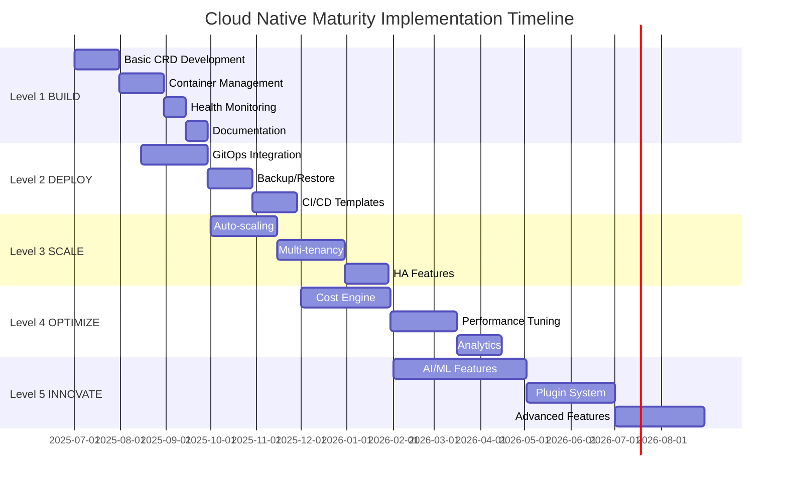

# Cloud Native Maturity Implementation Roadmap

**Version**: 1.0  
**Date**: June 12, 2025  
**Project**: Gunj Operator  
**Purpose**: Step-by-step implementation guide for each maturity level  

---

## 🗺️ Implementation Overview

This roadmap provides detailed implementation steps for the Gunj Operator to support organizations at each level of cloud-native maturity.

## 📅 Timeline Overview



---

## 1️⃣ Level 1: BUILD Implementation

### Sprint 1: Basic Operator (Weeks 1-2)

#### Technical Tasks
```yaml
# Task 1.1: Create Basic CRD
apiVersion: apiextensions.k8s.io/v1
kind: CustomResourceDefinition
metadata:
  name: observabilityplatforms.observability.io
spec:
  versions:
  - name: v1beta1
    schema:
      openAPIV3Schema:
        type: object
        properties:
          spec:
            type: object
            properties:
              components:
                type: object
                properties:
                  prometheus:
                    type: object
                    properties:
                      enabled:
                        type: boolean
                      version:
                        type: string
```

#### Implementation Checklist
- [ ] Create basic CRD structure
- [ ] Implement minimal controller
- [ ] Add basic validation
- [ ] Create sample configurations
- [ ] Write quickstart guide

#### Code Implementation
```go
// controllers/basic_controller.go
func (r *ObservabilityPlatformReconciler) ReconcileBasic(ctx context.Context, platform *v1beta1.ObservabilityPlatform) error {
    log := log.FromContext(ctx)
    
    // Deploy Prometheus if enabled
    if platform.Spec.Components.Prometheus.Enabled {
        if err := r.deployPrometheus(ctx, platform); err != nil {
            return fmt.Errorf("deploying prometheus: %w", err)
        }
    }
    
    // Deploy Grafana if enabled
    if platform.Spec.Components.Grafana.Enabled {
        if err := r.deployGrafana(ctx, platform); err != nil {
            return fmt.Errorf("deploying grafana: %w", err)
        }
    }
    
    return nil
}
```

### Sprint 2: Container Management (Weeks 3-4)

#### Container Strategy
```dockerfile
# build/Dockerfile.operator
FROM golang:1.21-alpine AS builder
WORKDIR /app
COPY . .
RUN go mod download
RUN go build -o operator cmd/operator/main.go

FROM gcr.io/distroless/static:nonroot
COPY --from=builder /app/operator /
USER 65532:65532
ENTRYPOINT ["/operator"]
```

#### Pre-built Component Images
```yaml
# config/images.yaml
images:
  prometheus:
    repository: prom/prometheus
    tag: v2.48.0
    pullPolicy: IfNotPresent
  grafana:
    repository: grafana/grafana
    tag: 10.2.0
    pullPolicy: IfNotPresent
  loki:
    repository: grafana/loki
    tag: 2.9.0
    pullPolicy: IfNotPresent
```

### Sprint 3: Monitoring & Documentation (Weeks 5-6)

#### Health Check Implementation
```go
// pkg/health/checks.go
type HealthChecker struct {
    client client.Client
}

func (h *HealthChecker) CheckComponent(ctx context.Context, component Component) (HealthStatus, error) {
    status := HealthStatus{
        Component: component.Name,
        Healthy:   false,
        Message:   "Unknown",
    }
    
    // Check deployment
    deployment := &appsv1.Deployment{}
    if err := h.client.Get(ctx, component.NamespacedName(), deployment); err != nil {
        status.Message = fmt.Sprintf("Deployment not found: %v", err)
        return status, nil
    }
    
    // Check readiness
    if deployment.Status.ReadyReplicas == *deployment.Spec.Replicas {
        status.Healthy = true
        status.Message = "All replicas ready"
    }
    
    return status, nil
}
```

---

## 2️⃣ Level 2: DEPLOY Implementation

### Sprint 4: GitOps Integration (Weeks 7-9)

#### ArgoCD Integration
```yaml
# config/argocd/app-template.yaml
apiVersion: argoproj.io/v1alpha1
kind: Application
metadata:
  name: observability-platform
  namespace: argocd
spec:
  project: default
  source:
    repoURL: '{{ .Values.gitops.repository }}'
    targetRevision: '{{ .Values.gitops.branch }}'
    path: '{{ .Values.gitops.path }}'
  destination:
    server: https://kubernetes.default.svc
    namespace: '{{ .Values.namespace }}'
  syncPolicy:
    automated:
      prune: true
      selfHeal: true
```

#### Flux Integration
```yaml
# config/flux/kustomization.yaml
apiVersion: kustomize.toolkit.fluxcd.io/v1beta2
kind: Kustomization
metadata:
  name: observability-platform
  namespace: flux-system
spec:
  interval: 10m
  path: "./clusters/production"
  prune: true
  sourceRef:
    kind: GitRepository
    name: observability-config
```

### Sprint 5: Backup/Restore (Weeks 10-11)

#### Backup Controller
```go
// controllers/backup_controller.go
type BackupController struct {
    client    client.Client
    storage   storage.Interface
    scheduler *cron.Cron
}

func (b *BackupController) ScheduleBackup(platform *v1beta1.ObservabilityPlatform) error {
    if !platform.Spec.Backup.Enabled {
        return nil
    }
    
    _, err := b.scheduler.AddFunc(platform.Spec.Backup.Schedule, func() {
        ctx := context.Background()
        if err := b.performBackup(ctx, platform); err != nil {
            log.Error(err, "Backup failed", "platform", platform.Name)
        }
    })
    
    return err
}

func (b *BackupController) performBackup(ctx context.Context, platform *v1beta1.ObservabilityPlatform) error {
    backup := &Backup{
        Timestamp: time.Now(),
        Platform:  platform.Name,
        Components: make(map[string]ComponentBackup),
    }
    
    // Backup each component
    for _, component := range platform.Spec.Components.List() {
        if data, err := b.backupComponent(ctx, component); err == nil {
            backup.Components[component.Name] = data
        }
    }
    
    // Store backup
    return b.storage.Store(ctx, backup)
}
```

---

## 3️⃣ Level 3: SCALE Implementation

### Sprint 6: Auto-scaling (Weeks 12-14)

#### HPA Configuration
```yaml
# templates/hpa.yaml
apiVersion: autoscaling/v2
kind: HorizontalPodAutoscaler
metadata:
  name: {{ .component }}-hpa
spec:
  scaleTargetRef:
    apiVersion: apps/v1
    kind: Deployment
    name: {{ .component }}
  minReplicas: {{ .minReplicas }}
  maxReplicas: {{ .maxReplicas }}
  metrics:
  - type: Resource
    resource:
      name: cpu
      target:
        type: Utilization
        averageUtilization: {{ .targetCPU }}
  - type: Resource
    resource:
      name: memory
      target:
        type: Utilization
        averageUtilization: {{ .targetMemory }}
  behavior:
    scaleDown:
      stabilizationWindowSeconds: 300
    scaleUp:
      stabilizationWindowSeconds: 60
```

#### VPA Implementation
```go
// pkg/scaling/vpa.go
type VPAController struct {
    client client.Client
}

func (v *VPAController) CreateVPA(component Component) error {
    vpa := &autoscalingv1.VerticalPodAutoscaler{
        ObjectMeta: metav1.ObjectMeta{
            Name:      fmt.Sprintf("%s-vpa", component.Name),
            Namespace: component.Namespace,
        },
        Spec: autoscalingv1.VerticalPodAutoscalerSpec{
            TargetRef: &autoscalingv1.CrossVersionObjectReference{
                APIVersion: "apps/v1",
                Kind:       "Deployment",
                Name:       component.Name,
            },
            UpdatePolicy: &autoscalingv1.PodUpdatePolicy{
                UpdateMode: autoscalingv1.UpdateModeAuto,
            },
        },
    }
    
    return v.client.Create(context.TODO(), vpa)
}
```

### Sprint 7: Multi-tenancy (Weeks 15-17)

#### Namespace Isolation
```go
// pkg/multitenancy/isolation.go
type TenantManager struct {
    client client.Client
}

func (t *TenantManager) CreateTenant(tenant Tenant) error {
    // Create namespace
    ns := &corev1.Namespace{
        ObjectMeta: metav1.ObjectMeta{
            Name: tenant.Namespace,
            Labels: map[string]string{
                "tenant":                    tenant.Name,
                "observability.io/managed":  "true",
            },
        },
    }
    
    if err := t.client.Create(context.TODO(), ns); err != nil {
        return err
    }
    
    // Create RBAC
    if err := t.createRBAC(tenant); err != nil {
        return err
    }
    
    // Create NetworkPolicy
    if err := t.createNetworkPolicy(tenant); err != nil {
        return err
    }
    
    // Create ResourceQuota
    if err := t.createResourceQuota(tenant); err != nil {
        return err
    }
    
    return nil
}
```

---

## 4️⃣ Level 4: OPTIMIZE Implementation

### Sprint 8: Cost Optimization Engine (Weeks 18-20)

#### Cost Calculator
```go
// pkg/optimization/cost.go
type CostEngine struct {
    client     client.Client
    pricing    PricingProvider
    metrics    MetricsProvider
}

func (c *CostEngine) CalculateCosts(platform *v1beta1.ObservabilityPlatform) (*CostReport, error) {
    report := &CostReport{
        Platform:   platform.Name,
        Period:     time.Now(),
        Components: make(map[string]ComponentCost),
    }
    
    // Calculate compute costs
    computeCost, err := c.calculateComputeCosts(platform)
    if err != nil {
        return nil, err
    }
    report.ComputeCost = computeCost
    
    // Calculate storage costs
    storageCost, err := c.calculateStorageCosts(platform)
    if err != nil {
        return nil, err
    }
    report.StorageCost = storageCost
    
    // Calculate network costs
    networkCost, err := c.calculateNetworkCosts(platform)
    if err != nil {
        return nil, err
    }
    report.NetworkCost = networkCost
    
    // Generate recommendations
    report.Recommendations = c.generateRecommendations(report)
    
    return report, nil
}
```

#### Resource Optimizer
```go
// pkg/optimization/resources.go
type ResourceOptimizer struct {
    client  client.Client
    metrics MetricsProvider
}

func (r *ResourceOptimizer) OptimizeResources(component Component) (*ResourceRecommendation, error) {
    // Get historical usage
    usage, err := r.metrics.GetResourceUsage(component, 7*24*time.Hour)
    if err != nil {
        return nil, err
    }
    
    recommendation := &ResourceRecommendation{
        Component: component.Name,
        Current:   component.Resources,
    }
    
    // Calculate optimal CPU
    recommendation.Recommended.CPU = r.calculateOptimalCPU(usage)
    
    // Calculate optimal Memory
    recommendation.Recommended.Memory = r.calculateOptimalMemory(usage)
    
    // Calculate potential savings
    recommendation.Savings = r.calculateSavings(
        recommendation.Current,
        recommendation.Recommended,
    )
    
    return recommendation, nil
}
```

---

## 5️⃣ Level 5: INNOVATE Implementation

### Sprint 9: AI/ML Integration (Weeks 21-24)

#### Anomaly Detection
```go
// pkg/ai/anomaly.go
type AnomalyDetector struct {
    model   MLModel
    metrics MetricsProvider
}

func (a *AnomalyDetector) DetectAnomalies(component Component) ([]Anomaly, error) {
    // Get recent metrics
    metrics, err := a.metrics.GetMetrics(component, 1*time.Hour)
    if err != nil {
        return nil, err
    }
    
    // Prepare data for model
    features := a.extractFeatures(metrics)
    
    // Run inference
    predictions := a.model.Predict(features)
    
    // Identify anomalies
    anomalies := []Anomaly{}
    for i, pred := range predictions {
        if pred.AnomalyScore > 0.8 {
            anomalies = append(anomalies, Anomaly{
                Timestamp:   metrics[i].Timestamp,
                Component:   component.Name,
                Metric:      metrics[i].Name,
                Score:       pred.AnomalyScore,
                Description: a.generateDescription(metrics[i], pred),
            })
        }
    }
    
    return anomalies, nil
}
```

#### Predictive Scaling
```python
# pkg/ai/models/predictive_scaling.py
import numpy as np
from sklearn.ensemble import RandomForestRegressor
from prophet import Prophet

class PredictiveScaler:
    def __init__(self):
        self.model = Prophet(
            daily_seasonality=True,
            weekly_seasonality=True,
            yearly_seasonality=False
        )
        
    def train(self, historical_data):
        # Prepare data
        df = pd.DataFrame({
            'ds': historical_data['timestamp'],
            'y': historical_data['resource_usage']
        })
        
        # Train model
        self.model.fit(df)
        
    def predict(self, horizon_hours=24):
        # Create future dataframe
        future = self.model.make_future_dataframe(
            periods=horizon_hours, 
            freq='H'
        )
        
        # Generate forecast
        forecast = self.model.predict(future)
        
        return {
            'timestamps': forecast['ds'].tolist(),
            'predicted': forecast['yhat'].tolist(),
            'upper_bound': forecast['yhat_upper'].tolist(),
            'lower_bound': forecast['yhat_lower'].tolist()
        }
```

### Sprint 10: Plugin System (Weeks 25-27)

#### Plugin Framework
```go
// pkg/plugins/framework.go
type PluginManager struct {
    registry map[string]Plugin
    client   client.Client
}

type Plugin interface {
    Name() string
    Version() string
    Init(config map[string]interface{}) error
    Execute(ctx context.Context, input interface{}) (interface{}, error)
    Cleanup() error
}

func (p *PluginManager) LoadPlugin(path string) error {
    // Load plugin binary
    plug, err := plugin.Open(path)
    if err != nil {
        return err
    }
    
    // Get plugin instance
    symbol, err := plug.Lookup("Plugin")
    if err != nil {
        return err
    }
    
    plugin, ok := symbol.(Plugin)
    if !ok {
        return fmt.Errorf("invalid plugin type")
    }
    
    // Register plugin
    p.registry[plugin.Name()] = plugin
    
    return nil
}
```

---

## 📊 Feature Release Schedule

### Release Timeline

| Version | Target Date | Maturity Level | Key Features |
|---------|-------------|----------------|--------------|
| v0.1.0 | Aug 2025 | Level 1 | Basic deployment, health checks |
| v0.2.0 | Sep 2025 | Level 1+ | Container management, monitoring |
| v0.3.0 | Oct 2025 | Level 2 | GitOps integration, backup/restore |
| v0.4.0 | Nov 2025 | Level 2+ | CI/CD templates, automation |
| v0.5.0 | Dec 2025 | Level 3 | Auto-scaling, multi-tenancy |
| v0.6.0 | Jan 2026 | Level 3+ | HA features, service mesh |
| v0.7.0 | Feb 2026 | Level 4 | Cost optimization, performance |
| v0.8.0 | Mar 2026 | Level 4+ | Advanced analytics, efficiency |
| v0.9.0 | Apr 2026 | Level 5 | AI/ML features, predictions |
| v1.0.0 | May 2026 | Level 5+ | Plugin system, full maturity |

---

## 🧪 Testing Strategy by Level

### Level 1 Testing
```go
// test/e2e/level1_test.go
var _ = Describe("Level 1: BUILD", func() {
    It("should deploy basic observability stack", func() {
        platform := &v1beta1.ObservabilityPlatform{
            ObjectMeta: metav1.ObjectMeta{
                Name: "test-basic",
            },
            Spec: v1beta1.ObservabilityPlatformSpec{
                Components: v1beta1.Components{
                    Prometheus: v1beta1.PrometheusSpec{
                        Enabled: true,
                    },
                },
            },
        }
        
        Expect(k8sClient.Create(ctx, platform)).Should(Succeed())
        
        Eventually(func() bool {
            deployment := &appsv1.Deployment{}
            err := k8sClient.Get(ctx, types.NamespacedName{
                Name:      "prometheus",
                Namespace: platform.Namespace,
            }, deployment)
            return err == nil && deployment.Status.ReadyReplicas > 0
        }, timeout, interval).Should(BeTrue())
    })
})
```

---

## 🎓 Training Modules by Level

### Level 1 Training Curriculum
1. **Module 1**: Introduction to Containers (2 hours)
2. **Module 2**: Kubernetes Basics (4 hours)
3. **Module 3**: Installing Gunj Operator (1 hour)
4. **Module 4**: First Platform Deployment (2 hours)
5. **Lab**: Deploy and Monitor Sample App (2 hours)

### Level 2 Training Curriculum
1. **Module 1**: GitOps Principles (2 hours)
2. **Module 2**: CI/CD Integration (4 hours)
3. **Module 3**: Automated Deployments (3 hours)
4. **Module 4**: Backup and Recovery (2 hours)
5. **Lab**: Full GitOps Pipeline (4 hours)

---

## 📝 Migration Guides

### From Manual to Level 1
```bash
# Step 1: Install operator
kubectl apply -f https://github.com/gunjanjp/gunj-operator/releases/latest/operator.yaml

# Step 2: Create basic platform
cat <<EOF | kubectl apply -f -
apiVersion: observability.io/v1beta1
kind: ObservabilityPlatform
metadata:
  name: my-platform
spec:
  components:
    prometheus:
      enabled: true
    grafana:
      enabled: true
EOF

# Step 3: Access dashboards
kubectl port-forward svc/grafana 3000:3000
```

---

## 🔄 Continuous Improvement Process

### Feedback Collection
1. **User Surveys**: Quarterly maturity assessment
2. **Feature Requests**: Level-based prioritization
3. **Usage Analytics**: Feature adoption tracking
4. **Community Input**: Regular maturity discussions

### Iteration Cycle
- **Month 1**: Collect feedback
- **Month 2**: Prioritize improvements
- **Month 3**: Implement and release

---

*This implementation roadmap is a living document updated with each release.*

**Next Update**: July 12, 2025
