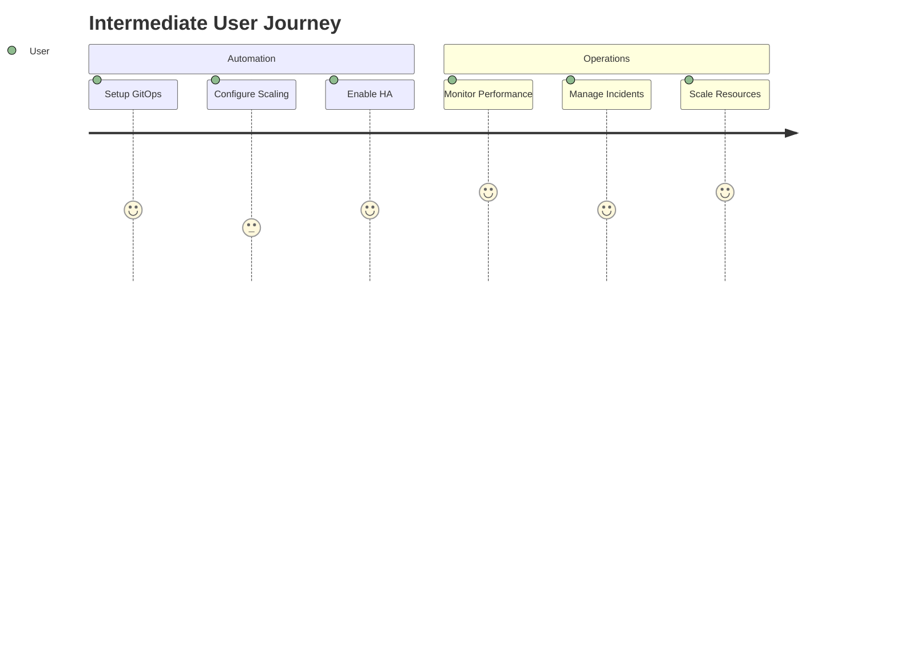
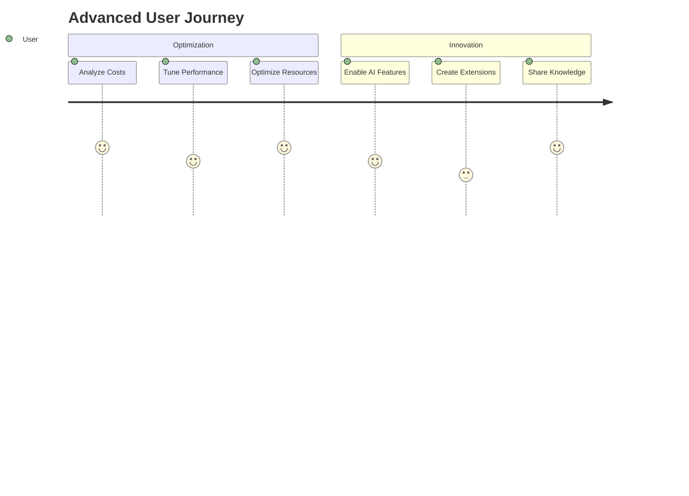

# Cloud Native Maturity Model Plan

**Version**: 1.0  
**Date**: June 12, 2025  
**Project**: Gunj Operator  
**Author**: Cloud Native Architecture Team  
**Status**: Initial Planning  

---

## 📋 Executive Summary

This document outlines how the Gunj Operator aligns with and implements the CNCF Cloud Native Maturity Model. The model provides a structured path for organizations to adopt cloud-native practices, and our operator will enable users to progress through each maturity level efficiently.

## 🎯 Cloud Native Maturity Model Overview

The Cloud Native Maturity Model consists of five progressive levels:

### Level 1: BUILD 🔨
**Focus**: Basic containerization and initial cloud-native adoption  
**Goal**: Get applications running in containers

### Level 2: DEPLOY 🚀
**Focus**: Automated deployment and basic orchestration  
**Goal**: Reliable, repeatable deployments

### Level 3: SCALE 📈
**Focus**: Scaling, observability, and reliability  
**Goal**: Handle production workloads efficiently

### Level 4: OPTIMIZE 🎯
**Focus**: Cost optimization and performance tuning  
**Goal**: Maximize efficiency and minimize costs

### Level 5: INNOVATE 💡
**Focus**: Advanced capabilities and continuous innovation  
**Goal**: Lead with cutting-edge practices

---

## 🗺️ Gunj Operator Feature Mapping

### Level 1: BUILD - Containerization Foundation

#### Operator Features
- **Basic Deployment**: Simple YAML to deploy observability stack
- **Container Management**: Pre-built container images for all components
- **Resource Templates**: Default configurations for getting started
- **Health Checks**: Basic liveness and readiness probes

#### User Capabilities Enabled
```yaml
# Simple deployment example
apiVersion: observability.io/v1beta1
kind: ObservabilityPlatform
metadata:
  name: basic-monitoring
spec:
  components:
    prometheus:
      enabled: true
    grafana:
      enabled: true
```

#### Implementation Requirements
- [ ] Basic CRD with minimal configuration
- [ ] Pre-configured container images
- [ ] Simple installation guide
- [ ] Basic health monitoring

### Level 2: DEPLOY - Automated Deployment

#### Operator Features
- **GitOps Integration**: ArgoCD/Flux support
- **Declarative Configuration**: Full IaC approach
- **Automated Rollouts**: Safe deployment strategies
- **Version Management**: Component version control
- **Backup/Restore**: Data protection capabilities

#### User Capabilities Enabled
```yaml
apiVersion: observability.io/v1beta1
kind: ObservabilityPlatform
metadata:
  name: production-monitoring
spec:
  deployment:
    strategy: RollingUpdate
    gitops:
      enabled: true
      repository: git@github.com:company/observability
  backup:
    enabled: true
    schedule: "0 2 * * *"
```

#### Implementation Requirements
- [ ] GitOps webhook support
- [ ] Backup controller implementation
- [ ] Rollout strategies
- [ ] Version compatibility matrix
- [ ] CI/CD integration guides

### Level 3: SCALE - Production Readiness

#### Operator Features
- **Auto-scaling**: HPA/VPA integration
- **Multi-tenancy**: Namespace isolation
- **High Availability**: Multi-replica deployments
- **Observability**: Deep metrics and tracing
- **Service Mesh Integration**: Istio/Linkerd support
- **Disaster Recovery**: Cross-region capabilities

#### User Capabilities Enabled
```yaml
apiVersion: observability.io/v1beta1
kind: ObservabilityPlatform
metadata:
  name: scalable-monitoring
spec:
  scaling:
    prometheus:
      replicas: 3
      autoscaling:
        enabled: true
        minReplicas: 3
        maxReplicas: 10
        targetCPU: 80
  highAvailability:
    enabled: true
    zones: ["us-east-1a", "us-east-1b", "us-east-1c"]
  multiTenancy:
    enabled: true
    isolation: strict
```

#### Implementation Requirements
- [ ] HPA/VPA controllers
- [ ] Multi-tenant RBAC
- [ ] Cross-AZ deployment logic
- [ ] Service mesh adapters
- [ ] Comprehensive monitoring
- [ ] Performance benchmarks

### Level 4: OPTIMIZE - Efficiency & Performance

#### Operator Features
- **Cost Optimization**: Resource right-sizing
- **Performance Tuning**: Automated optimization
- **Intelligent Scheduling**: Workload placement
- **Data Lifecycle**: Automated retention/archival
- **Resource Quotas**: Cost control mechanisms
- **Efficiency Reports**: Cost/performance analytics

#### User Capabilities Enabled
```yaml
apiVersion: observability.io/v1beta1
kind: ObservabilityPlatform
metadata:
  name: optimized-monitoring
spec:
  optimization:
    enabled: true
    costTargets:
      monthly: 5000  # USD
    performance:
      queryLatencyTarget: 100ms
      ingestionRateTarget: 1M/sec
  lifecycle:
    retention:
      metrics: 30d
      logs: 7d
      traces: 3d
    archival:
      enabled: true
      provider: s3
      costTier: glacier
```

#### Implementation Requirements
- [ ] Cost calculation engine
- [ ] Resource optimization algorithms
- [ ] Performance profiling
- [ ] Automated tuning logic
- [ ] Cost reporting dashboards
- [ ] Efficiency recommendations

### Level 5: INNOVATE - Advanced Capabilities

#### Operator Features
- **AI/ML Integration**: Anomaly detection, predictive scaling
- **Chaos Engineering**: Automated resilience testing
- **Advanced Security**: Zero-trust, encryption everywhere
- **Edge Computing**: Edge observability support
- **Serverless Integration**: FaaS monitoring
- **Custom Extensions**: Plugin ecosystem

#### User Capabilities Enabled
```yaml
apiVersion: observability.io/v1beta1
kind: ObservabilityPlatform
metadata:
  name: innovative-monitoring
spec:
  ai:
    anomalyDetection:
      enabled: true
      sensitivity: high
    predictiveScaling:
      enabled: true
      forecastWindow: 7d
  chaos:
    enabled: true
    experiments:
      - networkLatency
      - podFailure
  extensions:
    - name: custom-processor
      image: company/processor:latest
```

#### Implementation Requirements
- [ ] ML model integration
- [ ] Chaos experiment framework
- [ ] Plugin system architecture
- [ ] Edge deployment capabilities
- [ ] Advanced security features
- [ ] Innovation lab features

---

## 📊 Maturity Assessment Framework

### Assessment Criteria

| Level | Technical Criteria | Operational Criteria | Business Criteria |
|-------|-------------------|---------------------|-------------------|
| **BUILD** | • Containers deployed<br>• Basic monitoring<br>• Manual processes | • Ad-hoc operations<br>• Limited automation<br>• Reactive approach | • Initial cloud adoption<br>• Limited visibility<br>• High operational cost |
| **DEPLOY** | • GitOps enabled<br>• Automated deployments<br>• Version control | • Documented processes<br>• Basic automation<br>• Change management | • Faster deployments<br>• Reduced errors<br>• Better compliance |
| **SCALE** | • Auto-scaling active<br>• HA configured<br>• Multi-tenant ready | • SRE practices<br>• Proactive monitoring<br>• Incident response | • Handle growth<br>• Better reliability<br>• Customer satisfaction |
| **OPTIMIZE** | • Cost optimization<br>• Performance tuned<br>• Efficient resource use | • FinOps practices<br>• Continuous improvement<br>• Data-driven decisions | • Reduced costs<br>• Better margins<br>• Competitive advantage |
| **INNOVATE** | • AI/ML enabled<br>• Advanced features<br>• Extensible platform | • Innovation culture<br>• Experimentation<br>• Knowledge sharing | • Market leadership<br>• New capabilities<br>• Future-ready |

### Maturity Score Calculation

```javascript
// Maturity scoring algorithm
function calculateMaturityScore(assessment) {
  const weights = {
    technical: 0.4,
    operational: 0.3,
    business: 0.3
  };
  
  let score = 0;
  for (const category in weights) {
    score += assessment[category] * weights[category];
  }
  
  return {
    score: score,
    level: getMaturityLevel(score),
    recommendations: getRecommendations(assessment)
  };
}
```

---

## 🛤️ Implementation Roadmap

### Phase 1: Foundation (Months 1-3)
**Target**: Enable Level 1 & 2 capabilities

#### Milestones
- ✅ Week 1-4: Basic operator with simple deployment
- ⏱️ Week 5-8: GitOps integration
- ⏱️ Week 9-12: Automated deployment features

#### Deliverables
1. Core operator with basic CRDs
2. GitOps integration documentation
3. Deployment automation
4. Basic monitoring dashboards

### Phase 2: Scaling (Months 4-6)
**Target**: Enable Level 3 capabilities

#### Milestones
- ⏱️ Month 4: Auto-scaling implementation
- ⏱️ Month 5: Multi-tenancy support
- ⏱️ Month 6: HA and DR features

#### Deliverables
1. Auto-scaling controllers
2. Multi-tenant isolation
3. HA deployment patterns
4. Performance benchmarks

### Phase 3: Optimization (Months 7-9)
**Target**: Enable Level 4 capabilities

#### Milestones
- ⏱️ Month 7: Cost optimization engine
- ⏱️ Month 8: Performance tuning
- ⏱️ Month 9: Efficiency reporting

#### Deliverables
1. Cost optimization algorithms
2. Performance profiling tools
3. Efficiency dashboards
4. Best practices guide

### Phase 4: Innovation (Months 10-12)
**Target**: Enable Level 5 capabilities

#### Milestones
- ⏱️ Month 10: AI/ML integration
- ⏱️ Month 11: Plugin ecosystem
- ⏱️ Month 12: Advanced features

#### Deliverables
1. ML-powered features
2. Extension framework
3. Innovation lab
4. Future roadmap

---

## 📈 Metrics and KPIs

### Level 1: BUILD Metrics
- **Deployment Time**: < 30 minutes
- **Container Readiness**: 100%
- **Basic Monitoring**: Active
- **Documentation Coverage**: > 80%

### Level 2: DEPLOY Metrics
- **Deployment Frequency**: Daily capable
- **Deployment Success Rate**: > 95%
- **GitOps Adoption**: 100%
- **Recovery Time**: < 15 minutes

### Level 3: SCALE Metrics
- **Availability**: > 99.9%
- **Auto-scaling Response**: < 2 minutes
- **Multi-tenant Isolation**: Verified
- **Performance SLOs**: Met

### Level 4: OPTIMIZE Metrics
- **Cost Reduction**: > 30%
- **Resource Utilization**: > 80%
- **Performance Improvement**: > 50%
- **Waste Elimination**: < 10%

### Level 5: INNOVATE Metrics
- **AI Accuracy**: > 95%
- **Innovation Velocity**: 2x baseline
- **Plugin Ecosystem**: > 10 extensions
- **Community Contributions**: > 50/month

---

## 🎯 User Journey Mapping

### Beginner User (Level 1)


### Intermediate User (Level 2-3)


### Advanced User (Level 4-5)


---

## 🔧 Technical Implementation Details

### Level Progression API
```go
// MaturityController manages maturity level progression
type MaturityController struct {
    client client.Client
    scheme *runtime.Scheme
}

// AssessMaturity evaluates current maturity level
func (m *MaturityController) AssessMaturity(ctx context.Context, platform *v1beta1.ObservabilityPlatform) (*MaturityAssessment, error) {
    assessment := &MaturityAssessment{
        Level: LevelBuild,
        Score: 0,
        Gaps: []Gap{},
    }
    
    // Evaluate each level's criteria
    if m.meetsDeployCriteria(platform) {
        assessment.Level = LevelDeploy
    }
    if m.meetsScaleCriteria(platform) {
        assessment.Level = LevelScale
    }
    if m.meetsOptimizeCriteria(platform) {
        assessment.Level = LevelOptimize
    }
    if m.meetsInnovateCriteria(platform) {
        assessment.Level = LevelInnovate
    }
    
    return assessment, nil
}
```

### Feature Gates by Level
```yaml
# config/features.yaml
features:
  level1:
    - basic-deployment
    - health-checks
    - simple-config
  level2:
    - gitops-integration
    - automated-rollouts
    - backup-restore
  level3:
    - auto-scaling
    - multi-tenancy
    - high-availability
  level4:
    - cost-optimization
    - performance-tuning
    - efficiency-reports
  level5:
    - ai-ml-features
    - chaos-engineering
    - plugin-system
```

---

## 📚 Training and Enablement

### Level-based Learning Paths

#### Level 1: BUILD Training
- **Duration**: 1 day
- **Topics**: Containers, Kubernetes basics, Operator installation
- **Labs**: Deploy first platform, access dashboards
- **Certification**: Cloud Native Beginner

#### Level 2: DEPLOY Training  
- **Duration**: 2 days
- **Topics**: GitOps, CI/CD, Automation
- **Labs**: Setup automated deployments
- **Certification**: Cloud Native Practitioner

#### Level 3: SCALE Training
- **Duration**: 3 days
- **Topics**: Scaling, HA, Multi-tenancy
- **Labs**: Configure production platform
- **Certification**: Cloud Native Professional

#### Level 4: OPTIMIZE Training
- **Duration**: 2 days
- **Topics**: FinOps, Performance, Efficiency
- **Labs**: Optimize platform costs
- **Certification**: Cloud Native Expert

#### Level 5: INNOVATE Training
- **Duration**: 3 days
- **Topics**: AI/ML, Extensions, Innovation
- **Labs**: Build custom features
- **Certification**: Cloud Native Architect

---

## 🏆 Success Stories by Level

### Level 1 Success: StartupCo
- **Challenge**: No monitoring infrastructure
- **Solution**: Deployed Gunj Operator in 30 minutes
- **Result**: Full observability stack running

### Level 2 Success: RetailCorp
- **Challenge**: Manual deployments taking days
- **Solution**: GitOps with Gunj Operator
- **Result**: Daily deployments, 90% faster

### Level 3 Success: FinanceInc
- **Challenge**: Scaling issues during peaks
- **Solution**: Auto-scaling with HA
- **Result**: 99.99% availability achieved

### Level 4 Success: TechGiant
- **Challenge**: $1M/month monitoring costs
- **Solution**: Optimization features
- **Result**: 65% cost reduction

### Level 5 Success: InnovateLabs
- **Challenge**: Need predictive capabilities
- **Solution**: AI/ML features
- **Result**: 80% incident prediction accuracy

---

## 🔄 Continuous Improvement

### Feedback Loops
1. **User Surveys**: Quarterly maturity assessments
2. **Feature Requests**: Level-based prioritization
3. **Community Input**: Regular maturity discussions
4. **Metrics Analysis**: Data-driven improvements

### Evolution Strategy
- **Quarterly Reviews**: Assess model effectiveness
- **Annual Updates**: Major model revisions
- **Community Driven**: User-guided evolution
- **Industry Alignment**: Follow CNCF trends

---

## 📝 Conclusion

The Cloud Native Maturity Model provides a clear path for organizations to evolve their observability practices. The Gunj Operator is designed to support users at every level of their cloud-native journey, from initial containerization to advanced AI-powered operations.

By aligning with this model, we ensure that:
1. Users have a clear progression path
2. Features are developed in logical order
3. Value is delivered at each maturity level
4. Organizations can measure their progress
5. Best practices are embedded in the platform

---

## 📎 Appendices

### Appendix A: Maturity Assessment Template
[Download Assessment Template](./templates/maturity-assessment.xlsx)

### Appendix B: Implementation Checklist
[Download Implementation Checklist](./templates/implementation-checklist.md)

### Appendix C: Reference Architectures
[View Reference Architectures](./architectures/)

---

*This document will be updated quarterly based on user feedback and industry evolution.*

**Next Review**: September 12, 2025
