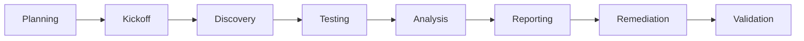

# Security Audit Planning Guide

**Version**: 1.0  
**Date**: June 12, 2025  
**Project**: Gunj Operator  
**Author**: Security Audit Team  
**Status**: Planning Framework  

---

## 📋 Overview

This guide provides a comprehensive framework for planning and conducting security audits for the Gunj Operator project. It covers internal audits, third-party assessments, and preparation for certification audits.

## 🎯 Audit Objectives

1. **Verify Security Controls**: Ensure implemented controls are effective
2. **Identify Vulnerabilities**: Discover security weaknesses before attackers
3. **Ensure Compliance**: Meet regulatory and standard requirements
4. **Validate Processes**: Confirm security processes are followed
5. **Continuous Improvement**: Identify areas for enhancement

---

## 📅 Audit Schedule

### Annual Audit Calendar

| Quarter | Audit Type | Scope | Duration | Auditor |
|---------|------------|-------|----------|---------|
| **Q1** |
| January | Code Security Audit | Source code, dependencies | 2 weeks | Internal + Tools |
| February | Infrastructure Audit | K8s, cloud, network | 1 week | Internal |
| March | Process Audit | SDLC, incident response | 1 week | Internal |
| **Q2** |
| April | Penetration Testing | Full application | 2 weeks | Third-party |
| May | Compliance Audit | GDPR, SOC2 prep | 2 weeks | External auditor |
| June | Container Security | Images, runtime | 1 week | Internal + Tools |
| **Q3** |
| July | API Security Audit | REST, GraphQL, gRPC | 1 week | Internal |
| August | Access Control Audit | RBAC, authentication | 1 week | Internal |
| September | Third-party Audit | Full security review | 3 weeks | External firm |
| **Q4** |
| October | Supply Chain Audit | Dependencies, build | 1 week | Internal |
| November | Incident Response Drill | Tabletop + technical | 2 days | All teams |
| December | Annual Review | Year retrospective | 1 week | Leadership |

---

## 🔍 Audit Types

### 1. Code Security Audit

#### Scope
```yaml
code_audit_scope:
  source_code:
    - application_code
    - infrastructure_code
    - configuration_files
    - scripts_and_tools
  
  dependencies:
    - direct_dependencies
    - transitive_dependencies
    - development_dependencies
    - runtime_dependencies
  
  secrets:
    - hardcoded_credentials
    - api_keys
    - certificates
    - connection_strings
```

#### Checklist
- [ ] SAST scan results reviewed
- [ ] Manual code review completed
- [ ] Dependency vulnerabilities assessed
- [ ] Secret scanning performed
- [ ] Security patterns validated
- [ ] Input validation verified
- [ ] Authentication/authorization reviewed
- [ ] Cryptography usage checked

#### Tools
- **SAST**: Semgrep, SonarQube, CodeQL
- **Dependencies**: Snyk, OWASP Dependency Check
- **Secrets**: GitLeaks, TruffleHog
- **Manual Review**: GitHub PR reviews

### 2. Infrastructure Security Audit

#### Scope
```yaml
infrastructure_audit_scope:
  kubernetes:
    - cluster_configuration
    - rbac_policies
    - network_policies
    - pod_security_policies
    - secrets_management
  
  cloud_infrastructure:
    - iam_policies
    - network_configuration
    - storage_encryption
    - logging_configuration
  
  deployment:
    - ci_cd_pipeline
    - container_registry
    - artifact_storage
    - deployment_process
```

#### Checklist
- [ ] Kubernetes CIS benchmark run
- [ ] Cloud security posture assessed
- [ ] Network segmentation verified
- [ ] Access controls reviewed
- [ ] Encryption standards met
- [ ] Logging/monitoring adequate
- [ ] Backup/recovery tested
- [ ] Incident response ready

### 3. Penetration Testing

#### Scope Definition
```yaml
pentest_scope:
  in_scope:
    applications:
      - gunj_operator_api
      - web_ui
      - graphql_endpoint
      - webhook_endpoints
    
    infrastructure:
      - kubernetes_cluster
      - container_registry
      - ci_cd_systems
    
    testing_types:
      - black_box
      - gray_box
      - authenticated_testing
  
  out_of_scope:
    - production_data_deletion
    - dos_attacks
    - social_engineering
    - physical_security
  
  rules_of_engagement:
    - testing_hours: business_hours_only
    - rate_limiting: respect_limits
    - data_handling: no_data_exfiltration
    - communication: daily_updates
```

#### Methodology
1. **Reconnaissance**: Information gathering
2. **Scanning**: Vulnerability identification
3. **Enumeration**: Service identification
4. **Exploitation**: Vulnerability verification
5. **Post-Exploitation**: Impact assessment
6. **Reporting**: Findings documentation

### 4. Compliance Audit

#### Standards Matrix

| Standard | Requirements | Evidence Needed | Status |
|----------|--------------|-----------------|--------|
| **SOC 2 Type II** |
| Security | Access controls, encryption | Policies, logs | ⏳ |
| Availability | Uptime, DR plan | SLAs, metrics | ⏳ |
| Confidentiality | Data protection | Encryption proof | ⏳ |
| **GDPR** |
| Privacy by Design | Privacy controls | Design docs | ⏳ |
| Data Protection | Encryption, access | Technical controls | ⏳ |
| Right to Erasure | Data deletion | Process docs | ⏳ |
| **ISO 27001** |
| Risk Management | Risk assessments | Risk register | ⏳ |
| Asset Management | Asset inventory | CMDB | ⏳ |
| Access Control | Identity management | IAM policies | ⏳ |

---

## 📋 Audit Preparation

### Pre-Audit Checklist

#### 30 Days Before
- [ ] Define audit scope and objectives
- [ ] Select audit team/vendor
- [ ] Schedule kickoff meeting
- [ ] Gather documentation
- [ ] Notify stakeholders
- [ ] Prepare environments

#### 14 Days Before
- [ ] Complete documentation review
- [ ] Set up audit accounts
- [ ] Configure monitoring
- [ ] Brief development teams
- [ ] Prepare evidence folders
- [ ] Schedule interviews

#### 7 Days Before
- [ ] Final scope confirmation
- [ ] Access verification
- [ ] Tool deployment
- [ ] Communication plan
- [ ] Emergency contacts
- [ ] Rollback plans ready

### Documentation Requirements

```yaml
required_documentation:
  policies:
    - information_security_policy
    - access_control_policy
    - incident_response_plan
    - business_continuity_plan
    - data_retention_policy
  
  procedures:
    - change_management
    - vulnerability_management
    - patch_management
    - user_provisioning
    - backup_procedures
  
  technical:
    - architecture_diagrams
    - network_diagrams
    - data_flow_diagrams
    - api_documentation
    - deployment_guides
  
  evidence:
    - access_logs
    - change_logs
    - incident_reports
    - training_records
    - audit_trails
```

---

## 🔄 Audit Process

### Execution Phases



### Phase Details

#### 1. Planning Phase (1-2 weeks)
- Define objectives and success criteria
- Determine scope and constraints
- Allocate resources
- Create project plan
- Establish communication channels

#### 2. Kickoff Phase (1 day)
- Introduce audit team
- Review scope and timeline
- Confirm access and permissions
- Discuss rules of engagement
- Set expectations

#### 3. Discovery Phase (2-3 days)
- Interview key personnel
- Review documentation
- Understand architecture
- Identify critical assets
- Map attack surface

#### 4. Testing Phase (1-2 weeks)
- Execute test plan
- Document findings
- Validate vulnerabilities
- Assess impact
- Gather evidence

#### 5. Analysis Phase (2-3 days)
- Analyze findings
- Determine root causes
- Assess business impact
- Prioritize remediation
- Develop recommendations

#### 6. Reporting Phase (2-3 days)
- Create detailed report
- Executive summary
- Technical findings
- Risk ratings
- Remediation guidance

#### 7. Remediation Phase (varies)
- Fix critical issues
- Implement recommendations
- Update documentation
- Improve processes
- Train personnel

#### 8. Validation Phase (1 week)
- Verify fixes
- Retest vulnerabilities
- Confirm remediation
- Update risk register
- Close audit

---

## 📊 Audit Metrics

### Key Performance Indicators

| KPI | Description | Target | Measurement |
|-----|-------------|--------|-------------|
| **Coverage** | % of systems audited | 100% | Systems audited / Total systems |
| **Finding Rate** | Issues per system | < 5 | Total findings / Systems audited |
| **Critical Findings** | High-risk issues | 0 | Count of critical findings |
| **Remediation Time** | Time to fix issues | < 30 days | Average days to close findings |
| **Repeat Findings** | Recurring issues | < 10% | Repeat findings / Total findings |

### Risk Scoring Matrix

```javascript
// Risk calculation
function calculateRiskScore(finding) {
    const impact = {
        critical: 10,
        high: 7,
        medium: 4,
        low: 1
    };
    
    const likelihood = {
        certain: 10,
        likely: 7,
        possible: 4,
        unlikely: 1
    };
    
    const score = impact[finding.impact] * likelihood[finding.likelihood];
    
    return {
        score: score,
        rating: score > 70 ? 'Critical' :
                score > 40 ? 'High' :
                score > 20 ? 'Medium' : 'Low'
    };
}
```

---

## 📝 Audit Reports

### Report Template Structure

```markdown
# Security Audit Report - [Project Name]

## Executive Summary
- Audit period
- Scope summary
- Key findings
- Overall risk rating
- Recommendations

## Methodology
- Standards followed
- Tools used
- Testing approach
- Limitations

## Findings Summary
| ID | Title | Severity | Status |
|----|-------|----------|--------|
| F001 | [Finding] | Critical | Open |

## Detailed Findings

### Finding F001: [Title]
**Severity**: Critical/High/Medium/Low
**Component**: [Affected component]
**CVSS Score**: X.X

#### Description
Detailed description of the finding.

#### Impact
Business and technical impact.

#### Evidence
Screenshots, logs, proof of concept.

#### Recommendation
How to fix the issue.

#### Management Response
[Response from management]

## Appendices
- A: Scope Details
- B: Tools Used
- C: Personnel Interviewed
```

---

## 🛠️ Audit Tools

### Technical Assessment Tools

| Category | Open Source | Commercial | Purpose |
|----------|-------------|------------|---------|
| **Vulnerability Scanning** |
| Network | Nmap, OpenVAS | Nessus, Qualys | Port/service scanning |
| Web | OWASP ZAP, Nikto | Burp Suite Pro | Web app testing |
| Container | Trivy, Clair | Twistlock, Aqua | Container scanning |
| **Code Analysis** |
| SAST | Semgrep, Bandit | Checkmarx, Fortify | Static analysis |
| DAST | OWASP ZAP | AppScan, WebInspect | Dynamic analysis |
| SCA | OWASP DC | Black Duck, Snyk | Dependency analysis |
| **Cloud Security** |
| AWS | Prowler, ScoutSuite | AWS Inspector | AWS security |
| Azure | ScoutSuite | Azure Security Center | Azure security |
| GCP | Forseti | Security Command Center | GCP security |

### Compliance Tools

| Tool | Purpose | Standards |
|------|---------|-----------|
| **Compliance Scanners** |
| Chef InSpec | Compliance as code | CIS, PCI, GDPR |
| OpenSCAP | Security compliance | NIST, CIS |
| Lynis | System hardening | Multiple |
| **Documentation** |
| Jira | Finding tracking | All |
| Confluence | Documentation | All |
| PlantUML | Diagram creation | All |

---

## 👥 Audit Team Roles

### Internal Audit Team

| Role | Responsibilities | Required Skills |
|------|-----------------|-----------------|
| **Audit Lead** | Planning, coordination, reporting | Project management, security expertise |
| **Technical Auditor** | Technical testing, tool operation | Penetration testing, scripting |
| **Compliance Auditor** | Standard compliance, documentation | Regulatory knowledge, attention to detail |
| **Developer Liaison** | Code review, remediation support | Development experience, security knowledge |

### External Audit Support

```yaml
external_auditor_requirements:
  certifications:
    - cisa_certification
    - cissp_certification
    - oscp_for_pentest
    - cloud_certifications
  
  experience:
    - similar_projects
    - industry_expertise
    - tool_proficiency
    - reporting_skills
  
  deliverables:
    - detailed_report
    - executive_presentation
    - remediation_guidance
    - knowledge_transfer
```

---

## 🚨 Post-Audit Actions

### Immediate Actions (24-48 hours)
1. Fix critical vulnerabilities
2. Implement emergency patches
3. Update firewall rules
4. Revoke compromised credentials
5. Enable additional monitoring

### Short-term Actions (1-4 weeks)
1. Address high-priority findings
2. Update security policies
3. Implement new controls
4. Conduct team training
5. Improve processes

### Long-term Actions (1-6 months)
1. Strategic security improvements
2. Architecture changes
3. Tool implementations
4. Process maturation
5. Culture development

---

## 📚 Resources

### Standards & Frameworks
- [NIST Cybersecurity Framework](https://www.nist.gov/cyberframework)
- [ISO 27001:2013](https://www.iso.org/isoiec-27001-information-security.html)
- [CIS Kubernetes Benchmark](https://www.cisecurity.org/benchmark/kubernetes)
- [OWASP Testing Guide](https://owasp.org/www-project-web-security-testing-guide/)

### Training Resources
- [SANS Security Courses](https://www.sans.org)
- [Offensive Security Training](https://www.offensive-security.com)
- [Cloud Security Alliance](https://cloudsecurityalliance.org)

---

*This audit planning guide is reviewed annually and updated based on lessons learned.*

**Next Review**: June 12, 2026  
**Document Owner**: Security Audit Lead
