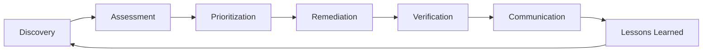
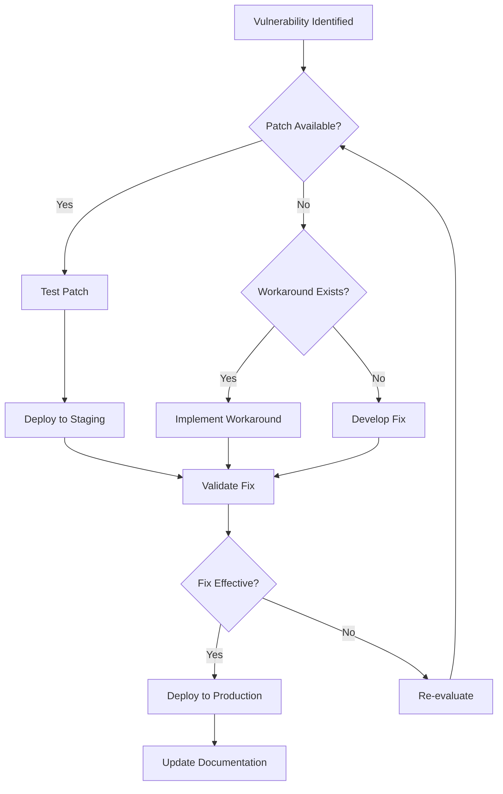

# Vulnerability Management Process

**Version**: 1.0  
**Date**: June 12, 2025  
**Project**: Gunj Operator  
**Author**: Security Team  
**Status**: Active Process  

---

## 📋 Overview

This document defines the vulnerability management process for the Gunj Operator project. It establishes procedures for identifying, assessing, prioritizing, remediating, and tracking security vulnerabilities throughout the project lifecycle.

## 🎯 Objectives

1. **Minimize Security Risk**: Reduce exposure to known vulnerabilities
2. **Rapid Response**: Quick identification and remediation of vulnerabilities
3. **Compliance**: Meet security standards and regulations
4. **Transparency**: Clear communication with stakeholders
5. **Continuous Improvement**: Learn from vulnerabilities to prevent recurrence

---

## 🔄 Vulnerability Management Lifecycle



---

## 1️⃣ Vulnerability Discovery

### Discovery Methods

| Method | Frequency | Tool/Process | Owner |
|--------|-----------|--------------|-------|
| **Automated Scanning** |
| Code scanning (SAST) | Every commit | Semgrep, SonarQube | CI/CD Pipeline |
| Dependency scanning | Daily | Snyk, Dependabot | Security Bot |
| Container scanning | Every build | Trivy, Grype | Build Pipeline |
| Infrastructure scanning | Weekly | Cloud provider tools | DevOps Team |
| **Manual Discovery** |
| Security audits | Quarterly | External auditor | Security Team |
| Penetration testing | Annually | Third-party | Security Team |
| Bug bounty reports | Ongoing | HackerOne | Security Team |
| Security research | Ongoing | Team research | All Teams |

### Discovery Sources

```yaml
sources:
  internal:
    - ci_pipeline_scans
    - security_monitoring
    - developer_reports
    - automated_tools
  
  external:
    - cve_databases
    - security_advisories
    - bug_bounty_program
    - security_researchers
    - user_reports
  
  intelligence:
    - nvd_feed
    - github_security_advisories
    - vendor_notifications
    - cncf_security_alerts
```

---

## 2️⃣ Vulnerability Assessment

### Severity Classification

| Severity | CVSS Score | Description | Example |
|----------|------------|-------------|---------|
| **Critical** | 9.0-10.0 | Immediate threat, easily exploitable | RCE, authentication bypass |
| **High** | 7.0-8.9 | Significant impact, exploitable | Privilege escalation, data exposure |
| **Medium** | 4.0-6.9 | Moderate impact, harder to exploit | XSS, information disclosure |
| **Low** | 0.1-3.9 | Limited impact, difficult to exploit | Minor info leak, DoS |

### Assessment Criteria

```yaml
assessment_factors:
  technical:
    - cvss_base_score
    - exploit_complexity
    - attack_vector
    - privileges_required
    - user_interaction
  
  environmental:
    - affected_components
    - data_sensitivity
    - system_criticality
    - network_exposure
    - compensating_controls
  
  threat:
    - exploit_availability
    - threat_actor_interest
    - public_disclosure
    - active_exploitation
```

### Risk Scoring Formula

```javascript
function calculateRiskScore(vulnerability) {
  const baseScore = vulnerability.cvss.score;
  const exploitability = vulnerability.exploitability * 0.3;
  const impact = vulnerability.businessImpact * 0.4;
  const exposure = vulnerability.exposureLevel * 0.3;
  
  return (baseScore * 0.4) + exploitability + impact + exposure;
}
```

---

## 3️⃣ Vulnerability Prioritization

### Priority Matrix

| Severity | Exploitability | Business Impact | Priority | SLA |
|----------|----------------|-----------------|----------|-----|
| Critical | High | High | P0 | 24 hours |
| Critical | Medium/Low | Any | P1 | 48 hours |
| High | High | High | P1 | 48 hours |
| High | Medium | Any | P2 | 7 days |
| Medium | High | High | P2 | 7 days |
| Medium | Any | Medium/Low | P3 | 30 days |
| Low | Any | Any | P4 | 90 days |

### Prioritization Workflow

```yaml
prioritization_process:
  1_initial_triage:
    - automated_severity_assignment
    - security_team_review
    - component_owner_notification
  
  2_detailed_analysis:
    - exploitability_assessment
    - business_impact_analysis
    - exposure_evaluation
  
  3_priority_assignment:
    - apply_priority_matrix
    - consider_special_factors
    - assign_to_team
  
  4_exception_handling:
    - false_positive_verification
    - risk_acceptance_process
    - compensating_controls
```

---

## 4️⃣ Vulnerability Remediation

### Remediation Strategies

| Strategy | Description | When to Use |
|----------|-------------|-------------|
| **Patch** | Apply security update | Patch available, low risk |
| **Upgrade** | Update to secure version | Major version with fix |
| **Configure** | Change configuration | Misconfiguration issue |
| **Mitigate** | Apply workaround | No patch available |
| **Replace** | Use alternative component | Component deprecated |
| **Accept** | Document and monitor | Low risk, high cost to fix |

### Remediation Workflow



### Remediation Tracking

```yaml
tracking_requirements:
  ticket_fields:
    - vulnerability_id
    - severity_level
    - affected_components
    - assigned_team
    - due_date
    - status
    - remediation_type
    - testing_status
    - deployment_status
  
  status_values:
    - new
    - triaged
    - in_progress
    - testing
    - ready_for_deploy
    - deployed
    - verified
    - closed
```

---

## 5️⃣ Verification & Validation

### Verification Process

| Stage | Action | Responsible | Output |
|-------|--------|-------------|--------|
| **Pre-deployment** |
| Code review | Review fix implementation | Developer peer | Review approval |
| Security test | Verify vulnerability fixed | Security team | Test report |
| Regression test | Ensure no breakage | QA team | Test results |
| **Post-deployment** |
| Rescan | Confirm fix in production | Security tools | Scan report |
| Monitoring | Watch for recurrence | Operations | Metrics |
| Penetration test | Validate effectiveness | Security team | Pentest report |

### Validation Checklist

- [ ] Original vulnerability no longer present
- [ ] No new vulnerabilities introduced
- [ ] All tests passing
- [ ] Performance impact acceptable
- [ ] Documentation updated
- [ ] Monitoring configured
- [ ] Rollback plan tested

---

## 6️⃣ Communication & Reporting

### Internal Communication

| Audience | Method | Frequency | Content |
|----------|---------|-----------|---------|
| Development Team | Slack/Email | Immediate | New vulnerabilities, assignments |
| Management | Dashboard | Daily | Status summary, metrics |
| Security Team | JIRA | Real-time | All vulnerability details |
| Operations | Runbook | As needed | Mitigation procedures |

### External Communication

```yaml
disclosure_timeline:
  critical_vulnerabilities:
    - immediate: Affected users notified
    - 24_hours: Patch released
    - 48_hours: Public advisory
    - 7_days: CVE published
  
  other_severities:
    - patch_release: Include in release notes
    - 30_days: Security bulletin
    - 90_days: Full disclosure
```

### Security Advisory Template

```markdown
# Security Advisory: [CVE-YYYY-NNNNN]

**Severity**: Critical/High/Medium/Low
**Affected Versions**: x.y.z to a.b.c
**Fixed Version**: m.n.o
**Published**: YYYY-MM-DD

## Summary
Brief description of the vulnerability.

## Impact
What can an attacker do with this vulnerability?

## Affected Components
- Component A (versions x.y.z - a.b.c)
- Component B (all versions before m.n.o)

## Mitigation
Temporary measures while patching.

## Fix
Update to version m.n.o or apply patch.

## Timeline
- YYYY-MM-DD: Vulnerability discovered
- YYYY-MM-DD: Fix developed
- YYYY-MM-DD: Fix released
- YYYY-MM-DD: Advisory published

## Credits
Discovered by Security Researcher Name.
```

---

## 📊 Metrics & KPIs

### Performance Metrics

| Metric | Formula | Target | Current |
|--------|---------|--------|---------|
| **Mean Time to Detect (MTTD)** | Time(detected) - Time(introduced) | < 7 days | - |
| **Mean Time to Patch (MTTP)** | Time(patched) - Time(detected) | < 30 days | - |
| **Patch Coverage** | (Patched / Total) × 100% | > 95% | - |
| **False Positive Rate** | (False Positives / Total) × 100% | < 10% | - |
| **Reopen Rate** | (Reopened / Closed) × 100% | < 5% | - |

### SLA Compliance

```javascript
// SLA Tracking
const slaTargets = {
  critical: { hours: 24 },
  high: { hours: 48 },
  medium: { days: 7 },
  low: { days: 30 }
};

function checkSLACompliance(vulnerability) {
  const timeElapsed = Date.now() - vulnerability.detectedAt;
  const target = slaTargets[vulnerability.severity];
  const targetMs = target.hours ? target.hours * 3600000 : target.days * 86400000;
  
  return {
    compliant: timeElapsed <= targetMs,
    percentage: (targetMs - timeElapsed) / targetMs * 100
  };
}
```

---

## 🚨 Escalation Procedures

### Escalation Matrix

| Condition | Level 1 | Level 2 | Level 3 |
|-----------|---------|---------|---------|
| **SLA Breach Risk** | Team Lead | Engineering Manager | CTO |
| **Critical Exploit** | Security Lead | CISO | Executive Team |
| **Data Breach Risk** | Privacy Officer | Legal Team | CEO |
| **Public Disclosure** | PR Team | CMO | Executive Team |

### Emergency Response

```yaml
emergency_response:
  triggers:
    - active_exploitation_detected
    - critical_zero_day
    - data_breach_potential
    - service_compromise
  
  actions:
    immediate:
      - isolate_affected_systems
      - notify_incident_commander
      - activate_war_room
      - begin_forensics
    
    within_1_hour:
      - assess_impact
      - develop_mitigation
      - prepare_communications
      - notify_stakeholders
    
    within_4_hours:
      - deploy_mitigation
      - issue_advisory
      - update_monitoring
      - prepare_patch
```

---

## 🔧 Tools & Automation

### Vulnerability Management Platform

```yaml
platform_requirements:
  core_features:
    - vulnerability_database
    - automated_scanning
    - ticket_integration
    - reporting_dashboard
    - api_access
  
  integrations:
    - github_issues
    - jira_tickets
    - slack_notifications
    - email_alerts
    - siem_integration
  
  automation:
    - scan_scheduling
    - ticket_creation
    - priority_assignment
    - sla_tracking
    - report_generation
```

### Automation Scripts

```python
# Example: Automated Vulnerability Processor
class VulnerabilityProcessor:
    def process_scan_results(self, scan_results):
        vulnerabilities = []
        
        for finding in scan_results:
            vuln = self.create_vulnerability(finding)
            vuln.severity = self.calculate_severity(finding)
            vuln.priority = self.assign_priority(vuln)
            vuln.owner = self.assign_owner(vuln)
            
            if self.is_duplicate(vuln):
                self.update_existing(vuln)
            else:
                self.create_ticket(vuln)
                vulnerabilities.append(vuln)
        
        self.send_notifications(vulnerabilities)
        return vulnerabilities
```

---

## 📚 Training & Awareness

### Training Requirements

| Role | Training Topics | Frequency |
|------|----------------|-----------|
| **Developers** | Secure coding, OWASP Top 10 | Quarterly |
| **Security Team** | Vulnerability assessment, tools | Monthly |
| **Operations** | Incident response, patching | Quarterly |
| **Management** | Risk management, compliance | Semi-annually |

### Awareness Program

- **Monthly Security Newsletter**: Latest vulnerabilities and fixes
- **Lunch & Learn Sessions**: Deep dives on security topics
- **Security Champions Program**: Embedded security experts
- **Gamification**: Security bug hunting contests

---

## 🔄 Continuous Improvement

### Review Process

```yaml
review_schedule:
  weekly:
    - vulnerability_status_review
    - sla_compliance_check
    - priority_adjustments
  
  monthly:
    - metrics_analysis
    - process_improvements
    - tool_effectiveness
  
  quarterly:
    - full_process_review
    - training_needs_assessment
    - tool_evaluation
  
  annually:
    - policy_update
    - strategic_planning
    - budget_review
```

### Lessons Learned

After each significant vulnerability:
1. **Root Cause Analysis**: Why did it occur?
2. **Detection Gap Analysis**: Why wasn't it found earlier?
3. **Process Improvement**: What can we do better?
4. **Prevention Strategy**: How do we prevent recurrence?
5. **Knowledge Sharing**: Document and train

---

## 📞 Contacts & Resources

### Internal Contacts
- **Security Team**: security@gunj-operator.io
- **Vulnerability Reports**: vulnerabilities@gunj-operator.io
- **Emergency**: security-emergency@gunj-operator.io

### External Resources
- **NVD Database**: https://nvd.nist.gov
- **CVE Database**: https://cve.mitre.org
- **CNCF Security**: https://github.com/cncf/tag-security
- **OWASP**: https://owasp.org

---

*This process document is reviewed quarterly and updated as needed.*

**Next Review**: September 12, 2025  
**Process Owner**: Security Team Lead
