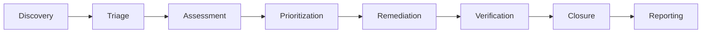

# Vulnerability Management Process
## Gunj Operator Project

**Version**: 1.0  
**Date**: June 12, 2025  
**Owner**: Security Team  
**Review Cycle**: Quarterly  

---

## 1. Overview

This document defines the vulnerability management process for the Gunj Operator project, ensuring systematic identification, assessment, remediation, and tracking of security vulnerabilities.

### 1.1 Objectives

- Identify vulnerabilities before they can be exploited
- Prioritize remediation based on risk
- Track vulnerability lifecycle from discovery to resolution
- Maintain compliance with security standards
- Minimize security risk exposure

### 1.2 Scope

This process covers:
- Application code vulnerabilities
- Container image vulnerabilities
- Dependency vulnerabilities
- Infrastructure vulnerabilities
- Configuration vulnerabilities

---

## 2. Vulnerability Lifecycle



### 2.1 Discovery Phase

#### Automated Discovery
```yaml
scanning_schedule:
  continuous:
    - commit_scanning    # Every commit
    - pr_scanning       # Every PR
  daily:
    - dependency_scan   # 00:00 UTC
    - container_scan    # 06:00 UTC
  weekly:
    - infrastructure_scan  # Sunday 00:00 UTC
    - configuration_scan   # Sunday 06:00 UTC
  monthly:
    - penetration_test    # First Monday
```

#### Discovery Sources
1. **Automated Scanning**
   - Trivy (containers)
   - Gosec (SAST)
   - Nancy (dependencies)
   - OWASP ZAP (DAST)

2. **Manual Discovery**
   - Security audits
   - Penetration testing
   - Code reviews
   - Bug bounty program

3. **External Reports**
   - Security researchers
   - Users
   - Security advisories
   - CVE databases

### 2.2 Triage Phase

#### Initial Assessment
```yaml
triage_checklist:
  - verify_vulnerability
  - determine_exploitability
  - assess_impact
  - identify_affected_components
  - assign_severity
  - create_tracking_ticket
```

#### Severity Classification
| Severity | CVSS Score | Response Time | Example |
|----------|------------|---------------|---------|
| Critical | 9.0 - 10.0 | 24 hours | RCE, Authentication bypass |
| High | 7.0 - 8.9 | 7 days | Privilege escalation, Data exposure |
| Medium | 4.0 - 6.9 | 30 days | XSS, Information disclosure |
| Low | 0.1 - 3.9 | 90 days | Minor information leak |

### 2.3 Assessment Phase

#### Risk Assessment Matrix
```
    Impact
    ┌─────┬─────┬─────┬─────┐
    │ Low │ Med │High │Crit │
┌───┼─────┼─────┼─────┼─────┤
│Low│  1  │  2  │  3  │  4  │
├───┼─────┼─────┼─────┼─────┤
│Med│  2  │  3  │  4  │  5  │
├───┼─────┼─────┼─────┼─────┤
│High│ 3  │  4  │  5  │  5  │
├───┼─────┼─────┼─────┼─────┤
│Crit│ 4  │  5  │  5  │  5  │
└───┴─────┴─────┴─────┴─────┘
Likelihood
```

#### Assessment Criteria
```go
type VulnerabilityAssessment struct {
    ID              string
    Severity        string
    CVSS            float64
    Exploitability  string  // None, PoC, Active
    Impact          Impact
    AffectedSystems []string
    AttackVector    string  // Network, Adjacent, Local, Physical
    Privileges      string  // None, Low, High
    UserInteraction bool
    FixAvailable    bool
    Workaround      bool
}

type Impact struct {
    Confidentiality string // None, Low, High
    Integrity       string // None, Low, High
    Availability    string // None, Low, High
    Scope          string // Unchanged, Changed
}
```

### 2.4 Prioritization Phase

#### Priority Calculation
```python
def calculate_priority(vulnerability):
    base_score = vulnerability.cvss
    
    # Adjust for exploitability
    if vulnerability.exploitability == "Active":
        base_score += 2.0
    elif vulnerability.exploitability == "PoC":
        base_score += 1.0
    
    # Adjust for fix availability
    if not vulnerability.fix_available:
        base_score += 0.5
    
    # Adjust for exposure
    if vulnerability.internet_facing:
        base_score += 1.0
    
    # Adjust for data sensitivity
    if vulnerability.affects_pii:
        base_score += 1.5
    
    return min(base_score, 10.0)
```

#### Priority Levels
| Priority | Score | Action |
|----------|-------|---------|
| P0 | 9.0+ | Drop everything, fix immediately |
| P1 | 7.0-8.9 | Fix within SLA |
| P2 | 5.0-6.9 | Schedule for next sprint |
| P3 | 3.0-4.9 | Backlog, fix within quarter |
| P4 | <3.0 | Track, fix as able |

### 2.5 Remediation Phase

#### Remediation Workflow
```yaml
remediation_steps:
  1_identify_fix:
    - research_vulnerability
    - identify_patch_or_workaround
    - test_fix_locally
  
  2_implement_fix:
    - create_feature_branch
    - apply_fix
    - write_tests
    - update_documentation
  
  3_review_and_test:
    - code_review
    - security_review
    - automated_testing
    - manual_testing
  
  4_deploy:
    - deploy_to_staging
    - verify_fix
    - deploy_to_production
    - monitor_for_regression
```

#### Fix Types
1. **Patch**: Update vulnerable component
2. **Upgrade**: Move to newer version
3. **Workaround**: Temporary mitigation
4. **Configuration**: Change settings
5. **Code Change**: Modify application code
6. **Compensating Control**: Add additional security

### 2.6 Verification Phase

#### Verification Checklist
- [ ] Vulnerability scanner shows fixed
- [ ] Manual testing confirms fix
- [ ] No functionality regression
- [ ] Performance impact acceptable
- [ ] Security tests pass
- [ ] Documentation updated

#### Verification Methods
```bash
# Automated verification
./scripts/verify-vulnerability-fix.sh CVE-2024-12345

# Manual verification
curl -X POST https://api.example.com/test \
  -H "Content-Type: application/json" \
  -d '{"test": "payload"}'

# Regression testing
make test-security
make test-integration
```

### 2.7 Closure Phase

#### Closure Criteria
- Fix deployed to all environments
- Verification completed successfully
- Documentation updated
- Stakeholders notified
- Metrics updated
- Lessons learned documented

#### Post-Closure Actions
```yaml
post_closure:
  - update_vulnerability_database
  - update_security_metrics
  - send_closure_notification
  - archive_evidence
  - schedule_retrospective
```

---

## 3. Vulnerability Tracking

### 3.1 Tracking System

#### JIRA Workflow
```
┌─────────┐     ┌─────────┐     ┌──────────┐
│   New   │────▶│Triaging │────▶│Confirmed │
└─────────┘     └─────────┘     └──────────┘
                                      │
                                      ▼
┌─────────┐     ┌─────────┐     ┌──────────┐
│ Closed  │◀────│Verified │◀────│   Fixed  │
└─────────┘     └─────────┘     └──────────┘
                                      ▲
                                      │
                                ┌──────────┐
                                │In Progress│
                                └──────────┘
```

#### Ticket Template
```markdown
### Vulnerability Details
- **CVE ID**: CVE-2024-12345
- **Severity**: High (CVSS 7.5)
- **Component**: dependency-xyz v1.2.3
- **Discovered**: 2025-06-12
- **Discovered By**: Trivy scan

### Description
Brief description of the vulnerability

### Impact
- Confidentiality: High
- Integrity: Medium
- Availability: Low

### Affected Systems
- [ ] Production
- [ ] Staging
- [ ] Development

### Remediation
- **Fix Available**: Yes
- **Fix Version**: 1.2.4
- **Workaround**: Block port 8080

### Verification Steps
1. Run security scan
2. Test functionality
3. Check for regression
```

### 3.2 Metrics and Reporting

#### Key Metrics
```sql
-- Mean Time to Detect (MTTD)
SELECT AVG(discovered_date - introduced_date) as mttd
FROM vulnerabilities
WHERE discovered_date >= NOW() - INTERVAL '30 days';

-- Mean Time to Remediate (MTTR)
SELECT AVG(fixed_date - discovered_date) as mttr
FROM vulnerabilities
WHERE fixed_date >= NOW() - INTERVAL '30 days';

-- Open vulnerabilities by severity
SELECT severity, COUNT(*) as count
FROM vulnerabilities
WHERE status != 'closed'
GROUP BY severity;
```

#### Dashboard Metrics
```yaml
vulnerability_dashboard:
  summary:
    - total_open_vulnerabilities
    - critical_vulnerabilities
    - average_age_of_vulnerabilities
    - fix_rate_last_30_days
  
  trends:
    - vulnerabilities_over_time
    - mttr_by_severity
    - discovery_sources
    - component_vulnerability_density
  
  compliance:
    - sla_compliance_rate
    - overdue_vulnerabilities
    - security_debt_score
```

---

## 4. Automation

### 4.1 Scanning Automation

#### CI/CD Integration
```yaml
name: Security Scanning

on:
  push:
    branches: [main, develop]
  pull_request:
  schedule:
    - cron: '0 0 * * *'

jobs:
  vulnerability-scan:
    runs-on: ubuntu-latest
    steps:
    - uses: actions/checkout@v4
    
    - name: Run Trivy vulnerability scanner
      uses: aquasecurity/trivy-action@master
      with:
        scan-type: 'fs'
        ignore-unfixed: true
        format: 'sarif'
        output: 'trivy-results.sarif'
        severity: 'CRITICAL,HIGH'
    
    - name: Upload Trivy scan results
      uses: github/codeql-action/upload-sarif@v3
      with:
        sarif_file: 'trivy-results.sarif'
    
    - name: Create issues for vulnerabilities
      run: |
        python scripts/create-vulnerability-issues.py trivy-results.sarif
```

### 4.2 Remediation Automation

#### Automated Patching
```python
#!/usr/bin/env python3
# auto-patch-vulnerabilities.py

import json
import subprocess
import requests

def get_vulnerabilities():
    """Get list of vulnerabilities from scanning tool"""
    result = subprocess.run(['trivy', 'fs', '.', '-f', 'json'], 
                          capture_output=True, text=True)
    return json.loads(result.stdout)

def check_fix_available(vulnerability):
    """Check if fix is available for vulnerability"""
    if vulnerability.get('FixedVersion'):
        return True
    return False

def apply_fix(vulnerability):
    """Apply fix for vulnerability"""
    if vulnerability['PkgName'].startswith('github.com/'):
        # Go dependency
        cmd = f"go get {vulnerability['PkgName']}@{vulnerability['FixedVersion']}"
    elif vulnerability['PkgName'] in package_json:
        # NPM dependency
        cmd = f"npm install {vulnerability['PkgName']}@{vulnerability['FixedVersion']}"
    else:
        return False
    
    subprocess.run(cmd, shell=True)
    return True

def create_pr(branch_name, vulnerabilities):
    """Create PR with fixes"""
    # Implementation for creating GitHub PR
    pass

if __name__ == "__main__":
    vulnerabilities = get_vulnerabilities()
    fixable = [v for v in vulnerabilities if check_fix_available(v)]
    
    if fixable:
        branch_name = f"auto-fix-vulnerabilities-{datetime.now().strftime('%Y%m%d')}"
        subprocess.run(f"git checkout -b {branch_name}", shell=True)
        
        for vuln in fixable:
            apply_fix(vuln)
        
        subprocess.run("git add .", shell=True)
        subprocess.run(f"git commit -m 'fix: auto-patch {len(fixable)} vulnerabilities'", shell=True)
        
        create_pr(branch_name, fixable)
```

---

## 5. Communication

### 5.1 Internal Communication

#### Notification Matrix
| Severity | Who | When | How |
|----------|-----|------|-----|
| Critical | Security Team, On-call, Leadership | Immediately | Page, Slack, Email |
| High | Security Team, Dev Team | Within 1 hour | Slack, Email |
| Medium | Security Team, Dev Team | Within 24 hours | Email, JIRA |
| Low | Dev Team | Weekly digest | Email |

#### Communication Templates
```markdown
Subject: [CRITICAL] Security Vulnerability Detected - Immediate Action Required

Team,

A critical vulnerability has been detected in our system:

**Vulnerability**: CVE-2024-12345
**Severity**: Critical (CVSS 9.8)
**Component**: authentication-service
**Impact**: Remote code execution possible

**Immediate Actions Required**:
1. Security team investigating impact
2. Patch being developed (ETA: 2 hours)
3. WAF rules being updated as temporary mitigation

**Status Page**: https://status.gunjoperator.io/incidents/123

Please join the war room: https://meet.google.com/xyz-abc-123

Thanks,
Security Team
```

### 5.2 External Communication

#### Responsible Disclosure
```markdown
# Security Advisory: GHSA-xxxx-yyyy-zzzz

## Summary
A vulnerability has been discovered in Gunj Operator that could allow [impact].

## Affected Versions
- Gunj Operator < v2.0.5

## Patches
- Fixed in v2.0.5

## Workarounds
If unable to upgrade immediately:
1. [Workaround steps]

## Credits
We thank [Researcher Name] for responsibly disclosing this vulnerability.

## Timeline
- 2025-06-01: Vulnerability reported
- 2025-06-02: Vulnerability confirmed
- 2025-06-05: Fix developed
- 2025-06-12: Fix released

## References
- CVE-2024-12345
- [Link to fix commit]
```

---

## 6. Compliance and Audit

### 6.1 Compliance Requirements

#### SLA Compliance
| Severity | Detection SLA | Resolution SLA | Escalation |
|----------|---------------|----------------|------------|
| Critical | Real-time | 24 hours | Immediate |
| High | 1 hour | 7 days | 24 hours |
| Medium | 24 hours | 30 days | 7 days |
| Low | 1 week | 90 days | 30 days |

#### Audit Trail
```sql
CREATE TABLE vulnerability_audit (
    id SERIAL PRIMARY KEY,
    vulnerability_id VARCHAR(50),
    action VARCHAR(50),
    actor VARCHAR(100),
    timestamp TIMESTAMP DEFAULT CURRENT_TIMESTAMP,
    details JSONB
);

-- Example audit entry
INSERT INTO vulnerability_audit (vulnerability_id, action, actor, details)
VALUES ('CVE-2024-12345', 'status_change', 'john.doe@example.com', 
        '{"from": "confirmed", "to": "in_progress", "reason": "Fix development started"}');
```

### 6.2 Reporting

#### Monthly Security Report
```markdown
# Vulnerability Management Report - June 2025

## Executive Summary
- Total vulnerabilities discovered: 45
- Vulnerabilities remediated: 42
- Average time to remediate: 3.2 days
- SLA compliance: 96%

## Vulnerability Breakdown
| Severity | Discovered | Fixed | Open |
|----------|------------|-------|------|
| Critical | 2 | 2 | 0 |
| High | 8 | 8 | 0 |
| Medium | 20 | 18 | 2 |
| Low | 15 | 14 | 1 |

## Trends
[Include charts showing trends]

## Top Vulnerable Components
1. dependency-xyz (5 vulnerabilities)
2. component-abc (3 vulnerabilities)
3. library-123 (2 vulnerabilities)

## Recommendations
1. Upgrade to Go 1.21.5
2. Implement additional scanning for CI/CD
3. Increase security training for developers
```

---

## 7. Continuous Improvement

### 7.1 Lessons Learned

After each significant vulnerability:
1. Conduct blameless post-mortem
2. Identify root causes
3. Update processes
4. Share knowledge
5. Implement preventive measures

### 7.2 Process Metrics

Track and improve:
- Time to detect vulnerabilities
- Time to remediate vulnerabilities
- False positive rate
- Vulnerability recurrence rate
- Process compliance rate

### 7.3 Tool Evaluation

Quarterly review:
- Scanner effectiveness
- Tool coverage gaps
- New tools evaluation
- Integration improvements
- Automation opportunities

---

**This process is reviewed quarterly and updated based on lessons learned and industry best practices.**

*For questions about this process, contact security@gunjoperator.io*
