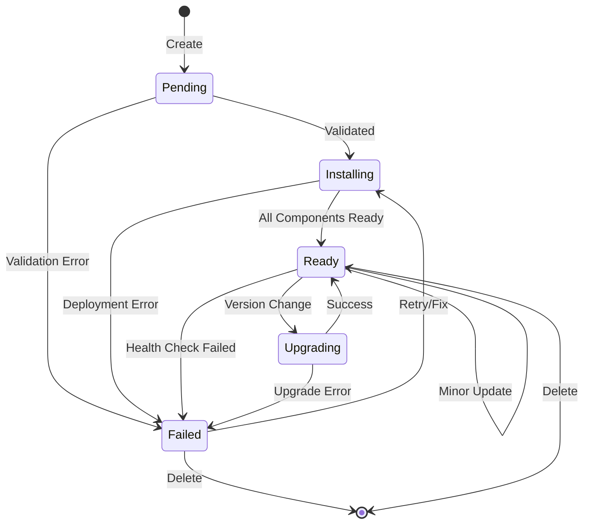

# ObservabilityPlatform State Machine Design

## Overview

The ObservabilityPlatform operator implements a state machine to manage the lifecycle of observability components. This document defines the states, transitions, and reconciliation logic.

## Platform States

### 1. Pending
- **Description**: Initial state when a platform is created
- **Entry Conditions**: New ObservabilityPlatform resource created
- **Exit Conditions**: All pre-flight checks pass
- **Actions**:
  - Validate resource specifications
  - Check namespace quotas
  - Verify required secrets exist
  - Create initial status conditions

### 2. Installing
- **Description**: Platform components are being deployed
- **Entry Conditions**: From Pending state with valid configuration
- **Exit Conditions**: All components report Ready status
- **Actions**:
  - Deploy components in order (Prometheus → Loki → Tempo → Grafana → AlertManager)
  - Create necessary ConfigMaps and Secrets
  - Set up PersistentVolumeClaims
  - Configure networking (Services, Ingress)

### 3. Ready
- **Description**: All components are running and healthy
- **Entry Conditions**: All component deployments are ready
- **Exit Conditions**: Component failure or spec change
- **Actions**:
  - Monitor component health
  - Update metrics
  - Maintain status endpoints
  - Process minor configuration updates

### 4. Failed
- **Description**: One or more components have failed
- **Entry Conditions**: Component health check failure or deployment error
- **Exit Conditions**: Manual intervention or automatic recovery
- **Actions**:
  - Log detailed error information
  - Attempt automatic recovery (configurable retries)
  - Emit events for alerting
  - Preserve last known good configuration

### 5. Upgrading
- **Description**: Platform is being upgraded to new versions
- **Entry Conditions**: Version change detected in spec
- **Exit Conditions**: Upgrade complete or rollback triggered
- **Actions**:
  - Create backup of current state
  - Perform rolling updates
  - Validate component compatibility
  - Update status with progress

## State Transition Diagram



## Component States

Each component (Prometheus, Grafana, Loki, Tempo) has its own state:

### Component State Values
- **Pending**: Component spec defined but not yet processed
- **Installing**: Component resources being created
- **Ready**: Component deployed and healthy
- **Failed**: Component deployment or health check failed
- **Upgrading**: Component being upgraded to new version

## Reconciliation Flow

### Main Reconciliation Loop

```go
func (r *ObservabilityPlatformReconciler) Reconcile(ctx context.Context, req ctrl.Request) (ctrl.Result, error) {
    // 1. Fetch the ObservabilityPlatform instance
    platform := &observabilityv1.ObservabilityPlatform{}
    if err := r.Get(ctx, req.NamespacedName, platform); err != nil {
        return ctrl.Result{}, client.IgnoreNotFound(err)
    }

    // 2. Handle deletion
    if !platform.DeletionTimestamp.IsZero() {
        return r.handleDeletion(ctx, platform)
    }

    // 3. Add finalizer if needed
    if !controllerutil.ContainsFinalizer(platform, finalizerName) {
        controllerutil.AddFinalizer(platform, finalizerName)
        if err := r.Update(ctx, platform); err != nil {
            return ctrl.Result{}, err
        }
    }

    // 4. Check if paused
    if platform.Spec.Paused {
        return ctrl.Result{}, nil
    }

    // 5. Determine current state and transition
    switch platform.Status.Phase {
    case "":
        return r.handlePendingState(ctx, platform)
    case "Pending":
        return r.handlePendingState(ctx, platform)
    case "Installing":
        return r.handleInstallingState(ctx, platform)
    case "Ready":
        return r.handleReadyState(ctx, platform)
    case "Failed":
        return r.handleFailedState(ctx, platform)
    case "Upgrading":
        return r.handleUpgradingState(ctx, platform)
    default:
        return ctrl.Result{}, fmt.Errorf("unknown phase: %s", platform.Status.Phase)
    }
}
```

### State Handlers

#### Pending State Handler
```go
func (r *ObservabilityPlatformReconciler) handlePendingState(ctx context.Context, platform *v1alpha1.ObservabilityPlatform) (ctrl.Result, error) {
    // Pre-flight checks
    if err := r.validatePlatform(ctx, platform); err != nil {
        return r.transitionToFailed(ctx, platform, err)
    }

    if err := r.checkPrerequisites(ctx, platform); err != nil {
        return ctrl.Result{RequeueAfter: 30 * time.Second}, nil
    }

    // Transition to Installing
    return r.transitionToInstalling(ctx, platform)
}
```

#### Installing State Handler
```go
func (r *ObservabilityPlatformReconciler) handleInstallingState(ctx context.Context, platform *v1alpha1.ObservabilityPlatform) (ctrl.Result, error) {
    // Deploy components in order
    components := []ComponentDeployer{
        r.prometheusDeployer,
        r.lokiDeployer,
        r.tempoDeployer,
        r.grafanaDeployer,
    }

    for _, deployer := range components {
        status, err := deployer.Deploy(ctx, platform)
        if err != nil {
            return r.transitionToFailed(ctx, platform, err)
        }
        
        if status != ComponentReady {
            // Component not ready yet, requeue
            return ctrl.Result{RequeueAfter: 10 * time.Second}, nil
        }
    }

    // All components ready
    return r.transitionToReady(ctx, platform)
}
```

## Idempotency Guarantees

All state handlers must be idempotent:

1. **Resource Creation**: Always check if resource exists before creating
2. **Resource Updates**: Use Server-Side Apply or strategic merge patches
3. **Status Updates**: Compare before updating to avoid unnecessary API calls
4. **External Actions**: Design to be safely repeatable

## Error Handling Strategy

### Retry Logic
```go
type RetryConfig struct {
    MaxRetries     int
    InitialBackoff time.Duration
    MaxBackoff     time.Duration
    BackoffFactor  float64
}

var defaultRetryConfig = RetryConfig{
    MaxRetries:     5,
    InitialBackoff: 10 * time.Second,
    MaxBackoff:     5 * time.Minute,
    BackoffFactor:  2.0,
}
```

### Error Categories

1. **Transient Errors**: Network issues, temporary resource constraints
   - Action: Exponential backoff retry
   
2. **Configuration Errors**: Invalid specifications, missing secrets
   - Action: Fail fast, require user intervention
   
3. **Resource Errors**: Quota exceeded, permissions denied
   - Action: Emit event, wait for resolution
   
4. **Component Errors**: Component-specific failures
   - Action: Component-specific recovery strategy

## Observability

### Metrics
- `observability_platform_state_transitions_total`: Counter of state transitions
- `observability_platform_reconciliation_duration_seconds`: Histogram of reconciliation duration
- `observability_platform_component_status`: Gauge of component states
- `observability_platform_errors_total`: Counter of errors by type

### Events
- State transitions
- Component deployments
- Error conditions
- Recovery actions

### Conditions
Standard Kubernetes conditions:
- `Ready`: Overall platform readiness
- `Progressing`: Installation/upgrade in progress
- `Degraded`: Partial failure state
- `Available`: Platform is serving requests

## Best Practices

1. **Minimize State**: Keep state in Kubernetes resources, not in memory
2. **Watch Owned Resources**: React to changes in owned resources
3. **Graceful Degradation**: Partial functionality better than complete failure
4. **Progressive Rollout**: Deploy/upgrade components incrementally
5. **Observability First**: Comprehensive logging, metrics, and events
