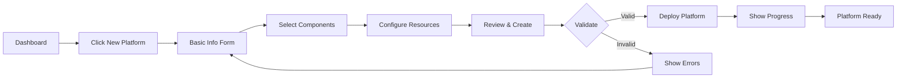

# Gunj Operator UI - Wireframes & Mockups

**Version**: 1.0  
**Last Updated**: June 12, 2025  
**Status**: Design Phase  
**Figma Link**: [View Interactive Prototype](#) *(to be created)*

## 📋 Table of Contents

1. [Design Overview](#design-overview)
2. [Low-Fidelity Wireframes](#low-fidelity-wireframes)
3. [High-Fidelity Mockups](#high-fidelity-mockups)
4. [Responsive Layouts](#responsive-layouts)
5. [Component Library](#component-library)
6. [Interactive Flows](#interactive-flows)

---

## 🎨 Design Overview

### Screen Inventory

1. **Core Screens**
   - Dashboard/Overview
   - Platform List
   - Platform Details
   - Platform Creation Wizard
   - Component Configuration

2. **Monitoring Screens**
   - Metrics Dashboard
   - Logs Viewer
   - Traces Explorer
   - Alerts Management

3. **Administrative Screens**
   - Settings
   - User Management
   - Audit Logs
   - Cost Analysis

### Design Principles Applied

- **Information Hierarchy**: Critical status information always visible
- **Progressive Disclosure**: Complex features revealed as needed
- **Consistency**: Unified patterns across all screens
- **Real-time Focus**: Live data updates without page refreshes
- **Mobile-First**: Responsive design from small screens up

---

## 📐 Low-Fidelity Wireframes

### 1. Dashboard/Overview

```
┌─────────────────────────────────────────────────────────────────────┐
│ [Logo] Gunj Operator          [Search]        [Notifications] [User] │
├─────────────────────────────────────────────────────────────────────┤
│                                                                       │
│  Platform Health Overview                          Quick Actions      │
│  ┌─────────────────────────┐                     ┌─────────────────┐│
│  │ Total Platforms: 12     │                     │ + New Platform  ││
│  │ ● Healthy: 10           │                     │ ↻ Sync All      ││
│  │ ● Warning: 1            │                     │ ⚙ Global Config ││
│  │ ● Critical: 1           │                     └─────────────────┘│
│  └─────────────────────────┘                                         │
│                                                                       │
│  Resource Usage                    Recent Activities                  │
│  ┌─────────────────┐             ┌─────────────────────────────────┐│
│  │ CPU:  ████░░ 68%│             │ 10:23 Platform prod updated     ││
│  │ Mem:  ███░░░ 52%│             │ 10:15 Alert resolved in staging ││
│  │ Disk: █████░ 81%│             │ 09:45 Backup completed for dev  ││
│  └─────────────────┘             └─────────────────────────────────┘│
│                                                                       │
│  Platform Status Grid                                                 │
│  ┌─────────┬─────────┬─────────┬─────────┐                         │
│  │ prod    │ staging │ dev     │ test    │                         │
│  │ ● Ready │ ● Ready │ ⚠ Warn  │ ● Ready │                         │
│  │ v2.48.0 │ v2.48.0 │ v2.47.0 │ v2.48.0 │                         │
│  └─────────┴─────────┴─────────┴─────────┘                         │
│                                                                       │
│  Component Health Matrix                                              │
│  ┌─────────────────────────────────────────────────────────────────┐│
│  │         │ Prometheus │ Grafana │ Loki │ Tempo │ AlertManager   ││
│  │ prod    │     ●      │    ●    │  ●   │   ●   │      ●        ││
│  │ staging │     ●      │    ●    │  ●   │   ●   │      ●        ││
│  │ dev     │     ●      │    ⚠    │  ●   │   ●   │      ●        ││
│  │ test    │     ●      │    ●    │  ●   │   -   │      ●        ││
│  └─────────────────────────────────────────────────────────────────┘│
└─────────────────────────────────────────────────────────────────────┘
```

### 2. Platform List View

```
┌─────────────────────────────────────────────────────────────────────┐
│ [<] Platforms                                    [+ New] [Filter ▼] │
├─────────────────────────────────────────────────────────────────────┤
│                                                                       │
│  Search: [_____________________] 	  Sort: [Status ▼] [Grid/List]  │
│                                                                       │
│  ┌─────────────────────────────────────────────────────────────┐   │
│  │ ● production                          namespace: monitoring  │   │
│  │   Status: Ready | Created: 2 months ago | v2.48.0          │   │
│  │   Components: P G L T A | Resources: 8 CPU, 32GB RAM       │   │
│  │   [View] [Edit] [Clone] [Delete]                           │   │
│  └─────────────────────────────────────────────────────────────┘   │
│                                                                       │
│  ┌─────────────────────────────────────────────────────────────┐   │
│  │ ● staging                              namespace: staging    │   │
│  │   Status: Ready | Created: 3 months ago | v2.48.0          │   │
│  │   Components: P G L - A | Resources: 4 CPU, 16GB RAM       │   │
│  │   [View] [Edit] [Clone] [Delete]                           │   │
│  └─────────────────────────────────────────────────────────────┘   │
│                                                                       │
│  ┌─────────────────────────────────────────────────────────────┐   │
│  │ ⚠ development                          namespace: dev        │   │
│  │   Status: Degraded | Created: 1 week ago | v2.47.0         │   │
│  │   Components: P G L T A | Resources: 2 CPU, 8GB RAM        │   │
│  │   [View] [Edit] [Clone] [Delete]                           │   │
│  └─────────────────────────────────────────────────────────────┘   │
│                                                                       │
│  [1] [2] [3] ... [10]  Showing 1-10 of 47 platforms               │
└─────────────────────────────────────────────────────────────────────┘
```

### 3. Platform Creation Wizard

```
┌─────────────────────────────────────────────────────────────────────┐
│ Create New Platform                                      [X] Close  │
├─────────────────────────────────────────────────────────────────────┤
│                                                                       │
│  Step 1 of 4: Basic Information          [1]--2---3---4            │
│  ─────────────────────────────────                                  │
│                                                                       │
│  Platform Name*        [_________________________]                  │
│  Namespace*           [_________________________]                  │
│  Description          [_________________________]                  │
│                       [_________________________]                  │
│                                                                       │
│  Environment          [Production ▼]                                │
│  Owner Team          [Platform Team ▼]                             │
│                                                                       │
│  Labels                                                              │
│  ┌─────────────────────────────────────┐                           │
│  │ Key: environment  Value: production  │ [Remove]                 │
│  │ Key: team        Value: platform    │ [Remove]                 │
│  └─────────────────────────────────────┘                           │
│  [+ Add Label]                                                       │
│                                                                       │
│  ─────────────────────────────────────────────                      │
│  [Cancel]                               [Back] [Next: Components →] │
└─────────────────────────────────────────────────────────────────────┘
```

### 4. Platform Details View

```
┌─────────────────────────────────────────────────────────────────────┐
│ [<] production                     [Edit] [Delete] [⚙] [↻ Refresh] │
├─────────────────────────────────────────────────────────────────────┤
│                                                                       │
│  [Overview] [Components] [Monitoring] [Logs] [Configuration] [Events]│
│  ──────────                                                          │
│                                                                       │
│  Platform Status                                                     │
│  ┌───────────────────────────────────┬─────────────────────────────┐│
│  │ Status: ● Ready                   │ Quick Actions               ││
│  │ Version: v2.48.0                  │ [↻ Sync] [⬆ Upgrade]      ││
│  │ Created: 2024-04-12               │ [💾 Backup] [📊 Export]    ││
│  │ Last Updated: 10 minutes ago      │                             ││
│  └───────────────────────────────────┴─────────────────────────────┘│
│                                                                       │
│  Resource Usage                                                      │
│  ┌─────────────────────────────────────────────────────────────────┐│
│  │ CPU Usage         ████████░░░░░░░░ 52% (4.2/8 cores)           ││
│  │ Memory Usage      ██████░░░░░░░░░░ 41% (13.1/32 GB)           ││
│  │ Storage Usage     ████████████░░░░ 78% (78/100 GB)            ││
│  │ Network I/O       ↓ 125 MB/s  ↑ 89 MB/s                        ││
│  └─────────────────────────────────────────────────────────────────┘│
│                                                                       │
│  Components                                                          │
│  ┌──────────────┬──────────┬──────────┬─────────────┬────────────┐│
│  │ Component    │ Status   │ Version  │ Replicas    │ Actions    ││
│  ├──────────────┼──────────┼──────────┼─────────────┼────────────┤│
│  │ Prometheus   │ ● Ready  │ v2.48.0  │ 3/3 Running │ [⚙] [↻]   ││
│  │ Grafana      │ ● Ready  │ v10.2.0  │ 2/2 Running │ [⚙] [↻]   ││
│  │ Loki         │ ● Ready  │ v2.9.0   │ 3/3 Running │ [⚙] [↻]   ││
│  │ Tempo        │ ● Ready  │ v2.3.0   │ 2/2 Running │ [⚙] [↻]   ││
│  │ AlertManager │ ● Ready  │ v0.26.0  │ 2/2 Running │ [⚙] [↻]   ││
│  └──────────────┴──────────┴──────────┴─────────────┴────────────┘│
└─────────────────────────────────────────────────────────────────────┘
```

### 5. Metrics Dashboard

```
┌─────────────────────────────────────────────────────────────────────┐
│ Metrics Dashboard - production      Time Range: [Last 1 hour ▼] [↻]│
├─────────────────────────────────────────────────────────────────────┤
│                                                                       │
│  Key Metrics                                                         │
│  ┌────────────┬────────────┬────────────┬────────────┐            │
│  │ Requests/s │ Error Rate │ P95 Latency│ Uptime     │            │
│  │   12.5K    │   0.02%    │   145ms    │  99.99%    │            │
│  │    ↑2%     │    ↓15%    │    ↑5ms    │            │            │
│  └────────────┴────────────┴────────────┴────────────┘            │
│                                                                       │
│  System Resources                                                    │
│  ┌─────────────────────────────────────────────────────────────┐   │
│  │                     CPU Usage (%)                             │   │
│  │  100 ┤                                                      │   │
│  │   80 ┤           ╭─╮                                       │   │
│  │   60 ┤      ╭────╯ ╰────╮                                  │   │
│  │   40 ┤──────╯           ╰──────────                        │   │
│  │   20 ┤                                                      │   │
│  │    0 └──────────────────────────────────────────────────    │   │
│  │      12:00   12:15   12:30   12:45   13:00   13:15         │   │
│  └─────────────────────────────────────────────────────────────┘   │
│                                                                       │
│  ┌─────────────────────────────────────────────────────────────┐   │
│  │                   Memory Usage (GB)                          │   │
│  │   32 ┤                                                      │   │
│  │   24 ┤                    ╭─────────────                    │   │
│  │   16 ┤────────────────────╯                                 │   │
│  │    8 ┤                                                      │   │
│  │    0 └──────────────────────────────────────────────────    │   │
│  │      12:00   12:15   12:30   12:45   13:00   13:15         │   │
│  └─────────────────────────────────────────────────────────────┘   │
│                                                                       │
│  [+ Add Panel] [⚙ Edit Dashboard] [📊 Export] [🔗 Share]           │
└─────────────────────────────────────────────────────────────────────┘
```

---

## 🎨 High-Fidelity Mockups

### Color-Coded Mockup Key
- 🟦 Primary Blue (#1976D2) - Primary actions, selected states
- 🟩 Success Green (#2E7D32) - Healthy status, success messages
- 🟨 Warning Orange (#F57C00) - Warning states, degraded performance
- 🟥 Error Red (#D32F2F) - Critical issues, errors
- ⬜ Neutral Grays - Backgrounds, borders, secondary text

### 1. Dashboard - Light Mode

```
┌─────────────────────────────────────────────────────────────────────┐
│ 🟦 Gunj Operator                      🔍 Search...    🔔 👤 John Doe │
├─────────────────────────────────────────────────────────────────────┤
│                                                                       │
│  Platform Health Overview                                             │
│  ┌─────────────────────────────────────────┬───────────────────────┐│
│  │ Total Platforms                          │ Quick Actions         ││
│  │ ╭───────────────╮                       │ ┌─────────────────┐  ││
│  │ │      12       │                       │ │ 🟦 + New        │  ││
│  │ ╰───────────────╯                       │ │    Platform     │  ││
│  │ 🟩 10 Healthy  🟨 1 Warning  🟥 1 Critical│ └─────────────────┘  ││
│  └─────────────────────────────────────────┴───────────────────────┘│
│                                                                       │
│  ┌───────────────────┬───────────────────┬─────────────────────────┐│
│  │ Resource Usage    │ Cost Optimization │ Recent Activities       ││
│  │ ┌───────────────┐ │ ┌───────────────┐ │ ┌───────────────────┐ ││
│  │ │ CPU    🟦68%  │ │ │ Monthly Cost  │ │ │ 10:23 Platform   │ ││
│  │ │ ████████░░░░ │ │ │ $1,234.56     │ │ │ prod updated     │ ││
│  │ │               │ │ │ ↓ 12% vs last │ │ ├───────────────────┤ ││
│  │ │ Memory 🟩52%  │ │ │ month         │ │ │ 10:15 Alert      │ ││
│  │ │ ████████░░░░ │ │ └───────────────┘ │ │ resolved         │ ││
│  │ │               │ │ Potential Savings│ │ ├───────────────────┤ ││
│  │ │ Disk   🟨81%  │ │ 💰 $156.78/month│ │ │ 09:45 Backup     │ ││
│  │ │ ████████████ │ │ [View Details]   │ │ │ completed        │ ││
│  │ └───────────────┘ └───────────────────┘ └───────────────────┘ ││
│  └───────────────────┴───────────────────┴─────────────────────────┘│
│                                                                       │
│  Platform Status Grid                                                 │
│  ┌─────────────┬─────────────┬─────────────┬─────────────┐         │
│  │ production  │ staging     │ development │ testing     │         │
│  │ 🟩 Ready    │ 🟩 Ready    │ 🟨 Degraded │ 🟩 Ready    │         │
│  │ v2.48.0     │ v2.48.0     │ v2.47.0     │ v2.48.0     │         │
│  │ 3 replicas  │ 2 replicas  │ 1 replica   │ 1 replica   │         │
│  └─────────────┴─────────────┴─────────────┴─────────────┘         │
└─────────────────────────────────────────────────────────────────────┘
```

### 2. Platform Creation Wizard - Component Selection

```
┌─────────────────────────────────────────────────────────────────────┐
│ Create New Platform                                      ✕ Close    │
├─────────────────────────────────────────────────────────────────────┤
│                                                                       │
│  Basic Info ✓ → Components → Resources → Review                     │
│  ━━━━━━━━━━━━━━━━━━━━━━━━━━━━                                      │
│                                                                       │
│  Select Components to Install                                        │
│                                                                       │
│  ┌─────────────────────────────────────────────────────────────┐   │
│  │ ☑ Prometheus                              [v2.48.0 ▼]       │   │
│  │   Metrics collection and storage                            │   │
│  │   • 3 replicas (HA mode)                                   │   │
│  │   • 30 days retention                                      │   │
│  │   [⚙ Advanced Settings]                                    │   │
│  └─────────────────────────────────────────────────────────────┘   │
│                                                                       │
│  ┌─────────────────────────────────────────────────────────────┐   │
│  │ ☑ Grafana                                 [v10.2.0 ▼]       │   │
│  │   Visualization and dashboards                              │   │
│  │   • 2 replicas                                             │   │
│  │   • OAuth authentication enabled                           │   │
│  │   [⚙ Advanced Settings]                                    │   │
│  └─────────────────────────────────────────────────────────────┘   │
│                                                                       │
│  ┌─────────────────────────────────────────────────────────────┐   │
│  │ ☑ Loki                                    [v2.9.0 ▼]        │   │
│  │   Log aggregation system                                    │   │
│  │   • S3 backend storage                                     │   │
│  │   • 7 days retention                                       │   │
│  │   [⚙ Advanced Settings]                                    │   │
│  └─────────────────────────────────────────────────────────────┘   │
│                                                                       │
│  ┌─────────────────────────────────────────────────────────────┐   │
│  │ ☐ Tempo                                    [v2.3.0 ▼]        │   │
│  │   Distributed tracing backend                               │   │
│  │   • Optional component                                      │   │
│  │   [⚙ Advanced Settings]                                    │   │
│  └─────────────────────────────────────────────────────────────┘   │
│                                                                       │
│  Estimated Resource Requirements:                                    │
│  CPU: 8 cores | Memory: 32 GB | Storage: 150 GB                    │
│                                                                       │
│  [← Back]                                    [Next: Resources →]     │
└─────────────────────────────────────────────────────────────────────┘
```

### 3. Component Configuration - Advanced Settings

```
┌─────────────────────────────────────────────────────────────────────┐
│ Configure Prometheus - production                         ✕ Close   │
├─────────────────────────────────────────────────────────────────────┤
│                                                                       │
│  [General] [Storage] [Scraping] [Alerting] [Advanced]               │
│  ─────────                                                           │
│                                                                       │
│  Basic Configuration                                                 │
│  ┌─────────────────────────────────────────────────────────────┐   │
│  │ Version              [v2.48.0 ▼]                            │   │
│  │ Replicas             [3] 🛈 High availability mode          │   │
│  │ Resource Preset      [Production (Recommended) ▼]           │   │
│  └─────────────────────────────────────────────────────────────┘   │
│                                                                       │
│  Resource Allocation                                                 │
│  ┌─────────────────────────────────────────────────────────────┐   │
│  │ CPU Request          [2________] cores                      │   │
│  │ CPU Limit            [4________] cores                      │   │
│  │ Memory Request       [8________] GB                         │   │
│  │ Memory Limit         [16_______] GB                         │   │
│  │                                                              │   │
│  │ 📊 Based on your workload, we recommend:                    │   │
│  │    • CPU: 2-4 cores                                         │   │
│  │    • Memory: 8-16 GB                                        │   │
│  │    [Calculate based on metrics]                             │   │
│  └─────────────────────────────────────────────────────────────┘   │
│                                                                       │
│  External Labels                                                     │
│  ┌─────────────────────────────────────────────────────────────┐   │
│  │ cluster:     production                              [✕]    │   │
│  │ region:      us-east-1                              [✕]    │   │
│  │ environment: prod                                   [✕]    │   │
│  │ [+ Add Label]                                               │   │
│  └─────────────────────────────────────────────────────────────┘   │
│                                                                       │
│  [Cancel]                              [Reset] [Apply Changes]       │
└─────────────────────────────────────────────────────────────────────┘
```

### 4. Monitoring Dashboard - Dark Mode

```
┌─────────────────────────────────────────────────────────────────────┐
│ 🌙 Metrics - production            [Last 1 hour ▼] [↻] [⚙] [📊]   │
├─────────────────────────────────────────────────────────────────────┤
│ 🌑 Background                                                        │
│  ┌────────────────────┬────────────────────┬──────────────────────┐│
│  │ 📈 Request Rate    │ ⚠️ Error Rate      │ ⏱️ P95 Latency      ││
│  │ 12,543 req/s       │ 0.02%              │ 145ms               ││
│  │ 🟩 ↑ 2.3%         │ 🟩 ↓ 0.01%        │ 🟨 ↑ 5ms           ││
│  └────────────────────┴────────────────────┴──────────────────────┘│
│                                                                       │
│  ┌─────────────────────────────────────────────────────────────────┐│
│  │ CPU Usage                                                        ││
│  │ 100%┤                                                           ││
│  │  80%┤        🟦━━━━━╱╲━━━━━━                                  ││
│  │  60%┤    ━━━━╱      ╲      ╲━━━━━━                          ││
│  │  40%┤━━━━                        ━━━━━━━━━                  ││
│  │  20%┤                                                          ││
│  │   0%└────┬────┬────┬────┬────┬────┬────┬────┬────┬────      ││
│  │        12:00  12:10  12:20  12:30  12:40  12:50  13:00        ││
│  └─────────────────────────────────────────────────────────────────┘│
│                                                                       │
│  ┌──────────────────────────┬──────────────────────────────────────┐│
│  │ Top Endpoints by Latency │ Active Alerts                        ││
│  │ ┌──────────────────────┐ │ ┌────────────────────────────────┐ ││
│  │ │ /api/v1/query  245ms │ │ │ 🟨 High Memory Usage          │ ││
│  │ │ /api/v1/write  189ms │ │ │    Prometheus-2 using 85% mem │ ││
│  │ │ /metrics       142ms │ │ │    Started: 5 minutes ago     │ ││
│  │ │ /api/v1/label  98ms │ │ │    [View] [Silence]           │ ││
│  │ │ /health        12ms │ │ └────────────────────────────────┘ ││
│  │ └──────────────────────┘ │ No critical alerts 🟢              ││
│  └──────────────────────────┴──────────────────────────────────────┘│
└─────────────────────────────────────────────────────────────────────┘
```

---

## 📱 Responsive Layouts

### Mobile Layout (375px width)

```
┌─────────────────────┐
│ ☰ Gunj Operator  🔔 │
├─────────────────────┤
│ Platform Health     │
│ ┌─────────────────┐ │
│ │ Total: 12       │ │
│ │ 🟢10 🟡1 🔴1   │ │
│ └─────────────────┘ │
│                     │
│ Quick Actions       │
│ ┌─────────────────┐ │
│ │ + New Platform  │ │
│ └─────────────────┘ │
│                     │
│ Platforms           │
│ ┌─────────────────┐ │
│ │ production 🟢   │ │
│ │ Ready • v2.48.0 │ │
│ │ [View] [...]    │ │
│ └─────────────────┘ │
│ ┌─────────────────┐ │
│ │ staging 🟢      │ │
│ │ Ready • v2.48.0 │ │
│ │ [View] [...]    │ │
│ └─────────────────┘ │
│                     │
│ [Dashboard][List]   │
└─────────────────────┘
```

### Tablet Layout (768px width)

```
┌─────────────────────────────────────────┐
│ Gunj Operator          [Search] 🔔 👤   │
├─────────────────────────────────────────┤
│ Platform Overview      [+ New Platform] │
│ ┌──────────────┬─────────────────────┐ │
│ │ Health       │ Resources           │ │
│ │ Total: 12    │ CPU:    ████░ 68%  │ │
│ │ 🟢10 🟡1 🔴1│ Memory: ███░░ 52%  │ │
│ │              │ Disk:   █████ 81%  │ │
│ └──────────────┴─────────────────────┘ │
│                                         │
│ Platform List                           │
│ ┌─────────────────────────────────────┐ │
│ │ production              🟢 Ready    │ │
│ │ monitoring • v2.48.0 • 3 replicas   │ │
│ │ [View] [Edit] [Delete]              │ │
│ ├─────────────────────────────────────┤ │
│ │ staging                 🟢 Ready    │ │
│ │ staging • v2.48.0 • 2 replicas      │ │
│ │ [View] [Edit] [Delete]              │ │
│ └─────────────────────────────────────┘ │
└─────────────────────────────────────────┘
```

### Desktop Layout (1920px width)
*See high-fidelity mockups above for full desktop layouts*

---

## 🧩 Component Library Showcase

### 1. Buttons

```
Primary Actions:
┌─────────────┐ ┌─────────────┐ ┌─────────────┐
│ 🟦 Create   │ │ 🟦 Save     │ │ 🟦 Deploy   │
└─────────────┘ └─────────────┘ └─────────────┘

Secondary Actions:
┌─────────────┐ ┌─────────────┐ ┌─────────────┐
│   Cancel    │ │   Edit      │ │   Export    │
└─────────────┘ └─────────────┘ └─────────────┘

Danger Actions:
┌─────────────┐ ┌─────────────┐
│ 🟥 Delete   │ │ 🟥 Remove   │
└─────────────┘ └─────────────┘

Icon Buttons:
┌───┐ ┌───┐ ┌───┐ ┌───┐
│ ↻ │ │ ⚙ │ │ 📊│ │ ⬇ │
└───┘ └───┘ └───┘ └───┘
```

### 2. Status Indicators

```
Platform Status:
🟢 Ready    🟡 Degraded    🔴 Critical    ⚫ Unknown    🔵 Installing

Component Health:
● Healthy   ◐ Partial     ○ Unhealthy   - Disabled

Progress Indicators:
━━━━━━━━━━━━━━━━ 100%
████████████░░░░ 75%
████████░░░░░░░░ 50%
████░░░░░░░░░░░░ 25%
```

### 3. Cards

```
┌─────────────────────────────────────┐
│ Card Title                     ⋮    │
├─────────────────────────────────────┤
│ Card content goes here with all     │
│ the necessary information displayed │
│ in a clean, organized manner.       │
│                                     │
│ [Primary Action] [Secondary]        │
└─────────────────────────────────────┘
```

### 4. Form Elements

```
Text Input:
┌─────────────────────────────────────┐
│ Label                               │
│ ┌─────────────────────────────────┐ │
│ │ Input text here...              │ │
│ └─────────────────────────────────┘ │
│ Helper text or error message        │
└─────────────────────────────────────┘

Select Dropdown:
┌─────────────────────────────────────┐
│ Version                             │
│ ┌─────────────────────────────┐▼┐  │
│ │ v2.48.0                      │ │  │
│ └─────────────────────────────┴─┘  │
└─────────────────────────────────────┘

Toggle Switch:
┌─────────────────────────────────────┐
│ Enable High Availability      [●━━] │
│ Run multiple replicas for HA        │
└─────────────────────────────────────┘
```

### 5. Data Tables

```
┌─────────────────────────────────────────────────────┐
│ Component  │ Status │ Version │ CPU  │ Memory │ ⋮  │
├────────────┼────────┼─────────┼──────┼────────┼────┤
│ Prometheus │ 🟢     │ v2.48.0 │ 2.1  │ 8.5 GB │ ⋮  │
│ Grafana    │ 🟢     │ v10.2.0 │ 0.8  │ 2.1 GB │ ⋮  │
│ Loki       │ 🟡     │ v2.9.0  │ 1.5  │ 6.2 GB │ ⋮  │
│ Tempo      │ 🟢     │ v2.3.0  │ 0.5  │ 1.8 GB │ ⋮  │
└────────────┴────────┴─────────┴──────┴────────┴────┘
│ ← Previous  [1] 2 3 ... 10  Next →                 │
└─────────────────────────────────────────────────────┘
```

### 6. Alerts & Notifications

```
Success:
┌─────────────────────────────────────────────┐
│ ✅ Platform created successfully!      ✕    │
│ Your new platform is being deployed.        │
└─────────────────────────────────────────────┘

Warning:
┌─────────────────────────────────────────────┐
│ ⚠️ High resource usage detected       ✕    │
│ CPU usage is above 90% threshold.          │
│ [View Details] [Dismiss]                    │
└─────────────────────────────────────────────┘

Error:
┌─────────────────────────────────────────────┐
│ ❌ Deployment failed                   ✕    │
│ Unable to create Prometheus instance.       │
│ Error: Insufficient resources               │
│ [Retry] [View Logs]                         │
└─────────────────────────────────────────────┘
```

---

## 🔄 Interactive Flows

### 1. Platform Creation Flow



### 2. Component Update Flow

```
1. Platform Details → Components Tab
2. Click Component Settings (⚙)
3. Modify Configuration
4. Preview Changes (Diff View)
5. Apply Changes
6. Rolling Update Progress
7. Update Complete Notification
```

### 3. Troubleshooting Flow

```
1. Alert Notification Appears
2. Click "View Details"
3. Problem Analysis Dashboard
   - Error logs
   - Metrics correlation
   - Suggested fixes
4. Apply Fix Options
   - Automatic remediation
   - Manual intervention
   - Escalate to team
5. Monitor Resolution
6. Mark as Resolved
```

### 4. Real-time Monitoring Flow

```
1. Select Platform
2. Navigate to Monitoring Tab
3. Choose Time Range
4. Metrics Auto-refresh (30s)
5. Hover for Details
6. Click to Drill Down
7. Export or Share View
```

---

## 📐 Design Specifications

### Grid System
- 12-column grid
- 24px gutter
- 8px baseline grid
- Responsive breakpoints: 375, 768, 1024, 1440, 1920px

### Touch Targets
- Minimum: 44x44px
- Recommended: 48x48px
- Spacing between targets: 8px minimum

### Loading States
1. Skeleton screens for initial load
2. Spinner for actions < 3 seconds
3. Progress bar for actions > 3 seconds
4. Shimmer effect for real-time updates

### Empty States
- Illustration or icon
- Clear message
- Call-to-action button
- Help link when appropriate

### Error Handling
1. Inline validation (real-time)
2. Form-level errors (on submit)
3. Toast notifications (transient)
4. Error pages (system failures)

---

## 🎯 Next Steps

1. **Create Figma Prototype**
   - Import design system
   - Build component library
   - Create interactive screens
   - Add micro-interactions

2. **Usability Testing**
   - Create test scenarios
   - Recruit 5-8 users
   - Conduct sessions
   - Iterate on feedback

3. **Development Handoff**
   - Export assets
   - Create style guide
   - Document interactions
   - Provide Figma access

4. **Component Development**
   - Set up Storybook
   - Build base components
   - Create composition patterns
   - Write documentation

---

This completes the wireframes and mockups for the Gunj Operator UI, providing a comprehensive foundation for the development phase.
