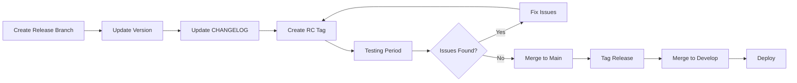

# Git Workflow and Merge Strategies

**Version**: 1.0  
**Last Updated**: June 12, 2025  
**Status**: Active

## 📋 Table of Contents

1. [Branch Strategy](#branch-strategy)
2. [Merge Strategies](#merge-strategies)
3. [Branch Protection Rules](#branch-protection-rules)
4. [Commit Guidelines](#commit-guidelines)
5. [Release Process](#release-process)

## 🌳 Branch Strategy

### Main Branches

```
main (production)
  ↑
develop (integration)
  ↑
feature/* (development)
```

### Branch Types

| Branch | Purpose | Base Branch | Merge To | Lifetime |
|--------|---------|-------------|-----------|----------|
| `main` | Production code | - | - | Permanent |
| `develop` | Integration | `main` | `main` | Permanent |
| `feature/*` | New features | `develop` | `develop` | Temporary |
| `bugfix/*` | Bug fixes | `develop` | `develop` | Temporary |
| `hotfix/*` | Emergency fixes | `main` | `main` & `develop` | Temporary |
| `release/*` | Release prep | `develop` | `main` & `develop` | Temporary |
| `chore/*` | Maintenance | `develop` | `develop` | Temporary |

### Branch Naming

```bash
# Features
feature/add-prometheus-alerts
feature/JIRA-123-oauth-integration

# Bug fixes
bugfix/fix-memory-leak
bugfix/JIRA-456-api-timeout

# Hotfixes
hotfix/v2.1.1-security-patch
hotfix/critical-data-loss

# Releases
release/v2.2.0
release/v2.2.0-rc1

# Chores
chore/update-dependencies
chore/improve-ci-performance
```

## 🔀 Merge Strategies

### Feature → Develop

**Strategy**: Squash and Merge

```bash
# All feature commits squashed into one
git checkout develop
git merge --squash feature/my-feature
git commit -m "feat(operator): add new reconciliation logic (#123)"
```

**Benefits**:
- Clean, linear history
- One commit per feature
- Easy to revert

**Rules**:
- PR title becomes commit message
- Must follow conventional commits
- Delete branch after merge

### Develop → Main

**Strategy**: Merge Commit

```bash
# Preserve full history
git checkout main
git merge --no-ff develop
git tag -a v2.2.0 -m "Release version 2.2.0"
```

**Benefits**:
- Preserves development history
- Clear release points
- Maintains context

**Rules**:
- Only for releases
- Requires release notes
- Tag immediately after merge

### Hotfix → Main & Develop

**Strategy**: Cherry-pick

```bash
# Apply to main
git checkout main
git cherry-pick hotfix-commit-sha

# Apply to develop
git checkout develop
git cherry-pick hotfix-commit-sha
```

**Benefits**:
- Precise fix application
- No unnecessary commits
- Clean history

**Rules**:
- Minimal changes only
- Immediate deployment
- Backport to develop

## 🛡️ Branch Protection Rules

### Main Branch

```yaml
protection_rules:
  # Review requirements
  required_reviews:
    required_approving_review_count: 2
    dismiss_stale_reviews: true
    require_code_owner_reviews: true
    required_review_from_codeowners: true
    bypass_pull_request_allowances:
      users: []
      teams: ["admins"]
  
  # Status checks
  required_status_checks:
    strict: true  # Require branches to be up to date
    contexts:
      - "lint / lint-go"
      - "lint / lint-typescript"
      - "test / test-unit"
      - "test / test-integration"
      - "build / build-operator"
      - "build / build-ui"
      - "security / scan"
      - "security / license-check"
  
  # Additional rules
  enforce_admins: true
  required_linear_history: false
  allow_force_pushes: false
  allow_deletions: false
  required_conversation_resolution: true
  lock_branch: false
  allow_auto_merge: false
```

### Develop Branch

```yaml
protection_rules:
  required_reviews:
    required_approving_review_count: 1
    dismiss_stale_reviews: true
    require_code_owner_reviews: true
  
  required_status_checks:
    strict: true
    contexts:
      - "lint / lint-go"
      - "lint / lint-typescript"
      - "test / test-unit"
      - "build / build-operator"
      - "build / build-ui"
  
  enforce_admins: false
  allow_force_pushes: false
  allow_deletions: false
```

### Feature Branches

```yaml
protection_rules:
  # No protection on feature branches
  # Developers have full control
  # Must pass CI to merge to develop
```

## 📝 Commit Guidelines

### Conventional Commits

We follow [Conventional Commits](https://www.conventionalcommits.org/) specification.

#### Format

```
<type>(<scope>): <subject>

<body>

<footer>
```

#### Types

| Type | Description | Example |
|------|-------------|---------|
| `feat` | New feature | `feat(api): add GraphQL endpoint` |
| `fix` | Bug fix | `fix(operator): resolve memory leak` |
| `docs` | Documentation | `docs(readme): update install guide` |
| `style` | Code style | `style(ui): format components` |
| `refactor` | Code refactor | `refactor(controller): simplify logic` |
| `perf` | Performance | `perf(api): optimize query` |
| `test` | Tests | `test(e2e): add platform tests` |
| `build` | Build system | `build(docker): optimize image` |
| `ci` | CI/CD | `ci(github): add security scan` |
| `chore` | Maintenance | `chore(deps): update go modules` |
| `revert` | Revert commit | `revert: feat(api): add endpoint` |

#### Scopes

Common scopes:
- `operator` - Operator changes
- `api` - API server changes
- `ui` - Frontend changes
- `docs` - Documentation
- `helm` - Helm chart changes
- `ci` - CI/CD changes

#### Examples

```bash
# Feature
feat(operator): add support for Prometheus 2.45
feat(ui): implement dark mode theme
feat(api): add webhook endpoints for alerts

# Fix
fix(operator): handle nil pointer in reconciler
fix(ui): resolve dashboard loading issue
fix(api): correct rate limiting logic

# Breaking change
feat(api)!: change authentication to OIDC

BREAKING CHANGE: JWT tokens are no longer supported.
Users must migrate to OIDC authentication.

# With issue reference
fix(operator): prevent duplicate resources

Resolves race condition when multiple controllers
process the same resource simultaneously.

Fixes #123
```

### Commit Message Rules

1. **Subject line**:
   - Max 72 characters
   - Start with lowercase
   - No period at end
   - Imperative mood ("add" not "added")

2. **Body** (optional):
   - Wrap at 72 characters
   - Explain what and why
   - Separate from subject with blank line

3. **Footer** (optional):
   - Reference issues: `Fixes #123`
   - Breaking changes: `BREAKING CHANGE: ...`
   - Co-authors: `Co-authored-by: Name <email>`

## 🚀 Release Process

### Version Numbering

We follow [Semantic Versioning](https://semver.org/): `MAJOR.MINOR.PATCH`

- **MAJOR**: Breaking changes
- **MINOR**: New features (backward compatible)
- **PATCH**: Bug fixes (backward compatible)

### Release Workflow



### Release Steps

1. **Create Release Branch**
   ```bash
   git checkout -b release/v2.2.0 develop
   ```

2. **Update Version**
   - Update version in `version.go`
   - Update Helm chart version
   - Update documentation

3. **Update CHANGELOG**
   ```markdown
   ## [2.2.0] - 2025-06-12
   ### Added
   - Feature 1
   - Feature 2
   
   ### Fixed
   - Bug 1
   - Bug 2
   
   ### Changed
   - Change 1
   
   ### Deprecated
   - Deprecation 1
   ```

4. **Create Release Candidate**
   ```bash
   git tag -a v2.2.0-rc1 -m "Release candidate 1 for v2.2.0"
   git push origin v2.2.0-rc1
   ```

5. **Testing Period**
   - Deploy to staging
   - Run acceptance tests
   - Performance testing
   - Security scanning

6. **Final Release**
   ```bash
   # Merge to main
   git checkout main
   git merge --no-ff release/v2.2.0
   
   # Tag release
   git tag -a v2.2.0 -m "Release version 2.2.0"
   git push origin main --tags
   
   # Merge back to develop
   git checkout develop
   git merge --no-ff main
   ```

### Post-Release

1. **GitHub Release**
   - Create release from tag
   - Add release notes
   - Upload artifacts

2. **Update Documentation**
   - Update version references
   - Publish new docs version

3. **Announcements**
   - Blog post
   - Slack announcement
   - Twitter/social media

4. **Monitor**
   - Watch for issues
   - Monitor metrics
   - Gather feedback

## 🔧 Git Configuration

### Recommended Git Config

```bash
# Set up conventional commit template
git config --global commit.template ~/.gitmessage

# Enable commit signing
git config --global commit.gpgsign true

# Set up helpful aliases
git config --global alias.cm "commit -m"
git config --global alias.co "checkout"
git config --global alias.br "branch"
git config --global alias.st "status"
git config --global alias.last "log -1 HEAD"
git config --global alias.unstage "reset HEAD --"

# Better diffs
git config --global diff.algorithm histogram
git config --global diff.colorMoved zebra

# Rebase by default
git config --global pull.rebase true

# Prune on fetch
git config --global fetch.prune true
```

### Git Hooks

Pre-commit hooks are configured via `.pre-commit-config.yaml`:

```yaml
repos:
  - repo: https://github.com/pre-commit/pre-commit-hooks
    hooks:
      - id: trailing-whitespace
      - id: end-of-file-fixer
      - id: check-yaml
      - id: check-added-large-files
      
  - repo: https://github.com/commitizen/commitizen
    hooks:
      - id: commitizen
      
  - repo: local
    hooks:
      - id: go-fmt
        name: go fmt
        entry: make fmt
        language: system
        files: \.go$
```

---

**Questions?** Reach out on Slack #gunj-operator-dev or email gunjanjp@gmail.com
