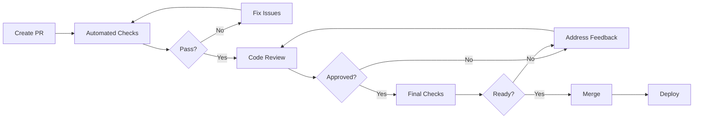

# Pull Request Review Process

**Version**: 1.0  
**Last Updated**: June 12, 2025  
**Status**: Active

## 📋 Table of Contents

1. [Overview](#overview)
2. [PR Lifecycle](#pr-lifecycle)
3. [Review Requirements](#review-requirements)
4. [Review Checklist](#review-checklist)
5. [Automated Checks](#automated-checks)
6. [Merge Strategies](#merge-strategies)
7. [Review Guidelines](#review-guidelines)
8. [Special Cases](#special-cases)

## 🌟 Overview

This document defines the pull request (PR) review process for the Gunj Operator project. Following these guidelines ensures code quality, security, and maintainability.

### Core Principles

1. **Quality First**: Every PR must meet our quality standards
2. **Collaborative Review**: Reviews are learning opportunities
3. **Timely Feedback**: Respond to PRs within 2 business days
4. **Constructive Communication**: Be respectful and helpful

## 🔄 PR Lifecycle



### 1. PR Creation

- Use appropriate PR template
- Fill all required sections
- Link related issues
- Assign reviewers
- Add relevant labels

### 2. Initial Validation

- CI/CD checks must pass
- No merge conflicts
- Follows commit conventions
- Has required approvals

### 3. Review Process

- Technical review
- Security review (if needed)
- Documentation review
- Performance review

### 4. Merge

- Squash and merge for features
- Merge commit for releases
- Rebase for hotfixes

## ✅ Review Requirements

### Approval Matrix

| PR Type | Required Approvals | Required Reviewers |
|---------|-------------------|-------------------|
| Bug Fix | 1 | Any maintainer |
| Feature (Small) | 2 | 1 maintainer + 1 contributor |
| Feature (Large) | 2 | 2 maintainers |
| Breaking Change | 3 | 2 maintainers + 1 lead |
| Security Fix | 2 | 1 maintainer + security team |
| Documentation | 1 | Any contributor |
| CI/CD Changes | 2 | 1 maintainer + DevOps |

### Review Timeline

- **First Response**: Within 24 hours
- **Initial Review**: Within 2 business days
- **Follow-up Reviews**: Within 1 business day
- **Final Approval**: Within 3 business days total

## 📝 Review Checklist

### Code Quality

- [ ] **Correctness**: Code works as intended
- [ ] **Clarity**: Code is easy to understand
- [ ] **Consistency**: Follows project style guide
- [ ] **Complexity**: No unnecessary complexity
- [ ] **Comments**: Complex logic is documented
- [ ] **Naming**: Variables and functions are well-named

### Architecture

- [ ] **Design**: Follows architectural patterns
- [ ] **Modularity**: Properly organized into modules
- [ ] **Dependencies**: No unnecessary dependencies
- [ ] **Interfaces**: Clean API boundaries
- [ ] **Extensibility**: Easy to extend/modify

### Testing

- [ ] **Coverage**: Adequate test coverage (>80%)
- [ ] **Unit Tests**: All functions tested
- [ ] **Integration Tests**: Component interactions tested
- [ ] **Edge Cases**: Error conditions handled
- [ ] **Test Quality**: Tests are maintainable

### Security

- [ ] **Authentication**: Proper auth checks
- [ ] **Authorization**: Correct permission checks
- [ ] **Input Validation**: All inputs validated
- [ ] **Secrets**: No hardcoded secrets
- [ ] **Dependencies**: No vulnerable dependencies
- [ ] **OWASP**: Follows OWASP guidelines

### Performance

- [ ] **Efficiency**: No obvious performance issues
- [ ] **Memory**: No memory leaks
- [ ] **Queries**: Optimized database queries
- [ ] **Caching**: Appropriate caching used
- [ ] **Benchmarks**: Performance benchmarks pass

### Documentation

- [ ] **Code Docs**: Functions/methods documented
- [ ] **API Docs**: API changes documented
- [ ] **User Docs**: User-facing changes documented
- [ ] **README**: README updated if needed
- [ ] **CHANGELOG**: Entry added

## 🤖 Automated Checks

### Required CI Checks

```yaml
# All PRs must pass these checks
required_checks:
  - lint-go           # Go linting (golangci-lint)
  - lint-typescript   # TypeScript linting (ESLint)
  - test-unit        # Unit tests
  - test-integration # Integration tests
  - build           # Build verification
  - security-scan   # Security vulnerability scan
  - license-check   # License compatibility
  - docs-build      # Documentation build
```

### Quality Gates

| Metric | Requirement |
|--------|------------|
| Code Coverage | ≥ 80% |
| Lint Issues | 0 errors, ≤ 5 warnings |
| Security Issues | 0 high/critical |
| Build Time | < 10 minutes |
| Test Time | < 15 minutes |

## 🔀 Merge Strategies

### Branch Protection Rules

```yaml
main:
  protection_rules:
    - require_pr_reviews: true
    - required_approving_reviews: 2
    - dismiss_stale_reviews: true
    - require_code_owner_reviews: true
    - require_status_checks: true
    - require_branches_up_to_date: true
    - require_signed_commits: true
    - include_administrators: false
```

### Merge Methods

1. **Feature Branches** → `develop`
   - Method: Squash and merge
   - Commit message: PR title
   - Delete branch after merge

2. **Develop** → `main`
   - Method: Merge commit
   - Preserve full history
   - Tag with version

3. **Hotfixes** → `main`
   - Method: Rebase and merge
   - Cherry-pick to develop
   - Immediate release

## 📖 Review Guidelines

### For Reviewers

#### Do's ✅

```markdown
# Good feedback examples

✅ "Consider using a map here for O(1) lookup instead of iterating through the slice"
✅ "This could be simplified using the builder pattern - see pkg/utils/builder.go for an example"
✅ "Great error handling! This pattern should be used throughout the codebase"
✅ "Could we add a test case for when the connection times out?"
```

#### Don'ts ❌

```markdown
# Avoid these types of comments

❌ "This is wrong"
❌ "I don't like this approach"
❌ "Why did you do it this way?"
❌ "This code is messy"
```

### Review Focus by Experience Level

#### Junior Developer PRs
- Focus on learning opportunities
- Explain the "why" behind suggestions
- Provide code examples
- Be extra encouraging

#### Senior Developer PRs
- Focus on architecture and design
- Discuss trade-offs
- Challenge assumptions
- Consider broader impact

### Comment Levels

Use prefixes to indicate comment priority:

- `[MUST]` - Blocking issue, must be fixed
- `[SHOULD]` - Strong suggestion, should be addressed
- `[CONSIDER]` - Optional improvement
- `[QUESTION]` - Clarification needed
- `[PRAISE]` - Positive reinforcement

Example:
```go
// [MUST] This will panic if config is nil
if config.Database.Host == "" {
    return errors.New("database host required")
}

// [SHOULD] Consider using structured error for better error handling
return fmt.Errorf("connection failed: %w", err)

// [CONSIDER] Could use sync.Once for thread-safe initialization
// [PRAISE] Excellent use of context for cancellation!
```

## 🎯 Special Cases

### Emergency Hotfixes

For critical production issues:

1. Create PR with `hotfix/` prefix
2. Add `emergency` label
3. Requires only 1 approval
4. Can bypass some CI checks
5. Must be followed by full PR

### Large Features

For PRs with >1000 lines changed:

1. Consider splitting into smaller PRs
2. Schedule review session
3. Provide architecture diagram
4. Create review guide document
5. Allow extra time for review

### Breaking Changes

1. Requires 3 approvals
2. Must include migration guide
3. Deprecation notices required
4. Update all examples
5. Coordinate with release planning

### Security Patches

1. Private review first
2. Security team approval required
3. No public details until patched
4. Coordinated disclosure
5. Immediate release after merge

## 📊 Review Metrics

We track these metrics to improve our review process:

- **Time to First Review**: Target < 24 hours
- **Time to Merge**: Target < 3 days
- **Review Iterations**: Target < 3
- **Post-Merge Issues**: Target < 5%

## 🔧 Tools and Automation

### Review Assignment

```yaml
# .github/CODEOWNERS
# Global owners
* @gunjanjp @maintainer-team

# Component owners
/operator/ @operator-team
/api/ @api-team
/ui/ @frontend-team
/docs/ @docs-team

# Specialized reviews
*.go @golang-reviewers
*.ts @typescript-reviewers
*.yaml @kubernetes-reviewers
```

### Auto-Assignment

```yaml
# .github/auto-assign.yml
reviewers:
  groups:
    - operator-team
    - api-team
  numberOfReviewers: 2
  
skipKeywords:
  - "[WIP]"
  - "[DRAFT]"
```

### PR Labels

Automatically applied labels:
- `size/XS`: <10 lines
- `size/S`: <100 lines
- `size/M`: <500 lines
- `size/L`: <1000 lines
- `size/XL`: >1000 lines

- `needs-review`: Awaiting review
- `changes-requested`: Changes needed
- `approved`: Ready to merge
- `blocked`: Blocked by dependency

## 📚 Additional Resources

- [Coding Standards](./coding-standards.md)
- [Git Workflow](./git-workflow.md)
- [Testing Guide](./testing-guide.md)
- [Security Guidelines](./security-guidelines.md)
- [Performance Guidelines](./performance-guidelines.md)

---

**Questions?** Ask in #gunj-operator-dev on Slack or email gunjanjp@gmail.com
