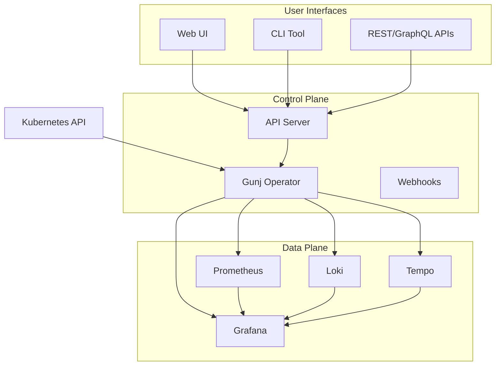

# Gunj Operator Documentation

Welcome to the Gunj Operator documentation! This comprehensive guide will help you understand, deploy, and contribute to the Gunj Operator - an enterprise-grade observability platform for Kubernetes.

## What is Gunj Operator?

The Gunj Operator is a Kubernetes operator that simplifies the deployment and management of observability infrastructure. It provides:

- **Automated Deployment**: Deploy Prometheus, Grafana, Loki, and Tempo with a single CRD
- **Lifecycle Management**: Handle upgrades, scaling, and configuration changes automatically
- **Enterprise Features**: Multi-tenancy, high availability, and security built-in
- **GitOps Ready**: Declarative configuration perfect for GitOps workflows
- **Cost Optimization**: Resource recommendations and automatic optimization

## Quick Links

<div class="grid cards" markdown>

-   :material-rocket-launch: **[Getting Started](getting-started.md)**

    ---

    Get up and running with the Gunj Operator in minutes

-   :material-book-open-variant: **[User Guide](user-guide/index.md)**

    ---

    Comprehensive guide for operators and administrators

-   :material-code-braces: **[Developer Guide](development/index.md)**

    ---

    Everything you need to contribute to the project

-   :material-api: **[API Reference](api/index.md)**

    ---

    Complete API documentation for all interfaces

</div>

## Key Features

### 🚀 Easy Installation

```yaml
# Install with Helm
helm repo add gunj-operator https://gunjanjp.github.io/gunj-operator/charts
helm install gunj-operator gunj-operator/gunj-operator -n gunj-system --create-namespace

# Create your first platform
kubectl apply -f - <<EOF
apiVersion: observability.io/v1beta1
kind: ObservabilityPlatform
metadata:
  name: my-platform
spec:
  components:
    prometheus:
      enabled: true
    grafana:
      enabled: true
EOF
```

### 🎯 Production Ready

- **High Availability**: Multi-replica deployments with automatic failover
- **Security**: RBAC, network policies, and encryption at rest
- **Scalability**: Horizontal scaling and resource optimization
- **Monitoring**: Self-monitoring with metrics and alerts

### 🔧 Flexible Configuration

- **Component Selection**: Enable only what you need
- **Version Control**: Pin specific versions or auto-upgrade
- **Custom Configuration**: Override any component setting
- **GitOps Integration**: Works with ArgoCD and Flux

## Architecture Overview



## Documentation Structure

### For Users

- **[Installation Guide](user-guide/installation/quick-start.md)**: Get started quickly
- **[Configuration Reference](user-guide/configuration/platforms.md)**: Configure your platforms
- **[Operations Guide](user-guide/operations/monitoring.md)**: Day-2 operations
- **[Troubleshooting](user-guide/operations/troubleshooting.md)**: Common issues and solutions

### For Developers

- **[Development Setup](development/getting-started.md)**: Set up your development environment
- **[Architecture Deep Dive](architecture/index.md)**: Understand the internals
- **[Contribution Guidelines](community/contributing.md)**: How to contribute
- **[API Development](development/api/rest.md)**: Extend the APIs

### For Architects

- **[Architecture Overview](architecture/index.md)**: System design and principles
- **[Security Model](architecture/security-architecture.md)**: Security considerations
- **[Integration Guide](architecture/integrations.md)**: Integrate with existing systems
- **[Decision Records](architecture/decisions/index.md)**: Architectural decisions

## Community

The Gunj Operator is an open-source project with a growing community:

- **GitHub**: [gunjanjp/gunj-operator](https://github.com/gunjanjp/gunj-operator)
- **Discussions**: [GitHub Discussions](https://github.com/gunjanjp/gunj-operator/discussions)
- **Slack**: [#gunj-operator](https://kubernetes.slack.com/archives/gunj-operator)
- **Email**: gunjanjp@gmail.com

### Contributing

We welcome contributions! See our [Contributing Guide](community/contributing.md) to get started.

### Code of Conduct

Please read our [Code of Conduct](community/code-of-conduct.md) before participating.

## License

The Gunj Operator is released under the [MIT License](https://github.com/gunjanjp/gunj-operator/blob/main/LICENSE).

## Support

- **Documentation**: You're here! 📚
- **Community Support**: [GitHub Discussions](https://github.com/gunjanjp/gunj-operator/discussions)
- **Bug Reports**: [GitHub Issues](https://github.com/gunjanjp/gunj-operator/issues)
- **Security Issues**: gunjanjp@gmail.com

---

**Ready to transform your observability infrastructure? [Get started now!](getting-started.md)**
