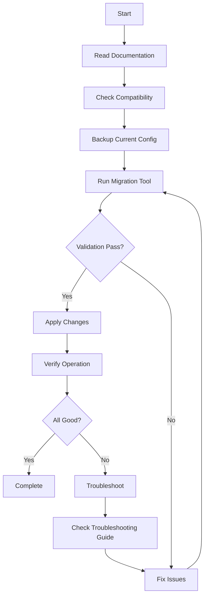

# Breaking Changes Documentation Summary

## Overview

This directory contains comprehensive documentation for migrating the Gunj Operator from API version v1alpha1 to v1beta1. The documentation is organized to serve different audiences and use cases.

## Document Index

### 1. **[breaking-changes-v2.md](breaking-changes-v2.md)** 📋
**Purpose**: Comprehensive technical reference for all breaking changes  
**Audience**: Platform engineers, DevOps teams, architects  
**Contents**:
- Detailed list of all breaking changes
- Field-by-field migration guide
- Impact assessment
- Version support timeline
- Technical migration strategies

### 2. **[user-friendly-migration-guide.md](user-friendly-migration-guide.md)** 🚀
**Purpose**: Simplified migration guide for end users  
**Audience**: Platform operators, administrators  
**Contents**:
- Quick start migration steps
- Common scenarios
- Simple troubleshooting
- Visual examples
- Step-by-step instructions

### 3. **[version-compatibility-matrix.md](version-compatibility-matrix.md)** 📊
**Purpose**: Complete compatibility reference  
**Audience**: Architects, planning teams  
**Contents**:
- Operator version compatibility
- Kubernetes version support
- Component version matrix
- Feature availability by version
- Integration compatibility

### 4. **[field-deprecation-timeline.md](field-deprecation-timeline.md)** 📅
**Purpose**: Deprecation schedule and timeline  
**Audience**: Planning teams, developers  
**Contents**:
- Visual deprecation timeline
- Field removal dates
- Priority classification
- Migration deadlines
- Deprecation policy

### 5. **[upgrade-procedures-best-practices.md](upgrade-procedures-best-practices.md)** 🔧
**Purpose**: Detailed upgrade procedures and best practices  
**Audience**: Operations teams, SREs  
**Contents**:
- Multiple upgrade methods
- Step-by-step procedures
- Best practices
- Rollback procedures
- Automation scripts

### 6. **[migration-troubleshooting-guide.md](migration-troubleshooting-guide.md)** 🔍
**Purpose**: Comprehensive troubleshooting reference  
**Audience**: Support teams, operators  
**Contents**:
- Common issues and solutions
- Diagnostic tools
- Resolution procedures
- Prevention strategies
- Emergency contacts

### 7. **[migration-examples.md](migration-examples.md)** 💡
**Purpose**: Practical migration examples  
**Audience**: Developers, operators  
**Contents**:
- Real-world examples
- Before/after configurations
- Component-specific migrations
- GitOps examples
- Common patterns

### 8. **[migration-helpers-guide.md](migration-helpers-guide.md)** 🛠️
**Purpose**: Migration tools and utilities documentation  
**Audience**: Developers, automation engineers  
**Contents**:
- CLI tool usage
- Automation scripts
- Validation tools
- Helper functions

## Quick Reference

### Critical Dates 📆

- **v1alpha1 Deprecated**: July 15, 2023
- **v1alpha1 Support Ends**: July 15, 2024
- **v1alpha1 Removed**: January 15, 2025
- **v1beta1 GA**: July 15, 2023
- **Recommended Migration**: Before June 15, 2024

### Key Breaking Changes 🚨

1. **`customConfig` removed** → Use structured fields
2. **Resource format changed** → Use Kubernetes standard
3. **Storage configuration nested** → Under `storage` key
4. **Type changes** → JSON strings to maps
5. **Duration format** → Use duration strings (30d, 15s)
6. **Validation stricter** → Follow Kubernetes conventions

### Migration Priority 🎯

| Priority | Changes | Action Required By |
|----------|---------|-------------------|
| 🔴 **Critical** | customConfig, globalConfig, type changes | July 15, 2024 |
| 🟡 **High** | Resource fields, storage config | October 15, 2024 |
| 🟢 **Medium** | Ingress, retention, labels | January 15, 2025 |

### Quick Migration Commands 💻

```bash
# Download migration tool
curl -LO https://github.com/gunjanjp/gunj-operator/releases/latest/download/gunj-migrate
chmod +x gunj-migrate

# Check current platforms
./gunj-migrate check

# Convert configuration
./gunj-migrate convert -f old.yaml -o new.yaml

# Apply migration
./gunj-migrate apply --all-namespaces
```

### Common Issues & Fixes 🔧

| Issue | Quick Fix |
|-------|-----------|
| "unknown field" error | Use migration tool or check field mapping |
| Platform stuck "Converting" | Restart conversion webhook |
| Resource quota exceeded | Disable HA temporarily |
| Version validation error | Add 'v' prefix (v2.48.0) |
| Webhook connection refused | Check webhook pods and certificates |

## Migration Workflow



## Getting Help

### Documentation Resources 📚
- **Full Documentation**: https://gunjanjp.github.io/gunj-operator/docs
- **API Reference**: https://gunjanjp.github.io/gunj-operator/api/v1beta1
- **Video Tutorials**: https://youtube.com/@GunjOperator

### Community Support 💬
- **Slack**: #gunj-operator-migration
- **GitHub Discussions**: https://github.com/gunjanjp/gunj-operator/discussions
- **Stack Overflow**: Tag `gunj-operator`

### Commercial Support 📞
- **Email**: gunjanjp@gmail.com
- **Support Portal**: https://support.gunj.io
- **Emergency**: +1-555-GUNJ-911

## Best Practices Summary

### Do's ✅
- **Test in non-production first**
- **Back up everything before migration**
- **Use the migration tool**
- **Follow the upgrade procedures**
- **Monitor after migration**
- **Update your documentation**

### Don'ts ❌
- **Don't skip the backup step**
- **Don't migrate production first**
- **Don't ignore deprecation warnings**
- **Don't use force unless necessary**
- **Don't disable monitoring during migration**

## Metrics for Success

Track these metrics during migration:

1. **Platform Availability**: Target 99.9%
2. **Migration Success Rate**: Target 100%
3. **Data Loss**: Target 0%
4. **Performance Impact**: <10% degradation
5. **Migration Time**: <30 minutes per platform

## Feedback

Help us improve this documentation:

- **Report Issues**: https://github.com/gunjanjp/gunj-operator/issues
- **Suggest Improvements**: gunjanjp@gmail.com
- **Contribute**: PRs welcome!

---

**Remember**: Migration might seem complex, but with proper planning and these guides, it's straightforward. The tools handle most of the complexity, and the community is here to help!

**Last Updated**: June 15, 2025  
**Version**: 2.0
