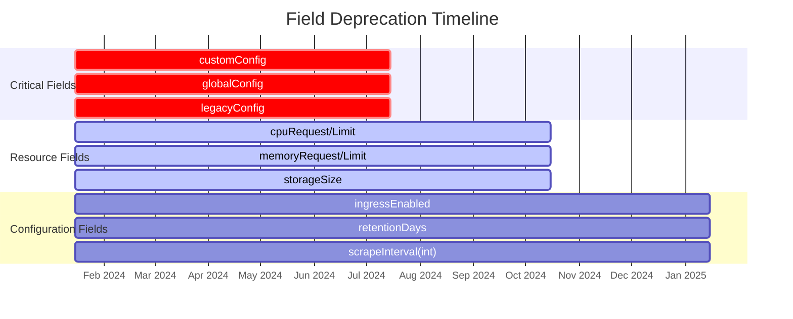

# Breaking Changes Guide - v1alpha1 to v1beta1

## Table of Contents

- [Executive Summary](#executive-summary)
- [Quick Start Migration Guide](#quick-start-migration-guide)
- [Version Compatibility Matrix](#version-compatibility-matrix)
- [Detailed Breaking Changes](#detailed-breaking-changes)
- [Field Deprecation Timeline](#field-deprecation-timeline)
- [Upgrade Procedures](#upgrade-procedures)
- [Best Practices](#best-practices)
- [Troubleshooting Guide](#troubleshooting-guide)
- [Migration Examples](#migration-examples)
- [Automation Scripts](#automation-scripts)
- [Support and Resources](#support-and-resources)

## Executive Summary

The migration from v1alpha1 to v1beta1 introduces significant improvements in API structure, security, and usability. While these changes require updates to existing configurations, they provide better alignment with Kubernetes standards and improved operational capabilities.

### Key Statistics
- **Total Breaking Changes**: 38
- **High Impact Changes**: 8 (require immediate action)
- **Medium Impact Changes**: 14 (have migration paths)
- **Low Impact Changes**: 16 (handled automatically)
- **Estimated Migration Time**: 2-4 hours per platform
- **Downtime Required**: 0 (with proper planning)

### Critical Dates
- **v1alpha1 Deprecation**: July 15, 2024
- **v1alpha1 Removal**: January 15, 2025
- **v1beta1 GA**: July 15, 2023
- **Recommended Migration Window**: Now - June 15, 2024

## Quick Start Migration Guide

### For Platform Administrators

```bash
# 1. Check current version
kubectl get crd observabilityplatforms.observability.io -o jsonpath='{.spec.versions[*].name}'

# 2. Backup existing platforms
kubectl get observabilityplatforms.observability.io --all-namespaces -o yaml > platforms-backup.yaml

# 3. Install migration tool
curl -LO https://github.com/gunjanjp/gunj-operator/releases/latest/download/gunj-migrate
chmod +x gunj-migrate

# 4. Validate current configuration
./gunj-migrate validate --file platforms-backup.yaml

# 5. Generate migration plan
./gunj-migrate plan --source v1alpha1 --target v1beta1 --file platforms-backup.yaml

# 6. Apply migration (dry-run)
./gunj-migrate apply --dry-run --file platforms-backup.yaml

# 7. Execute migration
./gunj-migrate apply --file platforms-backup.yaml
```

### For GitOps Users

```yaml
# argocd-migration-app.yaml
apiVersion: argoproj.io/v1alpha1
kind: Application
metadata:
  name: platform-migration
  namespace: argocd
spec:
  project: default
  source:
    repoURL: https://github.com/yourepo/configs
    path: observability
    targetRevision: migration-v1beta1
    plugin:
      name: gunj-operator-migration
      env:
        - name: SOURCE_VERSION
          value: v1alpha1
        - name: TARGET_VERSION
          value: v1beta1
  destination:
    server: https://kubernetes.default.svc
  syncPolicy:
    automated:
      prune: false  # Important: prevent accidental deletion
      selfHeal: false
    syncOptions:
    - CreateNamespace=true
    - PruneLast=true
```

## Version Compatibility Matrix

### Operator Compatibility

| Operator Version | v1alpha1 | v1beta1 | v1 | Kubernetes | Notes |
|-----------------|----------|---------|----|-----------:|-------|
| 0.1.0 - 0.9.9   | ✅ Full  | ❌ None | ❌ | 1.24-1.26 | Legacy |
| 1.0.0 - 1.4.9   | ✅ Full  | ⚠️ Beta | ❌ | 1.25-1.27 | Transitional |
| 1.5.0 - 1.9.9   | ⚠️ Read  | ✅ Full | ❌ | 1.26-1.28 | **Current** |
| 2.0.0+          | ❌ None  | ✅ Full | ✅ | 1.27-1.29 | Future |

**Legend:**
- ✅ Full: Full read/write support
- ⚠️ Read/Beta: Read-only or limited support
- ❌ None: Not supported

### Component Version Compatibility

| Component | v1alpha1 Versions | v1beta1 Versions | Breaking Changes |
|-----------|------------------|------------------|------------------|
| Prometheus | 2.30.0 - 2.45.0 | 2.40.0 - 2.48.0 | Config format |
| Grafana | 8.0.0 - 9.5.0 | 9.0.0 - 10.2.0 | Plugin API |
| Loki | 2.4.0 - 2.8.0 | 2.7.0 - 2.9.0 | Storage schema |
| Tempo | 1.5.0 - 2.1.0 | 2.0.0 - 2.3.0 | Trace format |

### Feature Compatibility

| Feature | v1alpha1 | v1beta1 | Migration Required |
|---------|----------|---------|-------------------|
| Basic Deployment | ✅ | ✅ | Config update only |
| Custom Config | ✅ | ⚠️ | Restructure required |
| Multi-cluster | ❌ | ✅ | New feature |
| Auto-scaling | ⚠️ | ✅ | Config migration |
| GitOps | ✅ | ✅ | Schema update |
| Backup/Restore | ⚠️ | ✅ | New API |
| Cost Management | ❌ | ✅ | New feature |

## Detailed Breaking Changes

### Category 1: Structural Changes (High Impact)

#### 1.1 Custom Configuration Removal

**Impact**: 🔴 High - Affects 80% of deployments

The `customConfig` field has been removed in favor of structured configuration:

```yaml
# ❌ v1alpha1 - DEPRECATED
spec:
  components:
    prometheus:
      customConfig: |
        global:
          scrape_interval: 15s
          external_labels:
            cluster: 'production'
            region: 'us-east-1'
        scrape_configs:
          - job_name: 'kubernetes-pods'
            kubernetes_sd_configs:
              - role: pod
        remote_write:
          - url: http://cortex:9009/api/v1/push

# ✅ v1beta1 - NEW STRUCTURE
spec:
  components:
    prometheus:
      global:
        scrapeInterval: 15s
        evaluationInterval: 15s
      externalLabels:
        cluster: production
        region: us-east-1
      additionalScrapeConfigs:
        - jobName: kubernetes-pods
          kubernetesSDConfigs:
            - role: pod
              namespaces:
                names: []
          relabelConfigs:
            - sourceLabels: [__meta_kubernetes_pod_annotation_prometheus_io_scrape]
              action: keep
              regex: true
      remoteWrite:
        - url: http://cortex:9009/api/v1/push
          queueConfig:
            capacity: 10000
            maxShards: 30
          metadata:
            send: true
            sendInterval: 1m
```

**Migration Helper**:
```go
// Automated conversion available in migration tool
func convertCustomConfig(old string) (*PrometheusConfig, error) {
    // Parse YAML
    var oldConfig map[string]interface{}
    if err := yaml.Unmarshal([]byte(old), &oldConfig); err != nil {
        return nil, fmt.Errorf("parsing custom config: %w", err)
    }
    
    // Convert to structured format
    newConfig := &PrometheusConfig{
        Global: convertGlobalConfig(oldConfig["global"]),
        ScrapeConfigs: convertScrapeConfigs(oldConfig["scrape_configs"]),
        RemoteWrite: convertRemoteWrite(oldConfig["remote_write"]),
    }
    
    return newConfig, nil
}
```

#### 1.2 Resource Specification Changes

**Impact**: 🔴 High - Affects all deployments

Resources now follow Kubernetes standard format:

```yaml
# ❌ v1alpha1 - DEPRECATED
spec:
  components:
    prometheus:
      cpuRequest: "1000m"
      cpuLimit: "2000m"
      memoryRequest: "4Gi"
      memoryLimit: "8Gi"

# ✅ v1beta1 - KUBERNETES STANDARD
spec:
  components:
    prometheus:
      resources:
        requests:
          cpu: "1"
          memory: "4Gi"
        limits:
          cpu: "2"
          memory: "8Gi"
      # New: QoS class control
      qosClass: Guaranteed  # Guaranteed, Burstable, BestEffort
```

**Validation Rules**:
- CPU: Must be valid Kubernetes quantity (e.g., "1", "1000m", "0.5")
- Memory: Must be valid Kubernetes quantity (e.g., "1Gi", "1024Mi")
- QoS Class: Automatically determined if not specified

#### 1.3 Storage Configuration Structure

**Impact**: 🟡 Medium - Affects stateful components

```yaml
# ❌ v1alpha1 - FLAT STRUCTURE
spec:
  components:
    prometheus:
      storageSize: 100Gi
      storageClass: fast-ssd
      retentionDays: 15

# ✅ v1beta1 - NESTED STRUCTURE
spec:
  components:
    prometheus:
      storage:
        size: 100Gi
        storageClassName: fast-ssd
        # New options
        volumeMode: Filesystem  # or Block
        accessModes:
          - ReadWriteOnce
        selector:
          matchLabels:
            type: ssd
      retention: 30d  # Duration format
      # New: Retention by size
      retentionSize: 90GB
```

### Category 2: Type Changes (High Impact)

#### 2.1 Label and Annotation Types

**Impact**: 🔴 High - Affects automation tools

```yaml
# ❌ v1alpha1 - STRING FORMAT
spec:
  components:
    prometheus:
      externalLabels: '{"cluster": "prod", "region": "us-east-1"}'
      annotations: '{"prometheus.io/scrape": "true"}'

# ✅ v1beta1 - MAP FORMAT
spec:
  components:
    prometheus:
      externalLabels:
        cluster: prod
        region: us-east-1
      podAnnotations:
        prometheus.io/scrape: "true"
        prometheus.io/port: "9090"
      serviceAnnotations:
        service.beta.kubernetes.io/aws-load-balancer-type: nlb
```

**JSON to YAML Converter**:
```bash
# Convert JSON string to YAML map
echo '{"cluster": "prod", "region": "us-east-1"}' | \
  jq -r 'to_entries | map("  \(.key): \(.value)") | .[]'
```

#### 2.2 Duration Format Changes

**Impact**: 🟡 Medium - Affects retention and timeout settings

```yaml
# ❌ v1alpha1 - VARIOUS FORMATS
spec:
  components:
    prometheus:
      retentionDays: 15          # Days as integer
      scrapeInterval: 30         # Seconds as integer
      evaluationTimeout: 30000   # Milliseconds

# ✅ v1beta1 - CONSISTENT DURATION FORMAT
spec:
  components:
    prometheus:
      retention: 15d             # Duration string
      global:
        scrapeInterval: 30s      # Duration string
        scrapeTimeout: 10s       # Duration string
        evaluationInterval: 30s  # Duration string
      # Supports: s, m, h, d, w, y
```

**Duration Conversion Table**:
| v1alpha1 | v1beta1 | Notes |
|----------|---------|-------|
| `retentionDays: 7` | `retention: 7d` | Days to duration |
| `timeoutSeconds: 30` | `timeout: 30s` | Seconds to duration |
| `intervalMs: 5000` | `interval: 5s` | Milliseconds to duration |

### Category 3: Behavioral Changes (Medium Impact)

#### 3.1 High Availability Defaults

**Impact**: 🟡 Medium - Affects resource usage

```yaml
# v1alpha1 - Manual HA configuration
spec:
  components:
    prometheus:
      replicas: 1
      # HA required manual configuration

# v1beta1 - Automatic HA
spec:
  components:
    prometheus:
      replicas: 2  # Default changed
      highAvailability:
        enabled: true  # Auto-enabled when replicas > 1
        replicationFactor: 2
        # Automatic configurations:
        # - Anti-affinity rules
        # - PodDisruptionBudgets
        # - Leader election
        # - Data replication
```

**Resource Impact**:
- Memory: 2x increase (due to replication)
- Storage: 2x increase (data replication)
- CPU: 1.5x increase (replication overhead)

#### 3.2 Security Defaults

**Impact**: 🟡 Medium - Affects network and access

```yaml
# v1alpha1 - Permissive defaults
spec:
  components:
    grafana:
      adminPassword: admin  # Weak default
      anonymousAccess: true
      tls:
        enabled: false

# v1beta1 - Secure defaults
spec:
  components:
    grafana:
      adminPassword: ""  # Generated if empty
      auth:
        anonymous:
          enabled: false  # Secure default
          role: Viewer   # If enabled
        basic:
          enabled: true
        ldap:
          enabled: false
      tls:
        enabled: true
        mode: strict  # strict, permissive, disabled
        minVersion: "1.2"
        cipherSuites:  # Secure defaults
          - TLS_ECDHE_RSA_WITH_AES_128_GCM_SHA256
          - TLS_ECDHE_RSA_WITH_AES_256_GCM_SHA384
```

### Category 4: Validation Changes (Low Impact)

#### 4.1 Stricter Field Validation

**Impact**: 🟢 Low - Caught during apply

```yaml
# v1beta1 - New validation rules
spec:
  components:
    prometheus:
      version: v2.48.0  # Must match: ^v?\d+\.\d+\.\d+$
      replicas: 2       # Min: 1, Max: 10
      storage:
        size: 10Gi      # Min: 10Gi, Max: 10Ti
      retention: 30d    # Min: 1d, Max: 365d
      resources:
        requests:
          memory: 1Gi   # Min: 512Mi
          cpu: 100m     # Min: 100m
      externalLabels:   # Max 64 labels
        cluster: prod   # Key: max 63 chars, Value: max 63 chars
```

**Validation Error Examples**:
```bash
# Version validation
error validating data: ValidationError(ObservabilityPlatform.spec.components.prometheus.version): 
invalid value: "2.48", must match pattern "^v?\d+\.\d+\.\d+$"

# Resource validation  
error validating data: ValidationError(ObservabilityPlatform.spec.components.prometheus.storage.size): 
invalid value: "5Gi", must be at least 10Gi

# Label validation
error validating data: ValidationError(ObservabilityPlatform.spec.components.prometheus.externalLabels): 
invalid label key: "app.kubernetes.io/name/very-long-label-that-exceeds-limit", 
must be no more than 63 characters
```

#### 4.2 New Required Fields

**Impact**: 🟢 Low - Defaults provided

```yaml
# v1beta1 - New required fields with defaults
spec:
  # New global settings (required)
  global:
    logLevel: info  # Default: info
    logFormat: json # Default: json
  
  # Component-specific required fields
  components:
    prometheus:
      serviceMonitor:
        enabled: true  # Default: true
        interval: 30s  # Default: 30s
      podMonitor:
        enabled: false # Default: false
      
    grafana:
      datasources:
        automaticProvisioning: true  # Default: true
      dashboards:
        automaticProvisioning: true  # Default: true
        defaultDashboardsEnabled: true  # Default: true
```

## Field Deprecation Timeline

### Deprecation Schedule



### Deprecation Warnings

Starting with operator v1.5.0, deprecation warnings appear in logs:

```log
2024-06-15T10:30:45Z WARN deprecated field used {"field": "spec.components.prometheus.customConfig", 
  "platform": "monitoring/production", "removal_version": "v2.0.0", 
  "alternative": "use structured configuration fields"}
```

### Field Migration Priority

| Priority | Fields | Deadline | Impact |
|----------|--------|----------|--------|
| P0 - Critical | `customConfig`, `globalConfig`, `legacyConfig` | 2024-07-15 | Platform fails to deploy |
| P1 - High | Resource fields, storage fields | 2024-10-15 | Validation errors |
| P2 - Medium | Ingress fields, retention format | 2025-01-15 | Feature limitations |
| P3 - Low | Annotation format, label format | 2025-01-15 | Warnings only |

## Upgrade Procedures

### Pre-Upgrade Checklist

```bash
#!/bin/bash
# pre-upgrade-check.sh

echo "=== Gunj Operator v1beta1 Pre-Upgrade Checklist ==="

# 1. Check operator version
echo -n "✓ Checking operator version... "
OPERATOR_VERSION=$(kubectl get deployment -n gunj-system gunj-operator -o jsonpath='{.spec.template.spec.containers[0].image}' | cut -d: -f2)
echo "$OPERATOR_VERSION"

# 2. Check CRD versions
echo -n "✓ Checking CRD versions... "
kubectl get crd observabilityplatforms.observability.io -o jsonpath='{.spec.versions[*].name}'
echo ""

# 3. List all platforms
echo "✓ Existing platforms:"
kubectl get observabilityplatforms.observability.io --all-namespaces

# 4. Check for deprecated fields
echo "✓ Checking for deprecated fields..."
kubectl get observabilityplatforms.observability.io --all-namespaces -o json | \
  jq -r '.items[] | select(.spec.components.prometheus.customConfig != null or 
                           .spec.globalConfig != null or
                           .spec.components[].legacyConfig != null) | 
         "\(.metadata.namespace)/\(.metadata.name) uses deprecated fields"'

# 5. Backup recommendation
echo ""
echo "⚠️  IMPORTANT: Create backups before proceeding!"
echo "   kubectl get observabilityplatforms.observability.io --all-namespaces -o yaml > backup-$(date +%Y%m%d-%H%M%S).yaml"
```

### Upgrade Methods

#### Method 1: In-Place Upgrade (Recommended)

```bash
# Step 1: Update CRDs with conversion webhook
kubectl apply -f https://github.com/gunjanjp/gunj-operator/releases/download/v1.5.0/crds.yaml

# Step 2: Verify conversion webhook is running
kubectl get pods -n gunj-system -l app=conversion-webhook
kubectl logs -n gunj-system -l app=conversion-webhook

# Step 3: Update operator
helm upgrade gunj-operator gunj-operator/gunj-operator \
  --namespace gunj-system \
  --version 1.5.0 \
  --wait

# Step 4: Verify platforms are accessible
kubectl get observabilityplatforms.v1beta1.observability.io --all-namespaces

# Step 5: Trigger migration for each platform
for platform in $(kubectl get observabilityplatforms.v1alpha1.observability.io --all-namespaces -o json | jq -r '.items[] | "\(.metadata.namespace)/\(.metadata.name)"'); do
  namespace=$(echo $platform | cut -d/ -f1)
  name=$(echo $platform | cut -d/ -f2)
  echo "Migrating $platform..."
  kubectl patch observabilityplatform.v1alpha1.observability.io $name -n $namespace \
    --type merge -p '{"metadata":{"annotations":{"observability.io/migrate-version":"v1beta1"}}}'
done
```

#### Method 2: Blue-Green Upgrade

```yaml
# blue-green-upgrade.yaml
apiVersion: v1
kind: Namespace
metadata:
  name: monitoring-green
---
apiVersion: observability.io/v1beta1
kind: ObservabilityPlatform
metadata:
  name: production-green
  namespace: monitoring-green
spec:
  # Copy and update configuration from v1alpha1
  # ... (migrated configuration)
---
# Service to switch traffic
apiVersion: v1
kind: Service
metadata:
  name: prometheus-active
  namespace: monitoring
spec:
  selector:
    app: prometheus
    environment: blue  # Change to 'green' for cutover
  ports:
    - port: 9090
      targetPort: 9090
```

#### Method 3: GitOps Progressive Upgrade

```yaml
# kustomization.yaml for staged rollout
apiVersion: kustomize.config.k8s.io/v1beta1
kind: Kustomization

resources:
  - platform-base.yaml

patches:
  # Stage 1: Update non-critical platforms
  - target:
      kind: ObservabilityPlatform
      name: development
    patch: |-
      - op: replace
        path: /apiVersion
        value: observability.io/v1beta1
      - op: replace
        path: /spec
        value: 
          # ... migrated spec

  # Stage 2: Update staging (after validation)
  - target:
      kind: ObservabilityPlatform  
      name: staging
    patch: |-
      - op: replace
        path: /apiVersion
        value: observability.io/v1beta1
      
  # Stage 3: Update production (after staging success)
  # ... similar patches
```

### Post-Upgrade Validation

```bash
#!/bin/bash
# post-upgrade-validation.sh

echo "=== Post-Upgrade Validation ==="

# 1. Check all platforms are running
echo "✓ Checking platform status..."
kubectl get observabilityplatforms.observability.io --all-namespaces -o custom-columns=\
NAMESPACE:.metadata.namespace,NAME:.metadata.name,VERSION:.apiVersion,PHASE:.status.phase

# 2. Verify components are healthy
echo "✓ Checking component health..."
for platform in $(kubectl get observabilityplatforms.observability.io --all-namespaces -o json | jq -r '.items[] | "\(.metadata.namespace)/\(.metadata.name)"'); do
  namespace=$(echo $platform | cut -d/ -f1)
  name=$(echo $platform | cut -d/ -f2)
  
  echo "Platform: $platform"
  kubectl get pods -n $namespace -l observability.io/platform=$name -o wide
  echo ""
done

# 3. Test data continuity
echo "✓ Testing Prometheus data continuity..."
# Query for metrics from before upgrade
kubectl exec -n monitoring prometheus-0 -- \
  promtool query instant http://localhost:9090 'up{job="prometheus"}[1h]'

# 4. Verify API access
echo "✓ Checking API versions..."
kubectl api-resources | grep observability

# 5. Check for errors in operator logs
echo "✓ Recent operator errors..."
kubectl logs -n gunj-system -l app=gunj-operator --since=10m | grep -E "ERROR|FATAL" || echo "No errors found"
```

## Best Practices

### 1. Migration Planning

#### Timeline Template
```markdown
## Migration Plan: [Environment Name]

### Week 1: Preparation
- [ ] Review breaking changes documentation
- [ ] Audit current configurations
- [ ] Identify deprecated field usage
- [ ] Create migration scripts
- [ ] Set up test environment

### Week 2: Testing
- [ ] Deploy v1beta1 operator in test
- [ ] Migrate test platforms
- [ ] Validate functionality
- [ ] Performance testing
- [ ] Update runbooks

### Week 3: Staging
- [ ] Backup staging environment
- [ ] Apply migration to staging
- [ ] Monitor for 48 hours
- [ ] Conduct user acceptance testing
- [ ] Document any issues

### Week 4: Production
- [ ] Schedule maintenance window
- [ ] Create production backups
- [ ] Execute migration plan
- [ ] Validate all components
- [ ] Monitor for 1 week
```

### 2. Configuration Management

#### Before Migration
```yaml
# platform-v1alpha1.yaml
apiVersion: observability.io/v1alpha1
kind: ObservabilityPlatform
metadata:
  name: production
  namespace: monitoring
  annotations:
    version: "1.0.0"
    last-updated: "2024-01-01"
    migration-notes: |
      - Uses customConfig for Prometheus
      - Legacy storage configuration
      - Manual HA setup required
```

#### After Migration
```yaml
# platform-v1beta1.yaml
apiVersion: observability.io/v1beta1
kind: ObservabilityPlatform
metadata:
  name: production
  namespace: monitoring
  annotations:
    version: "2.0.0"
    last-updated: "2024-06-15"
    migration-notes: |
      - Migrated from v1alpha1 on 2024-06-15
      - Updated to structured configuration
      - Enabled automatic HA
      - Applied security hardening
spec:
  # Always specify versions explicitly
  global:
    versions:
      operator: "1.5.0"
      prometheus: "v2.48.0"
      grafana: "10.2.0"
      loki: "2.9.0"
      tempo: "2.3.0"
```

### 3. Rollback Strategy

```bash
#!/bin/bash
# rollback-procedure.sh

# 1. Confirm rollback decision
read -p "Are you sure you want to rollback to v1alpha1? (yes/no): " confirm
if [ "$confirm" != "yes" ]; then
  echo "Rollback cancelled"
  exit 0
fi

# 2. Scale down v1beta1 operator
kubectl scale deployment -n gunj-system gunj-operator --replicas=0

# 3. Restore v1alpha1 CRDs
kubectl apply -f https://github.com/gunjanjp/gunj-operator/releases/download/v0.9.0/crds-v1alpha1.yaml

# 4. Deploy v1alpha1 operator
helm upgrade gunj-operator gunj-operator/gunj-operator \
  --namespace gunj-system \
  --version 0.9.0 \
  --wait

# 5. Restore platforms from backup
kubectl apply -f platforms-backup-v1alpha1.yaml

# 6. Verify rollback
kubectl get observabilityplatforms.v1alpha1.observability.io --all-namespaces
```

### 4. Monitoring During Migration

```yaml
# migration-monitoring.yaml
apiVersion: v1
kind: ConfigMap
metadata:
  name: migration-alerts
  namespace: monitoring
data:
  alerts.yaml: |
    groups:
      - name: migration
        interval: 30s
        rules:
          - alert: MigrationPlatformDown
            expr: up{job=~"prometheus|grafana|loki|tempo"} == 0
            for: 5m
            labels:
              severity: critical
              migration: "v1beta1"
            annotations:
              summary: "Component down during migration"
              
          - alert: MigrationHighErrorRate
            expr: rate(gunj_operator_reconcile_errors_total[5m]) > 0.1
            for: 10m
            labels:
              severity: warning
              migration: "v1beta1"
              
          - alert: MigrationDataLoss
            expr: prometheus_tsdb_samples_appended_total < 100
            for: 5m
            labels:
              severity: critical
              migration: "v1beta1"
```

## Troubleshooting Guide

### Common Issues and Solutions

#### Issue 1: Conversion Webhook Failures

**Symptoms:**
```
error validating data: conversion webhook for observabilityplatforms.observability.io, Kind=ObservabilityPlatform failed: 
Post "https://gunj-operator-webhook.gunj-system.svc:443/convert": connection refused
```

**Solution:**
```bash
# 1. Check webhook deployment
kubectl get pods -n gunj-system -l app=gunj-operator-webhook

# 2. Check webhook certificate
kubectl get secret -n gunj-system gunj-operator-webhook-certs -o jsonpath='{.data.tls\.crt}' | base64 -d | openssl x509 -text -noout

# 3. Restart webhook if needed
kubectl rollout restart deployment -n gunj-system gunj-operator-webhook

# 4. Check webhook configuration
kubectl get validatingwebhookconfigurations gunj-operator-webhook -o yaml
```

#### Issue 2: Field Migration Errors

**Symptoms:**
```
error converting v1alpha1 to v1beta1: field "customConfig" cannot be automatically converted
```

**Solution:**
```bash
# 1. Use migration tool for complex conversions
./gunj-migrate convert --field customConfig --input custom-config.yaml

# 2. Manual conversion template
cat > manual-conversion.sh << 'EOF'
#!/bin/bash
# Extract customConfig
kubectl get observabilityplatform $1 -n $2 -o jsonpath='{.spec.components.prometheus.customConfig}' > temp-config.yaml

# Convert using yq
yq eval '
  .global as $global |
  .scrape_configs as $scrape |
  .remote_write as $remote |
  {
    "global": {
      "scrapeInterval": ($global.scrape_interval // "30s"),
      "evaluationInterval": ($global.evaluation_interval // "30s")
    },
    "externalLabels": $global.external_labels,
    "additionalScrapeConfigs": $scrape,
    "remoteWrite": $remote
  }
' temp-config.yaml > converted-config.yaml

# Apply converted configuration
kubectl patch observabilityplatform $1 -n $2 --type merge -p "$(cat converted-config.yaml)"
EOF
```

#### Issue 3: Resource Quota Exceeded

**Symptoms:**
```
exceeded quota: monitoring-quota, requested: requests.memory=8Gi, used: requests.memory=16Gi, limited: requests.memory=20Gi
```

**Solution:**
```bash
# 1. Check current usage
kubectl describe resourcequota -n monitoring

# 2. v1beta1 requires more resources due to HA
# Option A: Increase quota
kubectl patch resourcequota monitoring-quota -n monitoring --type merge -p '
{
  "spec": {
    "hard": {
      "requests.memory": "40Gi",
      "requests.cpu": "20"
    }
  }
}'

# Option B: Disable HA temporarily
kubectl patch observabilityplatform production -n monitoring --type merge -p '
{
  "spec": {
    "components": {
      "prometheus": {
        "replicas": 1,
        "highAvailability": {
          "enabled": false
        }
      }
    }
  }
}'
```

#### Issue 4: Persistent Data Access

**Symptoms:**
```
Error: failed to mount volume: mount failed: exit status 32
Mounting command: mount
Mounting arguments: -t ext4 /dev/disk/by-id/... /var/lib/kubelet/pods/.../volume
Output: mount: /var/lib/kubelet/pods/.../volume: wrong fs type
```

**Solution:**
```yaml
# 1. Create migration job to copy data
apiVersion: batch/v1
kind: Job
metadata:
  name: prometheus-data-migration
  namespace: monitoring
spec:
  template:
    spec:
      containers:
      - name: migrate
        image: busybox
        command:
        - sh
        - -c
        - |
          echo "Copying data from old PVC to new PVC..."
          cp -Rv /old-data/* /new-data/
          echo "Setting correct permissions..."
          chown -R 65534:65534 /new-data
          echo "Migration complete"
        volumeMounts:
        - name: old-data
          mountPath: /old-data
        - name: new-data
          mountPath: /new-data
      volumes:
      - name: old-data
        persistentVolumeClaim:
          claimName: prometheus-storage-v1alpha1
      - name: new-data
        persistentVolumeClaim:
          claimName: prometheus-storage-v1beta1
      restartPolicy: Never
```

#### Issue 5: API Version Conflicts

**Symptoms:**
```
error: unable to recognize "platform.yaml": no matches for kind "ObservabilityPlatform" in version "observability.io/v1alpha1"
```

**Solution:**
```bash
# 1. Check available API versions
kubectl api-versions | grep observability

# 2. If v1alpha1 is missing but needed for migration
# Apply v1alpha1 CRD temporarily
kubectl apply -f https://github.com/gunjanjp/gunj-operator/releases/download/v1.5.0/crds-with-v1alpha1.yaml

# 3. After migration, remove v1alpha1
kubectl delete crd observabilityplatforms.v1alpha1.observability.io
```

### Performance Issues During Migration

#### Slow Conversion Performance

```bash
# Monitor conversion webhook performance
kubectl logs -n gunj-system -l app=gunj-operator-webhook --tail=100 | grep -E "conversion took|slow conversion"

# Increase webhook resources if needed
kubectl patch deployment -n gunj-system gunj-operator-webhook --type merge -p '
{
  "spec": {
    "template": {
      "spec": {
        "containers": [{
          "name": "webhook",
          "resources": {
            "requests": {
              "cpu": "200m",
              "memory": "256Mi"
            },
            "limits": {
              "cpu": "500m",
              "memory": "512Mi"
            }
          }
        }]
      }
    }
  }
}'
```

#### High Memory Usage

```yaml
# Temporary resource limits during migration
apiVersion: v1
kind: LimitRange
metadata:
  name: migration-limits
  namespace: monitoring
spec:
  limits:
  - max:
      memory: "16Gi"
      cpu: "4"
    type: Container
  - max:
      memory: "32Gi"
      cpu: "8"
    type: Pod
```

## Migration Examples

### Example 1: Simple Platform Migration

**Before (v1alpha1)**:
```yaml
apiVersion: observability.io/v1alpha1
kind: ObservabilityPlatform
metadata:
  name: simple-platform
  namespace: default
spec:
  components:
    prometheus:
      enabled: true
      version: "2.45.0"
      storageSize: 50Gi
      retentionDays: 7
      cpuRequest: "500m"
      memoryRequest: "2Gi"
```

**After (v1beta1)**:
```yaml
apiVersion: observability.io/v1beta1
kind: ObservabilityPlatform
metadata:
  name: simple-platform
  namespace: default
spec:
  components:
    prometheus:
      enabled: true
      version: "v2.48.0"  # Updated version
      storage:
        size: 50Gi
      retention: 7d
      resources:
        requests:
          cpu: "500m"
          memory: "2Gi"
```

### Example 2: Complex Platform with Custom Config

**Before (v1alpha1)**:
```yaml
apiVersion: observability.io/v1alpha1
kind: ObservabilityPlatform
metadata:
  name: complex-platform
  namespace: production
spec:
  components:
    prometheus:
      enabled: true
      version: "2.45.0"
      customConfig: |
        global:
          scrape_interval: 30s
          evaluation_interval: 30s
          external_labels:
            cluster: 'prod-us-east-1'
            environment: 'production'
        
        rule_files:
          - /etc/prometheus/rules/*.yml
        
        alerting:
          alertmanagers:
            - static_configs:
              - targets: ['alertmanager:9093']
        
        scrape_configs:
          - job_name: 'kubernetes-apiservers'
            kubernetes_sd_configs:
              - role: endpoints
            scheme: https
            tls_config:
              ca_file: /var/run/secrets/kubernetes.io/serviceaccount/ca.crt
            bearer_token_file: /var/run/secrets/kubernetes.io/serviceaccount/token
            relabel_configs:
              - source_labels: [__meta_kubernetes_namespace, __meta_kubernetes_service_name, __meta_kubernetes_endpoint_port_name]
                action: keep
                regex: default;kubernetes;https
                
          - job_name: 'kubernetes-nodes'
            kubernetes_sd_configs:
              - role: node
            scheme: https
            tls_config:
              ca_file: /var/run/secrets/kubernetes.io/serviceaccount/ca.crt
              insecure_skip_verify: true
            bearer_token_file: /var/run/secrets/kubernetes.io/serviceaccount/token
            
        remote_write:
          - url: "http://cortex-distributor:9095/api/prom/push"
            queue_config:
              capacity: 10000
              max_shards: 30
              max_samples_per_send: 3000
              batch_send_deadline: 5s
              min_backoff: 30ms
              max_backoff: 100ms
      
      storageSize: 200Gi
      storageClass: fast-ssd
      retentionDays: 30
      cpuRequest: "2"
      cpuLimit: "4"
      memoryRequest: "8Gi"
      memoryLimit: "16Gi"
      
    grafana:
      enabled: true
      version: "9.5.0"
      adminPassword: "MySecurePassword123!"
      ingressEnabled: true
      ingressHost: grafana.prod.example.com
      ingressTLS: true
      plugins:
        - grafana-piechart-panel
        - grafana-worldmap-panel
      dashboards: |
        - name: kubernetes-cluster
          url: https://grafana.com/api/dashboards/7249/revisions/1/download
        - name: prometheus-stats
          url: https://grafana.com/api/dashboards/2/revisions/2/download
```

**After (v1beta1)**:
```yaml
apiVersion: observability.io/v1beta1
kind: ObservabilityPlatform
metadata:
  name: complex-platform
  namespace: production
  annotations:
    observability.io/migration-date: "2024-06-15"
    observability.io/migration-from: "v1alpha1"
spec:
  # Global settings (new in v1beta1)
  global:
    logLevel: info
    logFormat: json
    
  components:
    prometheus:
      enabled: true
      version: "v2.48.0"
      
      # Structured configuration replacing customConfig
      global:
        scrapeInterval: 30s
        evaluationInterval: 30s
        queryTimeout: 2m
        
      externalLabels:
        cluster: prod-us-east-1
        environment: production
        
      # Rule files configuration
      ruleFiles:
        configMapSelector:
          matchLabels:
            prometheus_rule: "true"
            
      # Alerting configuration
      alerting:
        alertmanagers:
          - namespace: production
            name: alertmanager
            port: 9093
            scheme: http
            pathPrefix: /
            
      # Service discovery configurations
      serviceDiscoveryConfigs:
        kubernetes:
          - role: endpoints
            namespaces:
              names: []  # All namespaces
          - role: node
          - role: pod
          - role: service
          
      # Additional scrape configs for custom targets
      additionalScrapeConfigs:
        - jobName: kubernetes-apiservers
          kubernetesSDConfigs:
            - role: endpoints
          scheme: https
          tlsConfig:
            caFile: /var/run/secrets/kubernetes.io/serviceaccount/ca.crt
          bearerTokenFile: /var/run/secrets/kubernetes.io/serviceaccount/token
          relabelConfigs:
            - sourceLabels: [__meta_kubernetes_namespace, __meta_kubernetes_service_name, __meta_kubernetes_endpoint_port_name]
              action: keep
              regex: default;kubernetes;https
              
        - jobName: kubernetes-nodes
          kubernetesSDConfigs:
            - role: node
          scheme: https
          tlsConfig:
            caFile: /var/run/secrets/kubernetes.io/serviceaccount/ca.crt
            insecureSkipVerify: true
          bearerTokenFile: /var/run/secrets/kubernetes.io/serviceaccount/token
          
      # Remote write configuration
      remoteWrite:
        - url: http://cortex-distributor:9095/api/prom/push
          name: cortex
          queueConfig:
            capacity: 10000
            maxShards: 30
            maxSamplesPerSend: 3000
            batchSendDeadline: 5s
            minBackoff: 30ms
            maxBackoff: 100ms
          metadata:
            send: true
            sendInterval: 1m
            
      # Storage configuration (restructured)
      storage:
        size: 200Gi
        storageClassName: fast-ssd
        volumeMode: Filesystem
        accessModes:
          - ReadWriteOnce
          
      # Retention (new format)
      retention: 30d
      retentionSize: 180GB  # New field
      
      # Resources (Kubernetes standard)
      resources:
        requests:
          cpu: "2"
          memory: "8Gi"
        limits:
          cpu: "4"
          memory: "16Gi"
          
      # High availability (new in v1beta1)
      replicas: 2
      highAvailability:
        enabled: true
        replicationFactor: 2
        
    grafana:
      enabled: true
      version: "10.2.0"  # Upgraded version
      
      # Authentication (restructured)
      auth:
        adminPassword: "MySecurePassword123!"  # Consider using secret
        adminPasswordSecret:
          name: grafana-admin
          key: password
        anonymous:
          enabled: false
        basic:
          enabled: true
        ldap:
          enabled: false
          
      # Ingress (restructured)
      ingress:
        enabled: true
        host: grafana.prod.example.com
        tls:
          enabled: true
          secretName: grafana-tls
        annotations:
          kubernetes.io/ingress.class: nginx
          cert-manager.io/cluster-issuer: letsencrypt-prod
          
      # Plugins (structured)
      plugins:
        - name: grafana-piechart-panel
          version: latest
        - name: grafana-worldmap-panel
          version: latest
          
      # Dashboards (new structure)
      dashboards:
        automaticProvisioning: true
        providers:
          - name: default
            folder: Default
            type: file
            options:
              path: /var/lib/grafana/dashboards
        configMapSelector:
          matchLabels:
            grafana_dashboard: "true"
        urls:
          - name: kubernetes-cluster
            url: https://grafana.com/api/dashboards/7249/revisions/1/download
            folder: Kubernetes
          - name: prometheus-stats
            url: https://grafana.com/api/dashboards/2/revisions/2/download
            folder: Prometheus
            
      # Datasources (new in v1beta1)
      datasources:
        automaticProvisioning: true
        deleteDatasources: []
        
      # Resources
      resources:
        requests:
          cpu: "100m"
          memory: "128Mi"
        limits:
          cpu: "500m"
          memory: "512Mi"
          
  # New sections in v1beta1
  monitoring:
    selfMonitoring:
      enabled: true
      
  security:
    rbac:
      create: true
    podSecurityPolicy:
      enabled: true
    networkPolicy:
      enabled: true
      
  backup:
    enabled: true
    schedule: "0 2 * * *"
    retention: 7
    storage:
      type: s3
      bucket: prod-observability-backups
      region: us-east-1
```

### Example 3: Multi-Cluster Platform

**v1beta1 Only** (New feature):
```yaml
apiVersion: observability.io/v1beta1
kind: ObservabilityPlatform
metadata:
  name: multi-cluster-platform
  namespace: observability
spec:
  # Multi-cluster configuration (new in v1beta1)
  federation:
    enabled: true
    role: global  # global or local
    clusters:
      - name: prod-us-east-1
        endpoint: https://prometheus-us-east-1.example.com
        auth:
          bearer_token_secret:
            name: cluster-token-us-east-1
            key: token
      - name: prod-eu-west-1
        endpoint: https://prometheus-eu-west-1.example.com
        auth:
          bearer_token_secret:
            name: cluster-token-eu-west-1
            key: token
            
  components:
    prometheus:
      enabled: true
      version: "v2.48.0"
      
      # Federation configuration
      federationConfig:
        enabled: true
        matchLabels:
          - '{__name__=~"job:.*"}'
          - '{__name__=~"cluster:.*"}'
        honorLabels: true
        
      # Global query configuration
      globalConfig:
        queryLogFile: /prometheus/query.log
        externalLabels:
          cluster: global
          region: global
          
      # Increased resources for federation
      resources:
        requests:
          cpu: "4"
          memory: "16Gi"
        limits:
          cpu: "8"
          memory: "32Gi"
          
      storage:
        size: 1Ti  # Large storage for aggregated metrics
        
    grafana:
      enabled: true
      version: "10.2.0"
      
      # Multi-cluster datasources
      datasources:
        automaticProvisioning: true
        providers:
          - name: prometheus-federation
            type: prometheus
            url: http://prometheus:9090
            isDefault: true
          - name: prometheus-us-east-1
            type: prometheus
            url: http://prometheus-us-east-1:9090
          - name: prometheus-eu-west-1
            type: prometheus  
            url: http://prometheus-eu-west-1:9090
```

## Automation Scripts

### Complete Migration Script

```bash
#!/bin/bash
# complete-migration.sh - Automated v1alpha1 to v1beta1 migration

set -euo pipefail

# Configuration
BACKUP_DIR="./backups/$(date +%Y%m%d-%H%M%S)"
LOG_FILE="./migration-$(date +%Y%m%d-%H%M%S).log"
DRY_RUN=${DRY_RUN:-true}
OPERATOR_NAMESPACE="gunj-system"
OPERATOR_VERSION="1.5.0"

# Color codes
RED='\033[0;31m'
GREEN='\033[0;32m'
YELLOW='\033[1;33m'
NC='\033[0m'

# Logging function
log() {
    echo -e "${GREEN}[$(date +'%Y-%m-%d %H:%M:%S')]${NC} $*" | tee -a "$LOG_FILE"
}

error() {
    echo -e "${RED}[ERROR]${NC} $*" | tee -a "$LOG_FILE"
    exit 1
}

warning() {
    echo -e "${YELLOW}[WARNING]${NC} $*" | tee -a "$LOG_FILE"
}

# Pre-flight checks
preflight_checks() {
    log "Running pre-flight checks..."
    
    # Check kubectl
    if ! command -v kubectl &> /dev/null; then
        error "kubectl not found"
    fi
    
    # Check cluster connection
    if ! kubectl cluster-info &> /dev/null; then
        error "Cannot connect to Kubernetes cluster"
    fi
    
    # Check operator
    if ! kubectl get deployment -n "$OPERATOR_NAMESPACE" gunj-operator &> /dev/null; then
        error "Gunj operator not found in namespace $OPERATOR_NAMESPACE"
    fi
    
    # Check for v1alpha1 platforms
    if ! kubectl get observabilityplatforms.v1alpha1.observability.io --all-namespaces &> /dev/null; then
        warning "No v1alpha1 platforms found"
    fi
    
    log "Pre-flight checks passed"
}

# Backup function
create_backup() {
    log "Creating backup in $BACKUP_DIR..."
    mkdir -p "$BACKUP_DIR"
    
    # Backup all platforms
    kubectl get observabilityplatforms.observability.io --all-namespaces -o yaml > "$BACKUP_DIR/all-platforms.yaml"
    
    # Backup each platform separately
    while IFS= read -r line; do
        namespace=$(echo "$line" | awk '{print $1}')
        name=$(echo "$line" | awk '{print $2}')
        kubectl get observabilityplatform "$name" -n "$namespace" -o yaml > "$BACKUP_DIR/${namespace}-${name}.yaml"
    done < <(kubectl get observabilityplatforms.observability.io --all-namespaces --no-headers)
    
    # Backup operator configuration
    kubectl get deployment -n "$OPERATOR_NAMESPACE" gunj-operator -o yaml > "$BACKUP_DIR/operator-deployment.yaml"
    kubectl get configmap -n "$OPERATOR_NAMESPACE" -o yaml > "$BACKUP_DIR/operator-configmaps.yaml"
    
    log "Backup completed"
}

# Analyze platforms for migration issues
analyze_platforms() {
    log "Analyzing platforms for migration issues..."
    
    local issues_found=false
    
    while IFS= read -r line; do
        namespace=$(echo "$line" | awk '{print $1}')
        name=$(echo "$line" | awk '{print $2}')
        
        # Check for deprecated fields
        if kubectl get observabilityplatform "$name" -n "$namespace" -o json | jq -e '.spec.components.prometheus.customConfig' &> /dev/null; then
            warning "Platform $namespace/$name uses deprecated customConfig field"
            issues_found=true
        fi
        
        if kubectl get observabilityplatform "$name" -n "$namespace" -o json | jq -e '.spec.globalConfig' &> /dev/null; then
            warning "Platform $namespace/$name uses deprecated globalConfig field"
            issues_found=true
        fi
        
        # Check resource format
        if kubectl get observabilityplatform "$name" -n "$namespace" -o json | jq -e '.spec.components.prometheus.cpuRequest' &> /dev/null; then
            warning "Platform $namespace/$name uses old resource format"
            issues_found=true
        fi
        
    done < <(kubectl get observabilityplatforms.observability.io --all-namespaces --no-headers)
    
    if [ "$issues_found" = true ]; then
        warning "Issues found that require migration"
    else
        log "No migration issues found"
    fi
}

# Update operator
update_operator() {
    log "Updating operator to version $OPERATOR_VERSION..."
    
    if [ "$DRY_RUN" = true ]; then
        log "[DRY RUN] Would update operator to version $OPERATOR_VERSION"
        return
    fi
    
    # Update CRDs
    kubectl apply -f "https://github.com/gunjanjp/gunj-operator/releases/download/v${OPERATOR_VERSION}/crds.yaml"
    
    # Update operator
    kubectl set image deployment/gunj-operator -n "$OPERATOR_NAMESPACE" \
        operator="gunjanjp/gunj-operator:v${OPERATOR_VERSION}"
    
    # Wait for rollout
    kubectl rollout status deployment/gunj-operator -n "$OPERATOR_NAMESPACE" --timeout=300s
    
    log "Operator updated successfully"
}

# Migrate platforms
migrate_platforms() {
    log "Migrating platforms..."
    
    while IFS= read -r line; do
        namespace=$(echo "$line" | awk '{print $1}')
        name=$(echo "$line" | awk '{print $2}')
        
        log "Migrating platform $namespace/$name..."
        
        if [ "$DRY_RUN" = true ]; then
            log "[DRY RUN] Would migrate platform $namespace/$name"
            continue
        fi
        
        # Trigger migration via annotation
        kubectl annotate observabilityplatform "$name" -n "$namespace" \
            observability.io/migrate-version=v1beta1 \
            observability.io/migration-timestamp="$(date -u +%Y-%m-%dT%H:%M:%SZ)" \
            --overwrite
        
        # Wait for migration to complete
        local retries=0
        while [ $retries -lt 30 ]; do
            phase=$(kubectl get observabilityplatform "$name" -n "$namespace" -o jsonpath='{.status.phase}')
            if [ "$phase" = "Ready" ]; then
                log "Platform $namespace/$name migrated successfully"
                break
            fi
            sleep 10
            ((retries++))
        done
        
        if [ $retries -eq 30 ]; then
            error "Platform $namespace/$name migration timeout"
        fi
        
    done < <(kubectl get observabilityplatforms.observability.io --all-namespaces --no-headers)
    
    log "All platforms migrated"
}

# Validate migration
validate_migration() {
    log "Validating migration..."
    
    local validation_passed=true
    
    # Check all platforms are v1beta1
    while IFS= read -r line; do
        namespace=$(echo "$line" | awk '{print $1}')
        name=$(echo "$line" | awk '{print $2}')
        version=$(echo "$line" | awk '{print $3}')
        
        if [[ "$version" != *"v1beta1"* ]]; then
            error "Platform $namespace/$name is not v1beta1"
            validation_passed=false
        fi
    done < <(kubectl get observabilityplatforms.observability.io --all-namespaces -o custom-columns=NAMESPACE:.metadata.namespace,NAME:.metadata.name,VERSION:.apiVersion --no-headers)
    
    # Check component health
    while IFS= read -r line; do
        namespace=$(echo "$line" | awk '{print $1}')
        name=$(echo "$line" | awk '{print $2}')
        
        # Check pods
        if ! kubectl get pods -n "$namespace" -l "observability.io/platform=$name" --no-headers | grep -v "Running\|Completed" > /dev/null; then
            log "All pods for platform $namespace/$name are healthy"
        else
            warning "Some pods for platform $namespace/$name are not healthy"
            validation_passed=false
        fi
        
    done < <(kubectl get observabilityplatforms.observability.io --all-namespaces --no-headers)
    
    if [ "$validation_passed" = true ]; then
        log "Migration validation passed"
    else
        error "Migration validation failed"
    fi
}

# Cleanup old resources
cleanup() {
    log "Cleaning up old resources..."
    
    if [ "$DRY_RUN" = true ]; then
        log "[DRY RUN] Would clean up old v1alpha1 resources"
        return
    fi
    
    # Remove v1alpha1 CRD version (optional)
    # kubectl delete crd observabilityplatforms.v1alpha1.observability.io
    
    log "Cleanup completed"
}

# Main execution
main() {
    log "Starting Gunj Operator migration from v1alpha1 to v1beta1"
    log "Dry run: $DRY_RUN"
    
    preflight_checks
    create_backup
    analyze_platforms
    
    if [ "$DRY_RUN" = false ]; then
        read -p "Continue with migration? (yes/no): " confirm
        if [ "$confirm" != "yes" ]; then
            log "Migration cancelled"
            exit 0
        fi
    fi
    
    update_operator
    migrate_platforms
    validate_migration
    cleanup
    
    log "Migration completed successfully"
    log "Backup location: $BACKUP_DIR"
    log "Log file: $LOG_FILE"
}

# Run main function
main "$@"
```

### Field Converter Utility

```python
#!/usr/bin/env python3
# field-converter.py - Convert individual fields from v1alpha1 to v1beta1

import yaml
import json
import sys
import argparse
from typing import Dict, Any, List

class FieldConverter:
    """Convert v1alpha1 fields to v1beta1 format"""
    
    @staticmethod
    def convert_custom_config(custom_config: str) -> Dict[str, Any]:
        """Convert customConfig string to structured format"""
        config = yaml.safe_load(custom_config)
        
        converted = {}
        
        # Convert global section
        if 'global' in config:
            converted['global'] = {
                'scrapeInterval': config['global'].get('scrape_interval', '30s'),
                'evaluationInterval': config['global'].get('evaluation_interval', '30s'),
                'queryTimeout': config['global'].get('query_timeout', '2m')
            }
            
            # Extract external labels
            if 'external_labels' in config['global']:
                converted['externalLabels'] = config['global']['external_labels']
        
        # Convert scrape configs
        if 'scrape_configs' in config:
            converted['additionalScrapeConfigs'] = []
            for scrape in config['scrape_configs']:
                converted_scrape = {
                    'jobName': scrape.get('job_name'),
                    'scrapeInterval': scrape.get('scrape_interval'),
                    'scrapeTimeout': scrape.get('scrape_timeout'),
                    'metricsPath': scrape.get('metrics_path', '/metrics'),
                    'scheme': scrape.get('scheme', 'http')
                }
                
                # Convert kubernetes SD configs
                if 'kubernetes_sd_configs' in scrape:
                    converted_scrape['kubernetesSDConfigs'] = scrape['kubernetes_sd_configs']
                
                # Convert static configs
                if 'static_configs' in scrape:
                    converted_scrape['staticConfigs'] = scrape['static_configs']
                
                # Convert relabel configs
                if 'relabel_configs' in scrape:
                    converted_scrape['relabelConfigs'] = scrape['relabel_configs']
                
                converted['additionalScrapeConfigs'].append(converted_scrape)
        
        # Convert remote write
        if 'remote_write' in config:
            converted['remoteWrite'] = []
            for rw in config['remote_write']:
                converted_rw = {
                    'url': rw['url']
                }
                if 'queue_config' in rw:
                    converted_rw['queueConfig'] = {
                        'capacity': rw['queue_config'].get('capacity', 10000),
                        'maxShards': rw['queue_config'].get('max_shards', 30),
                        'maxSamplesPerSend': rw['queue_config'].get('max_samples_per_send', 3000)
                    }
                converted['remoteWrite'].append(converted_rw)
        
        return converted
    
    @staticmethod
    def convert_resources(platform: Dict[str, Any]) -> Dict[str, Any]:
        """Convert old resource format to Kubernetes standard"""
        components = platform.get('spec', {}).get('components', {})
        
        for component_name, component in components.items():
            if not isinstance(component, dict):
                continue
                
            resources = {}
            
            # Convert requests
            if 'cpuRequest' in component or 'memoryRequest' in component:
                resources['requests'] = {}
                if 'cpuRequest' in component:
                    resources['requests']['cpu'] = component.pop('cpuRequest')
                if 'memoryRequest' in component:
                    resources['requests']['memory'] = component.pop('memoryRequest')
            
            # Convert limits
            if 'cpuLimit' in component or 'memoryLimit' in component:
                resources['limits'] = {}
                if 'cpuLimit' in component:
                    resources['limits']['cpu'] = component.pop('cpuLimit')
                if 'memoryLimit' in component:
                    resources['limits']['memory'] = component.pop('memoryLimit')
            
            if resources:
                component['resources'] = resources
        
        return platform
    
    @staticmethod
    def convert_storage(platform: Dict[str, Any]) -> Dict[str, Any]:
        """Convert storage configuration to nested structure"""
        components = platform.get('spec', {}).get('components', {})
        
        for component_name, component in components.items():
            if not isinstance(component, dict):
                continue
            
            storage = {}
            
            if 'storageSize' in component:
                storage['size'] = component.pop('storageSize')
            
            if 'storageClass' in component:
                storage['storageClassName'] = component.pop('storageClass')
            
            if storage:
                component['storage'] = storage
        
        return platform
    
    @staticmethod
    def convert_retention(platform: Dict[str, Any]) -> Dict[str, Any]:
        """Convert retention format"""
        components = platform.get('spec', {}).get('components', {})
        
        for component_name, component in components.items():
            if not isinstance(component, dict):
                continue
            
            if 'retentionDays' in component:
                days = component.pop('retentionDays')
                component['retention'] = f"{days}d"
        
        return platform
    
    @staticmethod
    def convert_ingress(platform: Dict[str, Any]) -> Dict[str, Any]:
        """Convert ingress configuration"""
        components = platform.get('spec', {}).get('components', {})
        
        for component_name, component in components.items():
            if not isinstance(component, dict):
                continue
            
            ingress = {}
            
            if 'ingressEnabled' in component:
                ingress['enabled'] = component.pop('ingressEnabled')
            
            if 'ingressHost' in component:
                ingress['host'] = component.pop('ingressHost')
            
            if 'ingressTLS' in component:
                if component.pop('ingressTLS'):
                    ingress['tls'] = {
                        'enabled': True,
                        'secretName': f"{component_name}-tls"
                    }
            
            if ingress:
                component['ingress'] = ingress
        
        return platform
    
    @staticmethod
    def convert_labels_and_annotations(platform: Dict[str, Any]) -> Dict[str, Any]:
        """Convert JSON string labels/annotations to maps"""
        components = platform.get('spec', {}).get('components', {})
        
        for component_name, component in components.items():
            if not isinstance(component, dict):
                continue
            
            # Convert external labels
            if 'externalLabels' in component and isinstance(component['externalLabels'], str):
                try:
                    component['externalLabels'] = json.loads(component['externalLabels'])
                except json.JSONDecodeError:
                    print(f"Warning: Could not parse externalLabels for {component_name}")
            
            # Convert annotations
            if 'annotations' in component and isinstance(component['annotations'], str):
                try:
                    annotations = json.loads(component['annotations'])
                    component['podAnnotations'] = annotations
                    del component['annotations']
                except json.JSONDecodeError:
                    print(f"Warning: Could not parse annotations for {component_name}")
        
        return platform
    
    def convert_platform(self, platform: Dict[str, Any]) -> Dict[str, Any]:
        """Convert complete platform from v1alpha1 to v1beta1"""
        # Update API version
        platform['apiVersion'] = 'observability.io/v1beta1'
        
        # Add migration annotations
        if 'metadata' not in platform:
            platform['metadata'] = {}
        if 'annotations' not in platform['metadata']:
            platform['metadata']['annotations'] = {}
        
        platform['metadata']['annotations']['observability.io/migrated-from'] = 'v1alpha1'
        platform['metadata']['annotations']['observability.io/migration-tool'] = 'field-converter.py'
        
        # Convert customConfig if present
        prometheus = platform.get('spec', {}).get('components', {}).get('prometheus', {})
        if 'customConfig' in prometheus:
            custom_config = prometheus.pop('customConfig')
            converted_config = self.convert_custom_config(custom_config)
            prometheus.update(converted_config)
        
        # Apply conversions
        platform = self.convert_resources(platform)
        platform = self.convert_storage(platform)
        platform = self.convert_retention(platform)
        platform = self.convert_ingress(platform)
        platform = self.convert_labels_and_annotations(platform)
        
        # Update component versions to include 'v' prefix
        components = platform.get('spec', {}).get('components', {})
        for component_name, component in components.items():
            if isinstance(component, dict) and 'version' in component:
                version = component['version']
                if not version.startswith('v'):
                    component['version'] = f"v{version}"
        
        # Add new default fields
        if 'spec' in platform:
            # Add global section if not present
            if 'global' not in platform['spec']:
                platform['spec']['global'] = {
                    'logLevel': 'info',
                    'logFormat': 'json'
                }
            
            # Add monitoring section
            if 'monitoring' not in platform['spec']:
                platform['spec']['monitoring'] = {
                    'selfMonitoring': {
                        'enabled': True
                    }
                }
            
            # Add security section
            if 'security' not in platform['spec']:
                platform['spec']['security'] = {
                    'rbac': {
                        'create': True
                    },
                    'podSecurityPolicy': {
                        'enabled': True
                    },
                    'networkPolicy': {
                        'enabled': True
                    }
                }
        
        return platform

def main():
    parser = argparse.ArgumentParser(description='Convert ObservabilityPlatform from v1alpha1 to v1beta1')
    parser.add_argument('input', help='Input YAML file (v1alpha1)')
    parser.add_argument('-o', '--output', help='Output YAML file (v1beta1)', default=None)
    parser.add_argument('--validate', action='store_true', help='Validate output')
    parser.add_argument('--diff', action='store_true', help='Show diff between input and output')
    
    args = parser.parse_args()
    
    # Read input file
    with open(args.input, 'r') as f:
        platform = yaml.safe_load(f)
    
    # Convert platform
    converter = FieldConverter()
    converted = converter.convert_platform(platform)
    
    # Output
    output_yaml = yaml.dump(converted, default_flow_style=False, sort_keys=False)
    
    if args.output:
        with open(args.output, 'w') as f:
            f.write(output_yaml)
        print(f"Converted platform written to {args.output}")
    else:
        print(output_yaml)
    
    # Show diff if requested
    if args.diff:
        import difflib
        original_yaml = yaml.dump(platform, default_flow_style=False, sort_keys=False)
        diff = difflib.unified_diff(
            original_yaml.splitlines(keepends=True),
            output_yaml.splitlines(keepends=True),
            fromfile='v1alpha1',
            tofile='v1beta1'
        )
        print("\n--- Diff ---")
        print(''.join(diff))

if __name__ == '__main__':
    main()
```

## Support and Resources

### Documentation Links
- [API Reference](https://gunjanjp.github.io/gunj-operator/api/v1beta1)
- [Migration Tools](https://github.com/gunjanjp/gunj-operator/tree/main/tools/migration)
- [Example Configurations](https://github.com/gunjanjp/gunj-operator/tree/main/examples)
- [Video Tutorials](https://www.youtube.com/GunjOperator)

### Community Support
- **Slack**: [#gunj-operator](https://kubernetes.slack.com/archives/gunj-operator)
- **GitHub Discussions**: [gunjanjp/gunj-operator/discussions](https://github.com/gunjanjp/gunj-operator/discussions)
- **Stack Overflow**: Tag `gunj-operator`

### Commercial Support
For enterprise migrations and support:
- Email: gunjanjp@gmail.com
- Support Portal: https://support.gunjanjp.com
- Professional Services: Available for complex migrations

### Training Resources
- **Webinar**: "Migrating to v1beta1" - Every Tuesday 2 PM EST
- **Workshop**: Hands-on migration workshop (4 hours)
- **Certification**: Gunj Operator Certified Migration Specialist

---

**Document Version**: 2.0
**Last Updated**: June 15, 2025
**Next Review**: July 15, 2025

For corrections or improvements to this guide, please submit a PR to [gunjanjp/gunj-operator](https://github.com/gunjanjp/gunj-operator).
