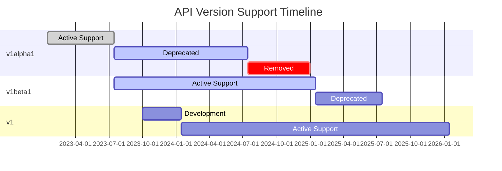

# Breaking Changes Guide

This document provides a comprehensive list of breaking changes between API versions of the Gunj Operator. Use this guide to understand the impact of upgrading and prepare your migration strategy.

## Table of Contents

- [Overview](#overview)
- [v1alpha1 to v1beta1](#v1alpha1-to-v1beta1)
- [v1beta1 to v1 (Future)](#v1beta1-to-v1-future)
- [Impact Assessment](#impact-assessment)
- [Migration Strategies](#migration-strategies)
- [Version Support Timeline](#version-support-timeline)

## Overview

Breaking changes are modifications that require user action when upgrading between API versions. These changes may include:

- **Removed fields**: Fields that no longer exist
- **Renamed fields**: Fields with new names or paths
- **Type changes**: Fields with different data types
- **Behavioral changes**: Same fields with different behavior
- **Validation changes**: New or modified validation rules
- **Default changes**: Different default values

## v1alpha1 to v1beta1

### Summary of Breaking Changes

| Category | Count | Impact Level |
|----------|-------|--------------|
| Removed Fields | 5 | High |
| Renamed Fields | 8 | Medium |
| Type Changes | 3 | High |
| Behavioral Changes | 6 | Medium |
| Validation Changes | 12 | Low |
| Default Changes | 4 | Low |

### Detailed Breaking Changes

#### 1. Field Removals

##### `spec.components.prometheus.customConfig` (REMOVED)
- **Impact**: High
- **Migration**: Split into specific configuration fields
- **Example**:
  ```yaml
  # v1alpha1 (OLD)
  spec:
    components:
      prometheus:
        customConfig:
          externalLabels: '{"cluster": "prod", "region": "us-east-1"}'
          remoteWrite: |
            - url: http://remote-storage:9090/api/v1/write
          scrapeConfigs: |
            - job_name: custom
              static_configs:
                - targets: ['app:8080']
  
  # v1beta1 (NEW)
  spec:
    components:
      prometheus:
        externalLabels:
          cluster: prod
          region: us-east-1
        remoteWrite:
          - url: http://remote-storage:9090/api/v1/write
        additionalScrapeConfigs:
          - job_name: custom
            static_configs:
              - targets: ['app:8080']
  ```

##### `spec.globalConfig` (REMOVED)
- **Impact**: Medium
- **Migration**: Moved to `spec.global`
- **Reason**: Naming consistency

##### `spec.components.*.legacyConfig` (REMOVED)
- **Impact**: High
- **Migration**: No direct replacement, use component-specific fields
- **Affected Components**: All (Prometheus, Grafana, Loki, Tempo)

##### `spec.experimental` (REMOVED)
- **Impact**: Low
- **Migration**: Experimental features promoted to stable
- **Note**: Features now available under proper configuration sections

##### `spec.components.*.deprecatedFields` (REMOVED)
- **Impact**: Medium
- **Migration**: Fields have been restructured
- **Action Required**: Update to use new field structure

#### 2. Field Renames

##### Alert Manager → Alertmanager
```yaml
# v1alpha1
spec:
  alerting:
    alertManager:  # Capital M
      config: ...

# v1beta1
spec:
  alerting:
    alertmanager:  # Lowercase m
      config: ...
```

##### Storage Configuration
```yaml
# v1alpha1
spec:
  components:
    prometheus:
      storageSize: 100Gi
      storageClass: fast-ssd

# v1beta1
spec:
  components:
    prometheus:
      storage:
        size: 100Gi
        storageClassName: fast-ssd
```

##### Resource Specifications
```yaml
# v1alpha1
spec:
  components:
    prometheus:
      cpuRequest: "1"
      memoryRequest: "4Gi"
      cpuLimit: "2"
      memoryLimit: "8Gi"

# v1beta1
spec:
  components:
    prometheus:
      resources:
        requests:
          cpu: "1"
          memory: "4Gi"
        limits:
          cpu: "2"
          memory: "8Gi"
```

##### Ingress Configuration
```yaml
# v1alpha1
spec:
  components:
    grafana:
      ingressEnabled: true
      ingressHost: grafana.example.com
      ingressTLS: true

# v1beta1
spec:
  components:
    grafana:
      ingress:
        enabled: true
        host: grafana.example.com
        tls:
          enabled: true
          secretName: grafana-tls
```

#### 3. Type Changes

##### External Labels
- **v1alpha1**: String (JSON format)
- **v1beta1**: Map[string]string
- **Example**:
  ```yaml
  # v1alpha1
  externalLabels: '{"cluster": "prod", "region": "us-east-1"}'
  
  # v1beta1
  externalLabels:
    cluster: prod
    region: us-east-1
  ```

##### Scrape Configs
- **v1alpha1**: String (YAML format)
- **v1beta1**: Structured array
- **Impact**: High - requires parsing and restructuring

##### Dashboard Configurations
- **v1alpha1**: String paths
- **v1beta1**: ConfigMap references
- **Example**:
  ```yaml
  # v1alpha1
  dashboards: "/etc/grafana/dashboards/*.json"
  
  # v1beta1
  dashboards:
    configMapSelector:
      matchLabels:
        grafana_dashboard: "1"
  ```

#### 4. Behavioral Changes

##### Default Retention Periods
- **v1alpha1**: 15 days (hardcoded)
- **v1beta1**: 30 days (configurable)
- **Impact**: Storage requirements will increase

##### Resource Allocation
- **v1alpha1**: Best effort
- **v1beta1**: Guaranteed QoS with proper requests/limits
- **Action**: Review and adjust resource allocations

##### High Availability
- **v1alpha1**: Manual configuration required
- **v1beta1**: Automatic HA setup when replicas > 1
- **Impact**: Additional resources needed for HA

##### Security Defaults
- **v1alpha1**: Permissive
- **v1beta1**: Secure by default
- **Changes**:
  - TLS enabled by default
  - Network policies applied
  - Pod security policies enforced
  - RBAC restrictions

##### Monitoring Scope
- **v1alpha1**: Namespace-scoped
- **v1beta1**: Cluster-wide with namespace filtering
- **Impact**: Broader monitoring coverage

##### Upgrade Strategy
- **v1alpha1**: Recreate pods
- **v1beta1**: Rolling updates
- **Benefit**: Zero-downtime upgrades

#### 5. Validation Changes

##### Version Format
- **v1alpha1**: Loose validation (v2.45.0 or 2.45.0)
- **v1beta1**: Strict semver (v2.45.0 only)
- **Regex**: `^v?\d+\.\d+\.\d+$`

##### Resource Quantities
- **v1alpha1**: String format accepted
- **v1beta1**: Kubernetes quantity format required
- **Valid Examples**: 100Mi, 1Gi, 1000m, 1

##### Label Validation
- **v1alpha1**: Any string accepted
- **v1beta1**: Kubernetes label format enforced
- **Rules**:
  - Max 63 characters
  - Alphanumeric, '-', '_', '.'
  - Must start/end with alphanumeric

##### DNS Names
- **v1alpha1**: Basic validation
- **v1beta1**: RFC 1123 compliance
- **Rules**:
  - Lowercase only
  - Max 253 characters
  - Valid DNS subdomain

##### Port Ranges
- **v1alpha1**: Any integer
- **v1beta1**: Valid port range (1-65535)
- **Additional**: Named ports supported

##### Storage Size
- **v1alpha1**: Minimum 1Gi
- **v1beta1**: Minimum 10Gi
- **Reason**: Performance and reliability

##### Replica Counts
- **v1alpha1**: 0 allowed
- **v1beta1**: Minimum 1 required
- **Exception**: Can be scaled to 0 post-deployment

##### Timeout Values
- **v1alpha1**: Seconds as integer
- **v1beta1**: Duration format (e.g., "30s", "5m")
- **Validation**: Must be positive duration

##### URL Validation
- **v1alpha1**: Basic string
- **v1beta1**: Valid URL required
- **Schemes**: http, https only

##### Certificate Validation
- **v1alpha1**: Not validated
- **v1beta1**: Must be valid PEM format
- **Checks**: Expiration, chain validation

##### Config File Sizes
- **v1alpha1**: Unlimited
- **v1beta1**: Max 1MB per config
- **Reason**: ConfigMap limitations

##### Annotation Limits
- **v1alpha1**: Unlimited
- **v1beta1**: Max 256KB total
- **Per Annotation**: Max 64KB

#### 6. Default Value Changes

| Field | v1alpha1 Default | v1beta1 Default | Reason |
|-------|------------------|-----------------|---------|
| `spec.components.prometheus.retention` | 15d | 30d | Industry standard |
| `spec.components.prometheus.replicas` | 1 | 2 | HA by default |
| `spec.components.grafana.plugins` | [] | ["grafana-piechart-panel"] | Common use case |
| `spec.components.loki.replicationFactor` | 1 | 3 | Data durability |
| `spec.security.tls.enabled` | false | true | Security first |
| `spec.components.*.resources.requests.memory` | None | 1Gi | Stability |
| `spec.monitoring.selfMonitoring` | false | true | Observability |
| `spec.components.tempo.storage.type` | memory | disk | Persistence |

### Status Field Changes

#### New Status Fields (v1beta1)
```yaml
status:
  # New fields in v1beta1
  observedGeneration: 5
  lastTransitionTime: "2024-01-15T10:30:00Z"
  componentsReady: 4
  componentsTotal: 4
  healthStatus: "Healthy"
  lastBackup: "2024-01-15T03:00:00Z"
  resourceUsage:
    cpu: "2.5"
    memory: "8Gi"
    storage: "150Gi"
  version: "v1beta1"
  operator Version: "1.5.0"
```

#### Removed Status Fields
- `status.lastUpdated` → Use `status.lastTransitionTime`
- `status.ready` → Use `status.phase`
- `status.errorCount` → Check conditions array

### API Behavior Changes

#### Reconciliation Frequency
- **v1alpha1**: 30 seconds
- **v1beta1**: 1 minute (configurable)
- **Override**: Use annotation `observability.io/reconcile-frequency`

#### Deletion Protection
- **v1alpha1**: Immediate deletion
- **v1beta1**: Finalizers prevent accidental deletion
- **Bypass**: Remove finalizer manually if needed

#### Update Strategy
- **v1alpha1**: Recreate all resources
- **v1beta1**: Smart patching, minimal disruption
- **Force Recreate**: Use annotation `observability.io/force-recreate`

## v1beta1 to v1 (Future)

### Planned Breaking Changes

⚠️ **Note**: v1 is not yet released. These are planned changes subject to modification.

#### 1. Strict API Compliance
- All fields must follow Kubernetes API conventions
- No custom formats or encodings
- Strict validation on all fields

#### 2. Feature Graduation
- Beta features become stable
- Experimental annotations removed
- Feature gates no longer needed

#### 3. Performance Optimizations
- New default values optimized for scale
- Resource requirements may increase
- Caching strategies change

#### 4. Security Hardening
- Mandatory security policies
- No opt-out for security features
- Stricter RBAC requirements

## Impact Assessment

### High Impact Changes

These changes require immediate attention and planning:

1. **Custom Config Removal**
   - Affects: All users with custom Prometheus configs
   - Action: Restructure configurations
   - Timeline: Must be done before upgrade

2. **Type Changes**
   - Affects: Automation scripts and GitOps
   - Action: Update all YAML files
   - Timeline: Test thoroughly before upgrade

3. **Resource Structure**
   - Affects: Resource definitions
   - Action: Adopt Kubernetes-standard format
   - Timeline: Can use conversion webhook

### Medium Impact Changes

These changes should be addressed but have workarounds:

1. **Field Renames**
   - Affects: Existing configurations
   - Action: Simple find-and-replace
   - Timeline: Can be automated

2. **Behavioral Changes**
   - Affects: Operational procedures
   - Action: Update runbooks
   - Timeline: Post-upgrade

3. **Validation Tightening**
   - Affects: Edge cases
   - Action: Validate configurations
   - Timeline: Pre-upgrade testing

### Low Impact Changes

These changes are mostly transparent:

1. **Default Value Changes**
   - Affects: Implicit configurations
   - Action: Review and adjust if needed
   - Timeline: Post-upgrade optimization

2. **New Required Fields**
   - Affects: Minimal configs
   - Action: Defaults usually sufficient
   - Timeline: As needed

## Migration Strategies

### 1. Big Bang Migration
- **When**: Small deployments, good test coverage
- **Pros**: Quick, single maintenance window
- **Cons**: Higher risk, longer downtime

### 2. Phased Migration
- **When**: Large deployments, critical systems
- **Pros**: Lower risk, gradual rollout
- **Cons**: Longer timeline, complex coordination

### 3. Blue-Green Migration
- **When**: Zero-downtime requirements
- **Pros**: Instant rollback, no downtime
- **Cons**: Double resources needed

### 4. Canary Migration
- **When**: Very large deployments
- **Pros**: Minimal blast radius
- **Cons**: Complex setup, slow

## Version Support Timeline

### Support Matrix

| Version | Release Date | End of Support | Status |
|---------|--------------|----------------|---------|
| v1alpha1 | 2023-01-15 | 2024-07-15 | Deprecated |
| v1beta1 | 2023-07-15 | 2025-01-15 | Current |
| v1 | 2024-01-15 (planned) | TBD | Future |

### Deprecation Timeline



### Migration Windows

- **Recommended Migration Period**: 3-6 months before deprecation
- **Final Migration Deadline**: 1 month before removal
- **Emergency Support**: Available for critical issues only

## Getting Help

### Resources
- [Field Mapping Reference](field-mapping-reference.md)
- [Migration Tools](migration-tools.md)
- [Troubleshooting Guide](migration-troubleshooting.md)
- [Example Scenarios](migration-examples.md)

### Support Channels
- GitHub Issues: https://github.com/gunjanjp/gunj-operator/issues
- Slack: #gunj-operator-migration
- Email: gunjanjp@gmail.com

### Professional Services
For complex migrations, professional services are available:
- Migration planning and assessment
- Custom tooling development
- Hands-on migration assistance
- Training and workshops
