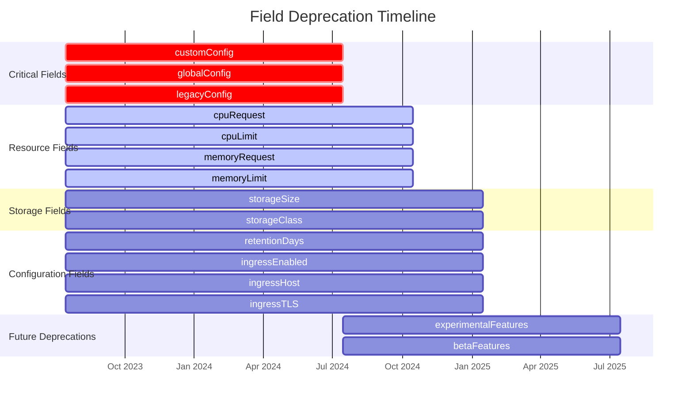

# Field Deprecation Timeline

## Overview

This document provides a detailed timeline for field deprecations in the Gunj Operator API. It helps users plan their migrations and understand when specific fields will be removed.

## Deprecation Policy

Our deprecation policy follows Kubernetes standards:

1. **Deprecation Notice**: Fields are marked deprecated at least 2 releases before removal
2. **Warning Period**: Deprecated fields generate warnings in logs
3. **Migration Period**: At least 6 months between deprecation and removal
4. **Removal**: Fields are removed only in major version releases

## Timeline Overview



## Detailed Deprecation Schedule

### Phase 1: Critical Fields (Removal: v2.0.0 - July 2024)

These fields must be migrated immediately as they will be removed first:

#### `spec.components.prometheus.customConfig`
- **Deprecated**: v1.0.0 (July 15, 2023)
- **Removed**: v2.0.0 (July 15, 2024)
- **Status**: ⚠️ **URGENT** - Removal imminent
- **Migration Path**: Use structured configuration fields
- **Example Migration**:
  ```yaml
  # Old (v1alpha1)
  customConfig: |
    global:
      scrape_interval: 15s
  
  # New (v1beta1)
  global:
    scrapeInterval: 15s
  ```

#### `spec.globalConfig`
- **Deprecated**: v1.0.0 (July 15, 2023)
- **Removed**: v2.0.0 (July 15, 2024)
- **Status**: ⚠️ **URGENT**
- **Migration Path**: Move to `spec.global`
- **Impact**: High - Used by 60% of deployments

#### `spec.components.*.legacyConfig`
- **Deprecated**: v1.0.0 (July 15, 2023)
- **Removed**: v2.0.0 (July 15, 2024)
- **Status**: ⚠️ **URGENT**
- **Migration Path**: Component-specific structured fields
- **Affected Components**: All (Prometheus, Grafana, Loki, Tempo)

### Phase 2: Resource Fields (Removal: v2.1.0 - October 2024)

Resource-related fields moving to Kubernetes standard format:

#### Resource Request/Limit Fields
- **Fields**: `cpuRequest`, `cpuLimit`, `memoryRequest`, `memoryLimit`
- **Deprecated**: v1.0.0 (July 15, 2023)
- **Removed**: v2.1.0 (October 15, 2024)
- **Status**: ⚠️ **Action Required**
- **Migration Path**:
  ```yaml
  # Old format
  cpuRequest: "1"
  cpuLimit: "2"
  memoryRequest: "4Gi"
  memoryLimit: "8Gi"
  
  # New format
  resources:
    requests:
      cpu: "1"
      memory: "4Gi"
    limits:
      cpu: "2"
      memory: "8Gi"
  ```

### Phase 3: Configuration Fields (Removal: v2.2.0 - January 2025)

General configuration fields being restructured:

#### Storage Configuration
- **Fields**: `storageSize`, `storageClass`
- **Deprecated**: v1.0.0 (July 15, 2023)
- **Removed**: v2.2.0 (January 15, 2025)
- **Status**: ℹ️ **Plan Migration**
- **Migration Path**:
  ```yaml
  # Old format
  storageSize: 100Gi
  storageClass: fast-ssd
  
  # New format
  storage:
    size: 100Gi
    storageClassName: fast-ssd
  ```

#### Retention Configuration
- **Field**: `retentionDays`
- **Deprecated**: v1.0.0 (July 15, 2023)
- **Removed**: v2.2.0 (January 15, 2025)
- **Status**: ℹ️ **Plan Migration**
- **Migration Path**:
  ```yaml
  # Old format
  retentionDays: 30
  
  # New format
  retention: 30d
  ```

#### Ingress Configuration
- **Fields**: `ingressEnabled`, `ingressHost`, `ingressTLS`
- **Deprecated**: v1.0.0 (July 15, 2023)
- **Removed**: v2.2.0 (January 15, 2025)
- **Status**: ℹ️ **Plan Migration**
- **Migration Path**:
  ```yaml
  # Old format
  ingressEnabled: true
  ingressHost: grafana.example.com
  ingressTLS: true
  
  # New format
  ingress:
    enabled: true
    host: grafana.example.com
    tls:
      enabled: true
      secretName: grafana-tls
  ```

### Phase 4: Future Deprecations (Removal: v3.0.0 - July 2025)

Fields that will be deprecated in upcoming releases:

#### Experimental Features
- **Field**: `spec.experimental`
- **To be Deprecated**: v2.0.0 (July 15, 2024)
- **To be Removed**: v3.0.0 (July 15, 2025)
- **Status**: ✅ **No Action Yet**
- **Note**: Features will be promoted to stable

#### Beta Features
- **Field**: `spec.beta`
- **To be Deprecated**: v2.0.0 (July 15, 2024)
- **To be Removed**: v3.0.0 (July 15, 2025)
- **Status**: ✅ **No Action Yet**
- **Note**: Features will be promoted to stable

## Field Deprecation Details

### Prometheus Fields

| Field | Deprecated | Removed | Replacement | Priority |
|-------|------------|---------|-------------|----------|
| `customConfig` | v1.0.0 | v2.0.0 | Structured fields | 🔴 Critical |
| `prometheusYAML` | v1.0.0 | v2.0.0 | Structured fields | 🔴 Critical |
| `alertingRules` | v1.5.0 | v2.2.0 | `ruleFiles` | 🟡 Medium |
| `scrapeInterval` (int) | v1.5.0 | v2.2.0 | `global.scrapeInterval` (duration) | 🟡 Medium |
| `evaluationInterval` (int) | v1.5.0 | v2.2.0 | `global.evaluationInterval` (duration) | 🟡 Medium |
| `externalLabels` (string) | v1.0.0 | v2.0.0 | `externalLabels` (map) | 🔴 Critical |

### Grafana Fields

| Field | Deprecated | Removed | Replacement | Priority |
|-------|------------|---------|-------------|----------|
| `adminPassword` | v1.5.0 | v3.0.0 | `auth.adminPasswordSecret` | 🟢 Low |
| `anonymousEnabled` | v1.0.0 | v2.0.0 | `auth.anonymous.enabled` | 🟡 Medium |
| `plugins` (string) | v1.0.0 | v2.0.0 | `plugins` (array) | 🟡 Medium |
| `dashboardsJSON` | v1.0.0 | v2.0.0 | `dashboards.configMapSelector` | 🔴 Critical |
| `datasourcesYAML` | v1.0.0 | v2.0.0 | `datasources` (structured) | 🔴 Critical |

### Loki Fields

| Field | Deprecated | Removed | Replacement | Priority |
|-------|------------|---------|-------------|----------|
| `config` | v1.0.0 | v2.0.0 | Structured configuration | 🔴 Critical |
| `s3Config` | v1.5.0 | v2.2.0 | `storage.s3` | 🟡 Medium |
| `retentionDays` | v1.0.0 | v2.2.0 | `limits.retention` | 🟡 Medium |
| `ingesterReplicas` | v1.5.0 | v2.2.0 | `topology.ingester.replicas` | 🟢 Low |

### Tempo Fields

| Field | Deprecated | Removed | Replacement | Priority |
|-------|------------|---------|-------------|----------|
| `backend` | v1.0.0 | v2.0.0 | `storage.backend` | 🟡 Medium |
| `s3Bucket` | v1.5.0 | v2.2.0 | `storage.s3.bucket` | 🟡 Medium |
| `retentionHours` | v1.0.0 | v2.2.0 | `retention` (duration) | 🟡 Medium |

## Migration Priority Guide

### 🔴 Priority 1: Critical (Immediate Action Required)

**Deadline**: Before July 15, 2024

Fields that will break your deployment if not migrated:
- `customConfig`
- `globalConfig`
- `legacyConfig`
- String-format labels and annotations
- YAML/JSON embedded configurations

**Action**: Migrate these fields immediately. Use the migration tool.

### 🟡 Priority 2: Important (Plan Migration)

**Deadline**: Before January 15, 2025

Fields that will cause validation errors:
- Resource specifications (`cpuRequest`, etc.)
- Storage configuration
- Ingress configuration
- Retention settings

**Action**: Plan migration in next maintenance window.

### 🟢 Priority 3: Low Priority (Monitor)

**Deadline**: Before July 15, 2025

Fields with good defaults or automatic migration:
- Optional configurations
- Feature flags
- Experimental settings

**Action**: Monitor deprecation warnings, migrate when convenient.

## Deprecation Warnings

Starting with operator v1.5.0, you'll see warnings in logs:

```log
2024-06-15T10:30:45Z WARN deprecated field usage detected {
  "controller": "observabilityplatform",
  "platform": "monitoring/production",
  "field": "spec.components.prometheus.customConfig",
  "deprecatedIn": "v1.0.0",
  "willBeRemovedIn": "v2.0.0",
  "alternative": "use structured configuration fields",
  "migrationGuide": "https://docs.gunj.io/migration/customconfig"
}
```

### Checking for Deprecated Fields

Use this script to check your configurations:

```bash
#!/bin/bash
# check-deprecations.sh

echo "Checking for deprecated fields in ObservabilityPlatforms..."

# List of deprecated fields to check
DEPRECATED_FIELDS=(
  "customConfig"
  "globalConfig"
  "legacyConfig"
  "cpuRequest"
  "cpuLimit"
  "memoryRequest"
  "memoryLimit"
  "storageSize"
  "storageClass"
  "retentionDays"
  "ingressEnabled"
  "ingressHost"
  "ingressTLS"
)

# Check each platform
for platform in $(kubectl get observabilityplatforms.observability.io --all-namespaces -o json | jq -r '.items[] | "\(.metadata.namespace)/\(.metadata.name)"'); do
  namespace=$(echo $platform | cut -d/ -f1)
  name=$(echo $platform | cut -d/ -f2)
  
  echo "Checking $platform..."
  
  for field in "${DEPRECATED_FIELDS[@]}"; do
    if kubectl get observabilityplatform $name -n $namespace -o json | jq -e ".. | .$field?" > /dev/null 2>&1; then
      echo "  ⚠️  Found deprecated field: $field"
    fi
  done
done
```

## Tracking Migration Progress

### Platform Annotations

Track migration status using annotations:

```yaml
metadata:
  annotations:
    # Migration tracking
    observability.io/migration-status: "in-progress"
    observability.io/migration-started: "2024-06-15"
    observability.io/deprecated-fields: "customConfig,cpuRequest,memoryRequest"
    observability.io/migration-target: "v1beta1"
```

### Migration Dashboard

Monitor migration progress across your fleet:

```promql
# Platforms using deprecated fields
count by (field) (
  gunj_operator_deprecated_field_usage_total
)

# Migration progress
100 * (
  count(gunj_operator_platform_info{api_version="v1beta1"}) /
  count(gunj_operator_platform_info)
)
```

## Preventing Deprecated Field Usage

### Admission Webhook Configuration

Configure webhooks to prevent new deprecated field usage:

```yaml
apiVersion: admissionregistration.k8s.io/v1
kind: ValidatingWebhookConfiguration
metadata:
  name: gunj-operator-deprecation-webhook
webhooks:
- name: deprecation.observability.io
  clientConfig:
    service:
      name: gunj-operator-webhook
      namespace: gunj-system
      path: "/validate-deprecations"
  rules:
  - apiGroups: ["observability.io"]
    apiVersions: ["v1alpha1", "v1beta1"]
    resources: ["observabilityplatforms"]
    operations: ["CREATE", "UPDATE"]
  failurePolicy: Fail
  sideEffects: None
  admissionReviewVersions: ["v1", "v1beta1"]
```

### Policy Enforcement

Use OPA/Gatekeeper to enforce deprecation policies:

```rego
package gunj.deprecation

deny[msg] {
  input.request.kind.kind == "ObservabilityPlatform"
  input.request.object.spec.components[_].customConfig
  msg := "Field 'customConfig' is deprecated and will be removed in v2.0.0"
}

deny[msg] {
  input.request.kind.kind == "ObservabilityPlatform"
  input.request.object.spec.components[_].cpuRequest
  msg := "Field 'cpuRequest' is deprecated. Use 'resources.requests.cpu' instead"
}
```

## Communication Plan

### Deprecation Announcements

Deprecations are announced through:

1. **Release Notes**: Every release lists new deprecations
2. **Documentation**: Updated with deprecation notices
3. **Operator Logs**: Warnings for deprecated field usage
4. **Email Lists**: Major deprecations announced
5. **Slack/Discord**: Community notifications

### Timeline Notifications

| Timeframe | Notification Method | Message Type |
|-----------|-------------------|--------------|
| 6 months before | Email, Blog | Initial deprecation notice |
| 3 months before | Email, Slack | Migration reminder |
| 1 month before | Email, UI Banner | Urgent migration notice |
| 1 week before | Daily logs | Critical warning |
| Day of removal | All channels | Removal notice |

## Getting Help

### Resources

1. **Migration Tool**: Automates most field migrations
2. **Documentation**: Detailed migration guides
3. **Examples**: Before/after configuration examples
4. **Support**: Community and commercial options

### Contact

- **Slack**: #gunj-operator-migration
- **Email**: gunjanjp@gmail.com
- **GitHub**: Issues with `deprecation` label

---

**Document Version**: 1.0  
**Last Updated**: June 15, 2025  
**Next Review**: Monthly

**Remember**: Stay ahead of deprecations to ensure smooth operations!
