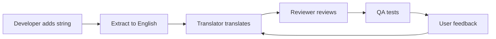

# Gunj Operator Translation Workflow Guide

**Version**: 1.0  
**Last Updated**: June 12, 2025  
**Project**: Gunj Operator - Enterprise Observability Platform  
**Contact**: gunjanjp@gmail.com  

---

## 🌍 Quick Start for Translators

### Setting Up Your Environment

1. **Clone the repository**
   ```bash
   git clone https://github.com/gunjanjp/gunj-operator.git
   cd gunj-operator
   ```

2. **Install dependencies**
   ```bash
   npm install
   cd ui && npm install
   ```

3. **Find translation files**
   ```
   public/locales/
   ├── en/           # Source language (English)
   │   ├── common.json
   │   ├── platform.json
   │   ├── errors.json
   │   └── validation.json
   ├── es/           # Spanish
   ├── ja/           # Japanese
   └── ...           # Other languages
   ```

---

## 📝 Translation Guidelines

### General Rules

1. **Consistency**: Use consistent terminology across all translations
2. **Context**: Consider where the text appears in the UI
3. **Length**: Keep translations similar in length to avoid UI issues
4. **Tone**: Maintain professional yet friendly tone
5. **Technical Terms**: Some technical terms may remain in English

### Variables and Placeholders

```json
// Variables are wrapped in {{}}
{
  "welcome": "Welcome, {{userName}}!",
  "platformCount": "You have {{count}} platform(s)"
}

// Do NOT translate variable names
❌ "welcome": "Bienvenido, {{nombreUsuario}}!"
✅ "welcome": "¡Bienvenido, {{userName}}!"
```

### Pluralization

```json
// English uses _one and _other
{
  "item_count_one": "{{count}} item",
  "item_count_other": "{{count}} items"
}

// Some languages need more forms
// Russian example:
{
  "item_count_one": "{{count}} элемент",      // 1, 21, 31...
  "item_count_few": "{{count}} элемента",     // 2-4, 22-24...
  "item_count_many": "{{count}} элементов",   // 0, 5-20, 25-30...
  "item_count_other": "{{count}} элементов"   // Decimals
}
```

---

## 🔄 Translation Process

### Step 1: Check for Updates

```bash
# Pull latest changes
git pull origin main

# Check which files need translation
npm run i18n:status

# Output:
# Spanish (es): 95% complete (5 missing keys)
# Japanese (ja): 88% complete (12 missing keys)
```

### Step 2: Find Missing Translations

```bash
# Generate translation report
npm run i18n:report

# Creates: translations-report.html
# Shows:
# - Missing translations by language
# - Unused translation keys
# - Keys that might need review
```

### Step 3: Translate

Use the provided translation template:

```json
// Template for new keys (generated automatically)
{
  "newKey": {
    "_comment": "Context: Shown on platform creation success",
    "value": "TO_BE_TRANSLATED"
  }
}
```

### Step 4: Validate

```bash
# Check JSON syntax
npm run i18n:lint

# Validate placeholders match
npm run i18n:validate

# Test in browser
npm run dev -- --lang=ja
```

### Step 5: Submit

```bash
# Create feature branch
git checkout -b i18n/japanese-updates

# Commit changes
git add public/locales/ja/*.json
git commit -m "i18n(ja): update Japanese translations"

# Push and create PR
git push origin i18n/japanese-updates
```

---

## 🌐 Language-Specific Guidelines

### Japanese (ja)

```json
{
  // Use appropriate politeness level
  "form.submit": "送信",          // Casual
  "form.submit": "送信する",      // Neutral
  "form.submit": "送信いたします", // Polite (recommended for enterprise)
  
  // Handle katakana for technical terms
  "platform": "プラットフォーム",
  "monitoring": "モニタリング",
  
  // Date format
  "dateFormat": "YYYY年MM月DD日"
}
```

### Chinese Simplified (zh-CN)

```json
{
  // Use simplified characters
  "settings": "设置",  // Not 設置
  
  // Technical terms often remain in English
  "Kubernetes": "Kubernetes",
  "Docker": "Docker",
  
  // But translate when common
  "container": "容器",
  "service": "服务"
}
```

### Arabic (ar)

```json
{
  // RTL considerations
  "direction": "rtl",
  
  // Numbers remain Western in technical contexts
  "version": "الإصدار 2.0",  // Version 2.0
  
  // Proper noun handling
  "prometheus": "بروميثيوس"
}
```

### Spanish (es)

```json
{
  // Gender agreement
  "platform.created": "Plataforma creada",     // feminine
  "service.created": "Servicio creado",        // masculine
  
  // Avoid anglicisms when possible
  "deploy": "desplegar",    // Not "deployar"
  "upload": "subir",        // Not "uploadear"
}
```

---

## 🧪 Testing Translations

### Visual Testing

1. **Check text overflow**
   ```bash
   # Run with specific language
   npm run dev -- --lang=de
   
   # Check all languages
   npm run test:i18n:visual
   ```

2. **Test different viewports**
   - Desktop: 1920x1080
   - Tablet: 768x1024
   - Mobile: 375x667

3. **Verify RTL layout**
   - Text alignment
   - Component positioning
   - Icon direction

### Functional Testing

```typescript
// Test data in each language
const testData = {
  en: { name: "Test Platform", status: "Ready" },
  ja: { name: "テストプラットフォーム", status: "準備完了" },
  es: { name: "Plataforma de Prueba", status: "Listo" },
};
```

### Common Issues Checklist

- [ ] Text truncation in buttons
- [ ] Overlapping labels
- [ ] Date/time format correctness
- [ ] Number formatting (decimal/thousand separators)
- [ ] Currency display
- [ ] Pluralization rules
- [ ] Variable interpolation
- [ ] Special characters display

---

## 🤝 Collaboration Tools

### Translation Management System

We use Crowdin for collaborative translation:

1. **Access**: Request access at translations@gunjanjp.github.io
2. **Project URL**: https://crowdin.com/project/gunj-operator
3. **Features**:
   - Translation memory
   - Glossary management
   - In-context translation
   - Review workflow

### Communication Channels

- **Slack**: #gunj-i18n channel
- **GitHub Discussions**: Translation questions
- **Weekly Sync**: Thursdays 2 PM UTC

### Glossary

Key terms and their translations:

| English | Spanish | Japanese | German | Chinese |
|---------|---------|----------|---------|---------|
| Platform | Plataforma | プラットフォーム | Plattform | 平台 |
| Deployment | Despliegue | デプロイメント | Bereitstellung | 部署 |
| Monitoring | Monitoreo | モニタリング | Überwachung | 监控 |
| Alert | Alerta | アラート | Warnung | 警报 |
| Dashboard | Panel | ダッシュボード | Dashboard | 仪表板 |

---

## 📊 Quality Metrics

### Translation Completeness

Target metrics:
- **Launch**: 100% of common namespace
- **Phase 1**: 95% of all namespaces
- **Ongoing**: 100% within 48 hours of new strings

### Review Process

1. **Peer Review**: Another native speaker reviews
2. **Context Check**: Verify in running application
3. **Technical Review**: Ensure technical accuracy
4. **Sign-off**: Language lead approves

### Feedback Loop



---

## 🛠️ Troubleshooting

### Common Issues

1. **Missing translations show keys**
   ```javascript
   // Check i18n initialization
   i18n.init({
     fallbackLng: 'en',
     debug: true, // Enable for debugging
   });
   ```

2. **Wrong pluralization**
   ```json
   // Ensure all plural forms exist
   {
     "items_zero": "No items",    // Optional
     "items_one": "One item",      // Required
     "items_other": "{{count}} items" // Required
   }
   ```

3. **Broken variables**
   ```json
   // Check variable names match exactly
   ❌ "welcome": "Hello {{name}!"     // Code uses {{userName}}
   ✅ "welcome": "Hello {{userName}}!" // Matches code
   ```

### Debug Mode

```typescript
// Enable debug mode in development
if (process.env.NODE_ENV === 'development') {
  i18n.init({
    debug: true,
    saveMissing: true,
    missingKeyHandler: (lng, ns, key) => {
      console.warn(`Missing translation: ${lng}/${ns}/${key}`);
    },
  });
}
```

---

## 📚 Additional Resources

### Style Guides
- [Microsoft Style Guide](https://docs.microsoft.com/en-us/style-guide/welcome/)
- [Google Developer Style Guide](https://developers.google.com/style)
- [Apple Style Guide](https://help.apple.com/applestyleguide/)

### Tools
- [DeepL API](https://www.deepl.com/pro-api) - For initial translations
- [Google Translate Toolkit](https://translate.google.com/toolkit)
- [Poedit](https://poedit.net/) - Offline translation editor

### References
- [CLDR Plural Rules](https://cldr.unicode.org/index/cldr-spec/plural-rules)
- [Date Format Patterns](https://www.unicode.org/reports/tr35/tr35-dates.html)
- [BCP 47 Language Tags](https://www.w3.org/International/articles/language-tags/)

---

**Thank you for helping make Gunj Operator accessible to users worldwide! 🌍**

*Questions? Join #gunj-i18n on Slack or email translations@gunjanjp.github.io*