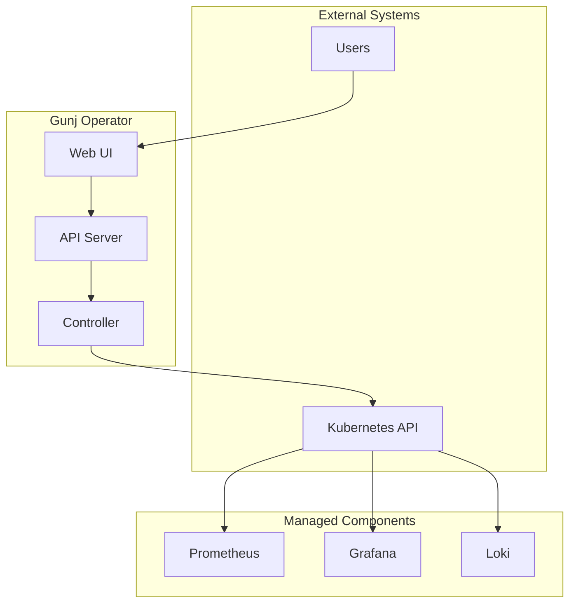
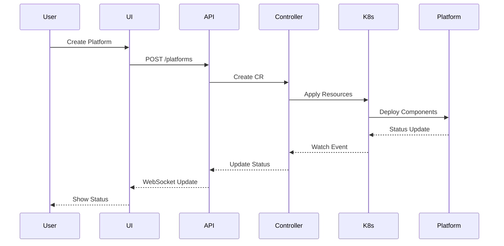
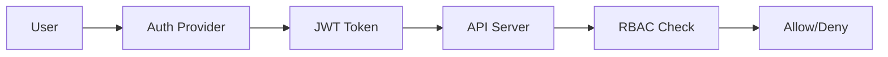
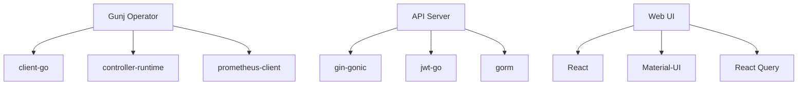
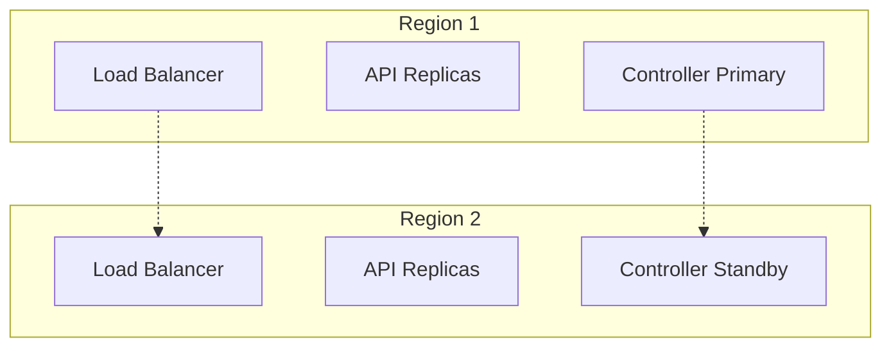

# [Component/System] Architecture

> **Version**: 1.0  
> **Status**: [Draft | Review | Approved]  
> **Last Updated**: YYYY-MM-DD  
> **Authors**: [List of authors]

## Executive Summary

[Provide a high-level overview of the architecture in 2-3 paragraphs. Include the main purpose, key design decisions, and primary benefits.]

## Table of Contents

- [Overview](#overview)
- [Design Goals](#design-goals)
- [Architecture Overview](#architecture-overview)
- [Component Details](#component-details)
- [Data Flow](#data-flow)
- [Security Architecture](#security-architecture)
- [Scalability & Performance](#scalability--performance)
- [Technology Stack](#technology-stack)
- [Deployment Architecture](#deployment-architecture)
- [Design Decisions](#design-decisions)
- [Future Considerations](#future-considerations)

## Overview

### Purpose

[Explain what this architecture document covers and why it exists]

### Scope

**In Scope:**
- [What is covered]
- [What is included]

**Out of Scope:**
- [What is not covered]
- [What is excluded]

### Audience

This document is intended for:
- Software architects
- Senior developers
- DevOps engineers
- Technical leads

## Design Goals

### Primary Goals

1. **Goal 1**: [Description and rationale]
2. **Goal 2**: [Description and rationale]
3. **Goal 3**: [Description and rationale]

### Non-Goals

1. **Non-Goal 1**: [What we explicitly don't aim to achieve]
2. **Non-Goal 2**: [What is out of scope]

### Constraints

- **Technical Constraints**: [Language, framework, infrastructure limitations]
- **Business Constraints**: [Time, budget, compliance requirements]
- **Operational Constraints**: [Deployment, maintenance requirements]

## Architecture Overview

### High-Level Architecture



*Figure 1: High-level system architecture*

### Architectural Patterns

- **Pattern 1**: [e.g., Microservices, Event-driven, etc.]
  - Rationale: [Why this pattern was chosen]
  - Benefits: [What it provides]
  
- **Pattern 2**: [e.g., Repository pattern, CQRS, etc.]
  - Rationale: [Why this pattern was chosen]
  - Benefits: [What it provides]

## Component Details

### Component 1: [Operator Controller]

**Purpose**: [What it does]

**Responsibilities**:
- Responsibility 1
- Responsibility 2
- Responsibility 3

**Key Interfaces**:
```go
type Controller interface {
    Reconcile(ctx context.Context, req Request) (Result, error)
    SetupWithManager(mgr Manager) error
}
```

**Dependencies**:
- Kubernetes API
- Component managers
- Metrics collector

**Configuration**:
```yaml
controller:
  workers: 10
  reconcileInterval: 30s
  maxRetries: 3
```

### Component 2: [API Server]

**Purpose**: [What it does]

**Endpoints**:
- `/api/v1/platforms` - Platform management
- `/api/v1/metrics` - Metrics access
- `/api/v1/health` - Health checks

**Technology**: Go, Gin framework

**Scaling**: Horizontal scaling with load balancer

### Component 3: [Web UI]

**Purpose**: [What it does]

**Architecture**: Single Page Application (SPA)

**Key Libraries**:
- React 18
- TypeScript
- Material-UI
- React Query

## Data Flow

### Request Flow



*Figure 2: Platform creation flow*

### Data Storage

#### Primary Storage

- **Kubernetes etcd**: All configuration and state
- **Prometheus**: Time-series metrics
- **Loki**: Log aggregation

#### Data Retention

| Data Type | Retention Period | Storage Location |
|-----------|------------------|------------------|
| Platform Config | Indefinite | etcd |
| Metrics | 30 days | Prometheus |
| Logs | 7 days | Loki |
| Audit Logs | 90 days | External S3 |

## Security Architecture

### Authentication & Authorization



### Security Layers

1. **Network Security**
   - TLS 1.3 for all communications
   - Network policies for pod isolation
   - Ingress with WAF

2. **Application Security**
   - JWT-based authentication
   - RBAC authorization
   - Input validation
   - Output encoding

3. **Data Security**
   - Encryption at rest
   - Encryption in transit
   - Key rotation
   - Secrets management

### Threat Model

| Threat | Impact | Likelihood | Mitigation |
|--------|--------|------------|------------|
| Unauthorized Access | High | Medium | RBAC, Authentication |
| Data Breach | High | Low | Encryption, Access Control |
| DoS Attack | Medium | Medium | Rate Limiting, Quotas |

## Scalability & Performance

### Scalability Strategy

#### Horizontal Scaling

- **API Server**: Stateless, scale with HPA
- **Controller**: Leader election, scale to 3
- **UI**: CDN distribution

#### Vertical Scaling

- **Database**: Increase resources as needed
- **Prometheus**: Federated setup for large scale

### Performance Targets

| Metric | Target | Current |
|--------|--------|---------|
| API Response Time | < 100ms | 85ms |
| Reconciliation Time | < 30s | 25s |
| UI Load Time | < 3s | 2.5s |
| Concurrent Platforms | 1000+ | Tested to 1500 |

### Bottlenecks & Mitigations

1. **Kubernetes API Rate Limits**
   - Mitigation: Caching, batching, backoff

2. **Prometheus Query Performance**
   - Mitigation: Query optimization, downsampling

## Technology Stack

### Core Technologies

| Component | Technology | Version | Rationale |
|-----------|------------|---------|-----------|
| Operator | Go | 1.21 | Performance, K8s ecosystem |
| API | Gin | 1.9 | Fast, minimal framework |
| UI | React | 18 | Modern, component-based |
| Container | Docker | 24.0 | Industry standard |
| Orchestration | Kubernetes | 1.29 | Target platform |

### Dependencies



## Deployment Architecture

### Development Environment

```yaml
apiVersion: apps/v1
kind: Deployment
metadata:
  name: gunj-operator-dev
spec:
  replicas: 1
  template:
    spec:
      containers:
      - name: operator
        image: gunj-operator:dev
        env:
        - name: ENVIRONMENT
          value: development
```

### Production Environment



### Infrastructure Requirements

| Component | Dev | Staging | Production |
|-----------|-----|---------|------------|
| Nodes | 1 | 3 | 5+ |
| CPU | 4 cores | 8 cores | 16+ cores |
| Memory | 8 GB | 16 GB | 32+ GB |
| Storage | 50 GB | 200 GB | 500+ GB |

## Design Decisions

### ADR-001: Operator Framework Choice

**Status**: Accepted

**Context**: Need to choose between Operator SDK and Kubebuilder

**Decision**: Use Kubebuilder

**Rationale**:
- Better documentation
- More flexible
- Active community
- CNCF project

**Consequences**:
- More boilerplate code
- Steeper learning curve
- More control over implementation

### ADR-002: API Design

**Status**: Accepted

**Context**: REST vs GraphQL vs gRPC

**Decision**: REST with GraphQL for complex queries

**Rationale**:
- REST is well understood
- GraphQL for flexibility
- Easier client implementation

### ADR-003: State Management

**Status**: Accepted

**Context**: Where to store operator state

**Decision**: Use Kubernetes CRDs exclusively

**Rationale**:
- Single source of truth
- Kubernetes native
- Built-in HA

## Future Considerations

### Planned Enhancements

1. **Multi-cluster Support** (Q3 2025)
   - Federation controller
   - Cross-cluster networking
   - Centralized management

2. **AI/ML Integration** (Q4 2025)
   - Anomaly detection
   - Predictive scaling
   - Intelligent alerting

3. **Enhanced Security** (Q1 2026)
   - mTLS everywhere
   - Hardware security modules
   - Zero-trust architecture

### Technical Debt

| Item | Priority | Effort | Impact |
|------|----------|--------|--------|
| Refactor controller logic | High | Large | Performance |
| Improve test coverage | Medium | Medium | Quality |
| Update dependencies | Low | Small | Security |

### Risks

1. **Kubernetes API Changes**
   - Mitigation: Version compatibility matrix
   
2. **Scale Limitations**
   - Mitigation: Sharding strategy

3. **Complexity Growth**
   - Mitigation: Modular architecture

## Appendix

### Glossary

| Term | Definition |
|------|------------|
| CRD | Custom Resource Definition |
| HPA | Horizontal Pod Autoscaler |
| SLO | Service Level Objective |

### References

1. [Kubernetes Operator Pattern](https://kubernetes.io/docs/concepts/extend-kubernetes/operator/)
2. [CNCF Best Practices](https://www.cncf.io/projects/)
3. [Go Project Layout](https://github.com/golang-standards/project-layout)

### Diagrams

Additional detailed diagrams are available in the `/docs/diagrams` directory.

---

**Document History**

| Version | Date | Author | Changes |
|---------|------|--------|---------|
| 1.0 | YYYY-MM-DD | [Name] | Initial version |
| 1.1 | YYYY-MM-DD | [Name] | Added security section |
