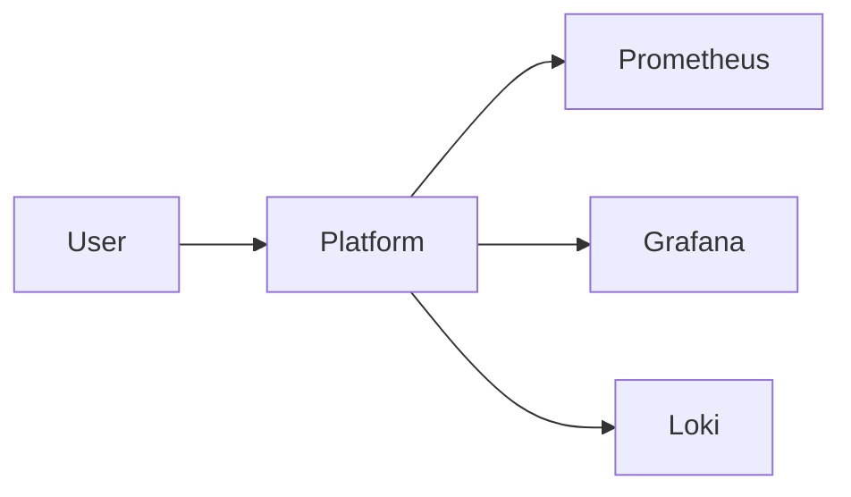

# Tutorial: [Tutorial Title]

> **Difficulty**: Beginner | Intermediate | Advanced  
> **Time**: ~30 minutes  
> **Prerequisites**: [List prerequisites]

## What You'll Learn

By the end of this tutorial, you will:

- ✅ [Learning outcome 1]
- ✅ [Learning outcome 2]
- ✅ [Learning outcome 3]
- ✅ [Learning outcome 4]

## Before You Begin

### Prerequisites

Make sure you have:

1. **Kubernetes cluster** (v1.26+)
   ```bash
   kubectl version --short
   ```

2. **Gunj Operator installed** (v2.0+)
   ```bash
   kubectl get deployment -n gunj-system gunj-operator
   ```

3. **Required permissions**
   ```bash
   kubectl auth can-i create observabilityplatforms
   ```

### What We're Building

[Describe what the tutorial will create/demonstrate. Include a diagram if helpful]



## Step 1: [First Major Step]

Let's start by [describing what we're doing in this step].

### 1.1 [Substep Title]

First, we need to [action]:

```bash
# Command with explanation
kubectl create namespace tutorial-demo
```

Expected output:
```
namespace/tutorial-demo created
```

> 💡 **Tip**: [Helpful tip or best practice]

### 1.2 [Substep Title]

Next, create a configuration file:

```yaml
# platform-config.yaml
apiVersion: observability.io/v1beta1
kind: ObservabilityPlatform
metadata:
  name: tutorial-platform
  namespace: tutorial-demo
spec:
  # We'll add configuration here
  components:
    prometheus:
      enabled: true
```

> ⚠️ **Important**: [Important note or warning]

Apply the configuration:

```bash
kubectl apply -f platform-config.yaml
```

### 📝 Check Your Progress

At this point, you should have:
- [ ] Created the namespace
- [ ] Created the configuration file
- [ ] Applied the configuration

Run this command to verify:
```bash
kubectl get observabilityplatform -n tutorial-demo
```

## Step 2: [Second Major Step]

Now that we have [what was accomplished in step 1], let's [what we're doing in step 2].

### 2.1 [Substep Title]

[Explanation of what we're doing]

```yaml
# Update platform-config.yaml
apiVersion: observability.io/v1beta1
kind: ObservabilityPlatform
metadata:
  name: tutorial-platform
  namespace: tutorial-demo
spec:
  components:
    prometheus:
      enabled: true
      version: v2.48.0  # Added version
      resources:        # Added resources
        requests:
          memory: "1Gi"
          cpu: "500m"
```

### 2.2 [Substep Title]

Apply the updated configuration:

```bash
kubectl apply -f platform-config.yaml
```

Watch the platform status:

```bash
kubectl get observabilityplatform tutorial-platform -n tutorial-demo -w
```

You should see the status change:
```
NAME                STATUS      AGE
tutorial-platform   Creating    5s
tutorial-platform   Ready       45s
```

### 🔍 Understanding What Happened

When you applied the configuration:

1. The operator detected the change
2. It created/updated the Prometheus deployment
3. It configured the resources as specified
4. It updated the platform status

## Step 3: [Third Major Step]

Let's explore what was created.

### 3.1 View Resources

List all resources created by the operator:

```bash
kubectl get all -n tutorial-demo -l app.kubernetes.io/managed-by=gunj-operator
```

Output will show:
```
NAME                                    READY   STATUS    RESTARTS   AGE
pod/prometheus-tutorial-platform-0      2/2     Running   0          2m

NAME                               TYPE        CLUSTER-IP      PORT(S)    AGE
service/prometheus-tutorial        ClusterIP   10.96.10.10     9090/TCP   2m

NAME                                           READY   AGE
statefulset.apps/prometheus-tutorial-platform  1/1     2m
```

### 3.2 Access the Service

Port-forward to access Prometheus:

```bash
kubectl port-forward -n tutorial-demo svc/prometheus-tutorial 9090:9090
```

Open your browser to [http://localhost:9090](http://localhost:9090)

> 🎉 **Success!** You should see the Prometheus UI.

## Step 4: [Additional Steps as Needed]

[Continue with more steps following the same pattern]

## Troubleshooting

### Problem: Platform Stuck in Creating State

**Symptoms**:
- Platform status shows "Creating" for more than 5 minutes

**Solution**:
```bash
# Check operator logs
kubectl logs -n gunj-system deployment/gunj-operator --tail=50

# Check events
kubectl get events -n tutorial-demo --sort-by='.lastTimestamp'
```

### Problem: Cannot Access Service

**Symptoms**:
- Port-forward command fails

**Solution**:
```bash
# Check if pod is running
kubectl get pods -n tutorial-demo

# Check service endpoints
kubectl get endpoints -n tutorial-demo
```

## Clean Up

To remove everything created in this tutorial:

```bash
# Delete the platform
kubectl delete observabilityplatform tutorial-platform -n tutorial-demo

# Delete the namespace
kubectl delete namespace tutorial-demo
```

## Summary

Congratulations! You've successfully:

- ✅ Created an ObservabilityPlatform resource
- ✅ Configured Prometheus component
- ✅ Accessed the deployed service
- ✅ Learned how the operator manages resources

### What You Learned

1. **Concept 1**: How to create platform configurations
2. **Concept 2**: How the operator processes resources
3. **Concept 3**: How to access deployed components
4. **Concept 4**: How to troubleshoot common issues

## Next Steps

Now that you've completed this tutorial, try:

1. **[Next Tutorial]**: [Description and link]
2. **Add Grafana**: Extend your platform with visualization
3. **Configure Alerts**: Set up monitoring alerts
4. **Production Setup**: Learn production best practices

### Additional Resources

- 📖 [User Guide](../user-guide/platforms.md)
- 🔧 [Configuration Reference](../user-guide/configuration.md)
- 💬 [Community Slack](https://gunjanjp.slack.com)
- ❓ [FAQ](../user-guide/faq.md)

## Feedback

How was this tutorial?

- 👍 [Good - Create an issue with feedback](https://github.com/gunjanjp/gunj-operator/issues/new?labels=tutorial-feedback&title=Tutorial+Feedback:+[Tutorial+Name])
- 👎 [Needs improvement - Tell us why](https://github.com/gunjanjp/gunj-operator/issues/new?labels=tutorial-feedback&title=Tutorial+Issue:+[Tutorial+Name])

### Share Your Success!

Completed the tutorial? Share it with the community:

- Tweet with #GunjOperator
- Share in our Slack channel
- Write a blog post about your experience

---

**Need help?** Ask in our [community Slack](https://gunjanjp.slack.com) or [create an issue](https://github.com/gunjanjp/gunj-operator/issues/new).
